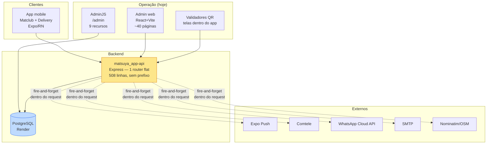

# 02 — Estado atual (linha de base auditada)

> Auditoria realizada em **14/08/2026** contra o código-fonte dos três repositórios, não contra documentação. Toda afirmação aqui é verificável em `arquivo:linha`. Este capítulo é a linha de base: nenhuma decisão dos capítulos seguintes se apoia em suposição sobre o que existe hoje.

---

## 1. Mapa do ecossistema

| Repositório | O que é | Stack | Branch relevante | Estado |
|---|---|---|---|---|
| `matsuya_app-api` | **A única API** de todo o ecossistema | Express 4.18 + Sequelize 6.25 + PostgreSQL, TypeScript 4.8, Node 20 | ⚠️ default é `master`; **todo o delivery vive em `feature/delivery-backend`, nunca mesclada** | Produção (Render) |
| `matsuya_app-v2` | App mobile do cliente (Matclub + Delivery) | Expo ~54, RN 0.81.5, React 19 | `main` | Produção (Matclub) / Fase 1 (Delivery) |
| `matsuya_app-admin-v2` | Admin web atual | React 18.3 + Vite 5 + Tailwind 3 | `main` — **módulo delivery ainda não commitado** | Produção (`admin.matsuya.com.br`) |



**Observação estrutural:** não existe fila, cache, broker, worker ou canal de tempo real. Tudo é HTTP síncrono contra um único processo Node e um único PostgreSQL. As integrações externas são chamadas **dentro do handler da requisição**, sem retry e sem persistência — se o Expo Push cair, a notificação simplesmente não acontece e ninguém fica sabendo.

---

## 2. A API

### 2.1 Estrutura

`src/` é plana e em camadas (controller → service → model):

```
src/
  routes.ts        # 508 linhas, UM express.Router(), montado em app.use(router)
  controllers/     # 25 arquivos
  services/        # 30 arquivos
  models/          # 24 modelos + index.ts (associações centralizadas)
  middlewares/     # auth.ts — o ÚNICO middleware do repositório
  database/        # index.ts + 33 migrations + 15 seeders
  adminjs/         # AdminJS 6.4 montado em /admin, 9 recursos
  utils/           # apiDocs.ts + routeDefinitions.ts (OpenAPI gerado por introspecção)
  __tests__/       # 21 arquivos de rota, com o banco mockado globalmente
```

**Não há prefixo de API.** O router é montado cru (`server.ts:31`), então as rotas vivem na raiz: `/auth/login`, `/points`, `/delivery/orders`. O único caminho com prefixo é `/admin` (AdminJS). Isso torna impossível versionar sem quebrar o app mobile — motivo pelo qual o capítulo [06](./06-arquitetura-backend.md) introduz `/api/v1` como namespace paralelo em vez de renomear o que existe.

`underscored: true` é global (`src/database/index.ts:32-34`): atributos camelCase mapeiam para colunas snake_case.

### 2.2 Superfícies administrativas coexistindo

Existem **duas** superfícies administrativas hoje, com modelos de autenticação diferentes:

1. **AdminJS** em `/admin` — sessão por cookie (`cookiePassword: 'cookie-password'`, literal), aceita `admin` e `manager`. Registra Plan, PlansBenefit, Voucher, VoucherType, VoucherDiscountType, User, Point, MatclubSubscriber, Unity. **Nenhum recurso de delivery.**
2. **A API REST** consumida pelo SPA `matsuya_app-admin-v2` — JWT no header.

A lista de CORS é hardcoded em `server.ts:10-22` e funciona como o registro de facto dos front-ends existentes: `admin.matsuya.com.br`, `admin-app.matsuya.com.br`, `validar-cupom.matsuya.com.br`, `validar-cashback.matsuya.com.br`, `localhost:3000`, `localhost:5173`. **Qualquer origem nova precisa ser adicionada em código.**

### 2.3 Autenticação e autorização

```ts
// src/services/jwtService.ts:3
const secret = 'chave-do-jwt'   // literal; a env `jwtSecret` existe e NUNCA é lida
```

- Payload do JWT: `{id, firstName, lastName, document, email, phone, birth, role, createdAt, unityId}`, expiração `1d`. **Não existe refresh token** — o cliente trata 401 como logout definitivo.
- `ensureAuth` (`src/middlewares/auth.ts`) verifica o token e **refaz o SELECT do usuário por e-mail a cada requisição**. Se o usuário não existir, define `req.user = null` e **mesmo assim chama `next()`** (`:26-28`) — falha aberta.
- `ensureRole(...roles)` existe, mas é aplicado em **exatamente um lugar**: o bloco de escrita de delivery (`routes.ts:445`).
- Papéis: três valores em um `STRING` com validador `isIn` (`User.ts:80`): `admin | manager | user`.
- **Escopo por unidade existe em 2 lugares apenas**: `orderController.adminList:148-155` e `deliveryZoneController:12-13` forçam o `unityId` do manager. Produtos, categorias, pontos, vouchers, clientes, promoções e relatórios são globais para qualquer autenticado — e, em vários casos, para qualquer um.

### 2.4 Endpoints de escrita sem autenticação alguma

Verificados em `src/routes.ts`:

| Endpoint | Impacto se abusado |
|---|---|
| `POST /points` | **Cunhar cashback para qualquer CPF** |
| `GET /points/list` | Dump de PII sem paginação |
| `POST /cashback/redeem` | Criar débitos em nome de terceiros |
| `POST /plans`, `PUT /plans/:id` | Alterar regras de fidelidade (faixas e % de cashback) |
| `POST /benefits`, `PUT /benefits/:id` | Alterar benefícios dos planos |
| `POST /vouchers`, `PUT /vouchers/:id` | **Emitir cupons de desconto** |
| `POST /promotions`, `PUT /promotions/:id` | Criar/alterar promoções |
| `POST /promotion_timeline`, `PUT .../:id` | Forjar uso de promoção |
| `POST /push-notification/new-points` | **Push para toda a base de usuários** |

Somados aos endpoints de SMS também abertos (`POST /send-confirmation`, `/check-confirmation`), isso é o defeito de maior impacto do sistema hoje e é o item 3 da Fase 0 ([18](./18-seguranca.md)).

### 2.5 Ausências verificadas

Grep em `src/**/*.{ts,tsx}` por `socket.io|websocket|bullmq|redis|ioredis|amqp|sentry|winston|pino|opentelemetry`:

| Capacidade | Estado |
|---|---|
| WebSocket / tempo real | **Ausente**. `server.ts` é um `app.listen` puro. |
| Fila / worker (BullMQ, Redis, RabbitMQ) | **Ausente**. Push, SMS, WhatsApp e e-mail são chamadas inline. |
| Log de auditoria genérico | **Ausente**. Só `order_status_events` e `qrcode_uses`, ambos específicos de domínio. |
| Logging estruturado | **Ausente**. `console.log`. Sem morgan, sem request-id. |
| Middleware de erro | **Ausente**. Cada controller faz seu try/catch e devolve 400. |
| Métricas / tracing / APM | **Ausente**. |
| Rate limiting / helmet | **Ausente**. |
| Validação de payload (zod/joi) | **Ausente**. Validação manual por controller. |
| Dockerfile / CI / `.env.example` | **Ausente**. Nenhum `.github/`, nenhum `render.yaml`. |
| Integração de pagamento | **Ausente**. Zero ocorrências de `mercadopago|stripe|pagseguro`. A única aparição de "pix" em `src/` é o literal do tipo `PaymentMethod`. |

### 2.6 Práticas de deploy que precisam mudar

- `npm start` roda **`ts-node dist/server.js`** — produção executa JS compilado *através do ts-node*.
- **`dist/` é versionado no git.** É por isso que `git status` vive sujo.
- **`.env.development` e `.env.production` estão versionados.** O `.gitignore` cobre apenas `node_modules/` e `.env`. Isso expõe credenciais do banco, Twilio, Comtele, token do WhatsApp e SMTP.
- `config/sequelizeCli.mjs` tem credenciais de dev/test hardcoded; `src/database/index.ts:23` fixa `port: 5432` ignorando `PG_PORT`.
- A env de produção ainda tem a chave com typo `wtSecret` — morta de qualquer forma, já que o segredo é literal.

---

## 3. Cashback hoje

### 3.1 O modelo

A tabela `points` é um **pseudo-ledger**:

| Coluna | Tipo | Observação |
|---|---|---|
| `type` | `'credit' | 'debit' | 'benefit'` | |
| `cashback` | FLOAT | valor — **só preenchido em credit/benefit** |
| `points` | FLOAT | **os débitos guardam o valor resgatado aqui, com `cashback: 0`** (`pointController.ts:344-350`) |
| `user_document` | STRING | **CPF, não FK.** Sem integridade referencial e sem índice garantido |
| `unity` | STRING | **nome da unidade, não FK** |
| `expiration_date` | DATE NOT NULL | expiração por linha |
| `status` | `'pending' | 'approved' | 'rejected'` | default `approved` |
| `suspicious`, `table_number` | | superfície antifraude |

O modelo **não declara nenhuma associação** — todo join é manual por CPF.

### 3.2 Como o saldo é calculado

Fórmula idêntica em dois lugares (`pointService.generatedBenefit()` em `src/services/pointService.ts:189-254` e duplicada inline em `matclubSubscribersController.checkPlan:301-346`):

```
benefit     = SUM(cashback) WHERE type IN (credit,benefit) AND status='approved'
used        = SUM(points)   WHERE type='debit'             AND status='approved'
expired     = SUM(cashback) WHERE type IN (credit,benefit) AND status='approved'
                                 AND expiration_date <= now
realExpired = max(0, expired - used)
balance     = max(0, benefit - used - realExpired)
```

Três defeitos estruturais:

1. **A expiração é compensada em agregado, não por lote.** Não existem colunas de consumo (`consumed`/`remaining`). A atribuição FIFO existe apenas para *exibição*, em `src/utils/cashbackStatus.ts`. O capítulo [10](./10-cashback-ledger.md) demonstra numericamente o caso em que essa fórmula **entrega ao cliente saldo que ele não tem**.
2. **Dinheiro em FLOAT.** `Point.cashback`, `Point.points` e todos os valores de `orders` são `DataTypes.FLOAT`. IEEE-754 não representa R$ 0,10; um ledger cujo invariante é `SUM(lançamentos) == saldo` é inimplementável sobre floats.
3. **Saldo recalculado por 3 agregações a cada leitura.** Sem cache, sem materialização, sem índice em `user_document`.

### 3.3 O ciclo de redenção em loja (e o bug em produção)

```
POST /cashback/redeem          → insere débito status='pending' + transaction_code
GET  /cashback/redeem/validate/:transactionCode  → operador lê o QR, registra qrcode_use
PUT  /cashback/redeem/:id/confirm                → 'approved' | 'rejected'
GET  /cashback/redeem/:id/status                 → cliente faz polling a cada 3s
```

O cliente mantém uma **contagem regressiva de 120 s e auto-rejeita** ao expirar (`RedeemModal.tsx`). **Esse timer só existe no cliente.** Se o app for morto, perder rede ou o usuário fechar a tela de forma inesperada, o débito `pending` fica **órfão para sempre** — não há job server-side de expiração. Isso reduz silenciosamente o saldo disponível de clientes reais hoje. O sweeper especificado em [10](./10-cashback-ledger.md) §2.5 corrige isso e é entregável isoladamente.

### 3.4 Fidelidade

`plans` (Bronze/Prata/Ouro, cashback 1/2/3 %, faixa `start_value`–`end_value`) + `matclub_subscribers` (usuário → plano). A progressão é recalculada em `matclubSubscriberService.checkPlan` e dispara push na promoção de nível. **O app mobile duplica os limiares em código** (`getPlanStartValue`: 699 e 2500, `src/utils/mappers.ts`), com um comentário admitindo que precisa acompanhar o banco.

---

## 4. Delivery hoje

### 4.1 O que existe

Modelos criados pela migration `20260525120000-create-delivery-tables.js`: `product_categories`, `products`, `product_option_groups`, `product_options`, `addresses`, `delivery_zones`, `orders`, `order_items`, `order_status_events`. Depois vieram `order_reviews`, `orders.delivery_type` e o bloco geográfico de `unity` (lat/lng + endereço estruturado + `geocoded_at/geocode_source`, via Nominatim/OSM).

### 4.2 Catálogo é por unidade — e isso gerou um remendo

`products.unity_id` é **NOT NULL** e `product_categories.unity_id` é anulável. Cada unidade tem suas próprias linhas de produto, com **ids diferentes**. Consequência direta: quando o cliente troca de unidade no checkout, o carrinho inteiro precisa ser traduzido — daí existir `POST /delivery/units/:unityId/cart/remap`, que devolve itens `ok | ok_with_warnings`, `unmatched` com razão (`not_in_unity | inactive | ambiguous`) e opções descartadas.

Não existe conceito de catálogo mestre. Um produto novo da rede precisa ser cadastrado N vezes. O capítulo [08](./08-banco-de-dados.md) resolve isso com catálogo mestre + override por unidade.

### 4.3 Máquina de estados

`src/services/orderService.ts:48-55`:

```
pending          → confirmed | cancelled
confirmed        → preparing | cancelled
preparing        → out_for_delivery | cancelled
out_for_delivery → delivered
delivered        → (terminal)
cancelled        → (terminal)
```

`updateStatus` (`:402-427`) valida a transição e grava pedido + `OrderStatusEvent` numa transação — correto até onde vai. Mas é alcançável apenas por `PATCH /delivery/admin/orders/:id/status`, e **não há estado algum para rejeição, falha de pagamento, aguardando pagamento, pronto, aguardando entregador, falha de entrega ou cancelamento parcial**.

### 4.4 Criação de pedido

`orderService.create` (`:188-321`) faz o certo em pontos importantes: valida propriedade do endereço, carrega produtos com escopo `unityId` + `active`, **rejeita `optionIds` que não pertencem ao produto** (`:247` — correção de um bug real de subfaturamento), calcula `unitPrice` e `lineTotal`, resolve frete pela zona ativa mais barata que atende o `minOrder`, e grava tudo numa transação com o evento `pending` inicial.

Mas:

```ts
// orderService.ts:280 — "Fase 1: no discounts/cashback yet"
discountTotal: 0, cashbackUsed: 0, cashbackEarned: 0, voucherCode: null
paymentStatus: 'pending'   // e NUNCA atualizado por nenhum caminho de código
```

### 4.5 O que o app mobile faz de fato hoje

- **Pix é uma string BR Code estática mockada.** Sem criação de cobrança, sem polling de status, sem webhook.
- **Cartões salvos ficam em texto puro no AsyncStorage** (`delivery_payment_methods`), sem PSP e sem tokenização.
- **Cupons no checkout são um mapa hardcoded no cliente** (`BEMVINDO10`, `MATSUYA15`, `FRETEGRATIS`); o código nunca é enviado como `voucherCode` — é concatenado no campo livre `notes`.
- **Cashback nunca é gasto.** O checkout apenas *exibe* quanto o pedido vai render.
- **O código de confirmação de entrega de 4 dígitos é gerado no cliente** e guardado no AsyncStorage — nunca chega ao servidor.
- **Rastreamento é polling de 15 s** em `GET /delivery/orders/:id` (o endpoint `/tracking` existe e não é usado).
- `orders.address_snapshot` é **NOT NULL na migration e anulável no modelo**, e pedidos de retirada gravam `null` — a criação de pedido `pickup` provavelmente falha no banco.

---

## 5. O admin web atual

~21 mil linhas, 40 páginas, 14 pastas de feature. Maduro em cobertura funcional de fidelidade; frágil exatamente onde as três novas aplicações vão pressionar.

**O que vale preservar (como conhecimento, não como código):** `src/constants/api.ts` (catálogo de endpoints), `src/types/*`, a máquina de status de delivery com os rótulos pt-BR, `apiError.ts`, `exportCsv.ts`, `cpfMask.ts`.

**Por que não serve de base:**

| Problema | Detalhe |
|---|---|
| Sem biblioteca de server-state | Cada hook reimplementa loading/error/refetch com guarda `useRef` contra o StrictMode. Zero cache, dedupe, refetch em background ou invalidação. **Não há polling, WebSocket, SSE, som ou notificação em lugar nenhum do código.** |
| Sem design system | `tailwind.config.js` é o default intocado. A identidade (`from-orange-500 to-red-600` etc.) é string literal repetida em dezenas de arquivos. **Não existe Button, Input, Modal, Table, Pagination, Badge, EmptyState nem Skeleton** — a marcação de modal é copiada e colada em cada página. Sem dark mode. |
| Permissão por prefixo de rota | Dois arrays hardcoded + `useCanPerformActions() === (role === 'admin')`. **`/delivery/*` não está em nenhum dos dois**, então um manager consegue escrever no catálogo hoje. `useManagerUnity` é filtro decorativo no cliente, e um manager pertence a **exatamente um** `unityId`. |
| Agregação no cliente | Margem financeira, contagem de cupons ativos, série diária, ordenação e paginação são calculadas no navegador sobre payloads não paginados. Não escala para visão de rede. |
| Componentes gigantes | `SubscriberDetailsPage.tsx` 2001 linhas, `CashbackFormPage.tsx` 1092, `CashbackListPage.tsx` 1080. |
| Higiene | Sem testes, sem CI, sem Docker, sem code splitting (as 40 páginas num bundle só), sem rota 404, ~50 `any`, artefatos do bolt.new e migrations órfãs de Supabase (dependência que não existe). |

O SPA também envia o JWT **cru no header `Authorization`, sem `Bearer`** — funciona só porque `ensureAuth` faz um `.replace(/Bearer /, '')` que vira no-op.

---

## 6. O que o app mobile já espera (contrato a não quebrar)

Estes literais são o vocabulário do domínio e aparecem renderizados hoje. Qualquer capítulo posterior que os contradiga está errado.

| Conceito | Valores |
|---|---|
| Status do pedido | `pending` (Aguardando confirmação) · `confirmed` (Confirmado) · `preparing` (Em preparo) · `out_for_delivery` (Saiu para entrega) · `delivered` (Entregue) · `cancelled` (Cancelado) |
| Ativos | `pending, confirmed, preparing, out_for_delivery` |
| `paymentMethod` | `pix` (Pix) · `card` (Cartão) · `on_delivery` (Na entrega) |
| `paymentStatus` | `pending · paid · failed · refunded` |
| `deliveryType` | `delivery · pickup` |
| Tipo de ponto | `credit · debit · benefit`; status `pending · approved · rejected` |
| Confirmação de resgate | `approved · rejected` |
| Papel | `admin · manager · user` |
| Ambiente do app | `cashback · delivery` |

Telas staff dentro do app: `ScannerScreen`, `CashbackValidatorScreen`, `VoucherValidatorScreen`. **A única checagem de papel do app inteiro está desabilitada** — `HomeScreen.tsx:652` tem `{false && (user.role === 'admin' || ...)}`, um patch temporário para captura de screenshots que não foi revertido. As três telas estão registradas como rotas comuns, sem guarda. E os dois validadores **discordam no parâmetro de unidade**: o de cashback envia `unity: <nome>`, o de voucher envia `unityId: <número>`.

---

## 7. Inventário de dívida e risco herdado

| # | Item | Severidade | Onde |
|---|---|---|---|
| 1 | Segredo do JWT hardcoded | **Crítica** | `src/services/jwtService.ts:3` |
| 2 | `.env.development` e `.env.production` versionados | **Crítica** | raiz do repo |
| 3 | 9 endpoints de escrita sem autenticação | **Crítica** | `src/routes.ts` |
| 4 | `ensureAuth` falha aberta quando o usuário não existe | **Alta** | `src/middlewares/auth.ts:26-28` |
| 5 | Dinheiro em FLOAT | **Alta** | `Point.ts`, `Order.ts` |
| 6 | Débitos `pending` órfãos (timer só no cliente) | **Alta** | `RedeemModal.tsx` + ausência de job |
| 7 | Fórmula de saldo compensa expiração em agregado | **Alta** | `pointService.ts:189-254` |
| 8 | `points.user_document` é CPF string, sem FK e sem índice | **Alta** | `Point.ts` |
| 9 | `ensureRole` aplicado em 1 lugar; escopo por unidade em 2 | **Alta** | `routes.ts:445` |
| 10 | `cookiePassword` do AdminJS hardcoded | Média | `src/adminjs/authentication.ts` |
| 11 | `dist/` versionado + `ts-node` em produção | Média | `package.json` |
| 12 | `orders.address_snapshot` NOT NULL vs. modelo anulável | Média | migration vs. `Order.ts:115` |
| 13 | Sem middleware de erro; unhandled rejection derruba o processo | Média | — |
| 14 | Sem rate limit em `/auth/*` e endpoints de SMS | Média | — |
| 15 | Branch `feature/delivery-backend` nunca mesclada e ausente do remoto | Média | topologia de git |
| 16 | Duas superfícies admin (AdminJS + SPA) com autenticações distintas | Média | — |
| 17 | CORS hardcoded em código | Baixa | `server.ts:10-22` |
| 18 | Sem backup verificado nem ambiente de staging | **Alta** | infra |
| 19 | Dependências e credenciais mortas em produção: pacote `twilio` sem nenhum import, variáveis `TWILIO_*` e `ZENVIA_API_TOKEN` que nenhum código lê (SMS migrou para Comtele no commit `afe4a30`) | Média | `package.json`, `.env.*` |

---

## 8. O que a linha de base impõe à arquitetura nova

1. **Não dá para versionar por cima do que existe.** Sem prefixo, sem contrato estável e com o app mobile em produção, o caminho é um namespace `/api/v1` paralelo com o roteador legado congelado — não um rename.
2. **Autorização precisa ser aplicada na camada de query, não no controller.** O padrão atual (dois controllers lembrando de filtrar por `unityId`) não sobrevive a três aplicações e a dezenas de endpoints.
3. **O cashback precisa de um ledger de verdade antes de virar meio de pagamento.** Colocar `cashbackUsed` para funcionar sobre a fórmula atual seria construir liquidação financeira sobre um saldo que já está errado.
4. **O catálogo por unidade precisa de um mestre antes do Corporate existir.** "Gerir o cardápio da rede" não é implementável sobre linhas duplicadas com ids distintos.
5. **Tempo real não é um adicional do Order Hub — é o produto.** E, como toda loja tem internet instável, o protocolo de reconexão precisa ser especificado junto, não depois.
6. **A Fase 0 de segurança é bloqueante.** Não faz sentido publicar três painéis administrativos novos contra uma API cujo token qualquer pessoa consegue forjar.
