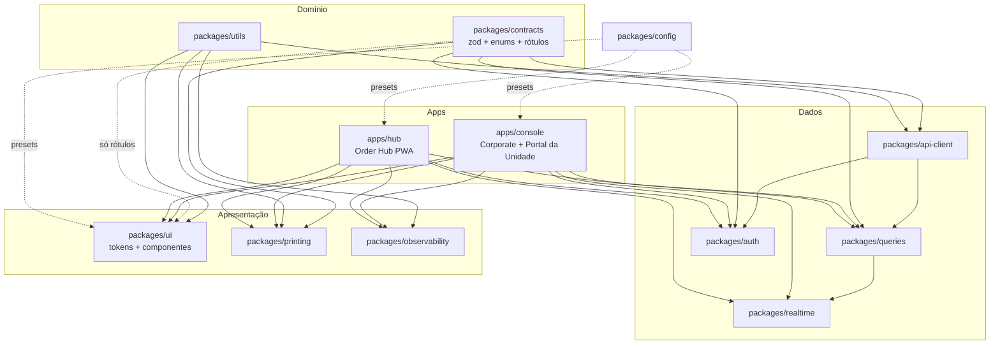

# 04 — Arquitetura front-end

> PARTE 4 do briefing. Cobre estratégia de repositório, framework, camada de estado/dados, cliente de tempo real, impressão, preocupações transversais e o plano de absorção do admin atual. O design system tem capítulo próprio ([05](./05-design-system.md)); o inventário de telas e a UX do Order Hub estão em [16](./16-telas.md) e [17](./17-ux-navegacao.md).

---

## 1. A pergunta que importa: três aplicações ou duas?

O briefing pede três front-ends. Antes de aceitar, vale medir a sobreposição real entre Corporate e Store Manager.

| Dimensão | Corporate | Store Manager |
|---|---|---|
| Telas | Dashboard, unidades, catálogo mestre, cashback, clientes, usuários, relatórios | Dashboard, config. operacional, catálogo local, relatórios |
| Diferença | Escopo `network` \| `group:{id}`, agregação entre unidades | Escopo `unit:{id}` dentro de um conjunto permitido |
| Diferença | Escrita de catálogo é autoritativa | Escrita restringida pelos travamentos do Corporate (campo desabilitado + 403) |
| Diferença | Vê todas as chaves de permissão | Vê um subconjunto |
| **Sobreposição** | — | **~70% dos componentes, ~55% das rotas, 100% do design system, camada de dados, auth e tempo real** |

O delta entre os dois é **resolução de escopo + conjunto de permissões + alguns módulos exclusivos do Corporate**. É exatamente o que um registro de módulos dirigido por permissão expressa. Duas bases de código significariam manter duas cópias do dashboard de unidade que diferem por um `if`.

O **Order Hub é genuinamente diferente**: tablet de balcão em modo quiosque, dark por padrão, som, resiliência offline, service worker, impressão térmica, e um bundle que não pode carregar Recharts nem XLSX. E, principalmente, uma cadência de release que não pode ser acoplada à correção de um relatório financeiro ao meio-dia.

### 1.1 Alternativas avaliadas

| Opção | Veredito | Motivo |
|---|---|---|
| 3 repositórios independentes | ✗ | 3× deriva de design system, 3× deriva de contrato, nenhuma mudança atômica entre UI e contratos — e o time não tem disciplina de teste/CI para absorver isso |
| Monorepo, 3 apps | ~ | Infra certa, recorte errado — a duplicação Corporate/Store Manager permanece |
| Microfrontends (Module Federation) | ✗ | Resolve independência de escala organizacional que não temos. Custa version skew em runtime, dor com singletons compartilhados (React, cache do Query, socket) e debug mais difícil. Reavaliar só quando times separados tiverem trilhos de release separados |
| Uma app única, módulos por permissão (as três) | ✗ | Força o Hub a compartilhar bundle, router, tema padrão e cadência de deploy do console; o dispositivo de quiosque ganha superfície administrativa; a estratégia offline/service worker vaza para o Corporate |
| **Monorepo, 2 deployables: `console` (Corporate + Store Manager) + `hub`** | ✅ **Recomendado** | Elimina os 70% duplicados e isola a única app com restrições de runtime genuinamente distintas |

### 1.2 Recomendação

**Um monorepo pnpm. Duas aplicações deployáveis.**

- **`apps/console`** — Corporate **e** Portal da Unidade. Mesmo artefato de build, mesmo domínio. Navegação, conjunto de módulos e capacidades são computados a partir de `permissions[] × scopes[]` devolvidos por `/api/v1/auth/me`. Um franqueado que faz login recebe a experiência de Portal da Unidade porque o escopo dele é `unit:*` — não porque acessou outra URL.
- **`apps/hub`** — Order Hub. Build separado, deploy separado, PWA, dark-first, grafo de dependências mínimo.

**Isso continua entregando as três experiências que o briefing pede.** Um terceiro alvo de deploy com **zero código adicional** é opcional: `portal.matsuya.com.br` servindo o *mesmo* artefato do console com `VITE_APP_PROFILE=unit`, o que muda apenas a rota inicial, o lockup de logo e esconde o seletor de escopo de rede. Use isso se os franqueados exigirem URL própria — é configuração de deploy, não base de código.

### 1.3 O que faria mudar de ideia depois

| Gatilho | Novo formato |
|---|---|
| Store Manager passar de ~40% de telas exclusivas, ou uma squad própria assumi-lo | Extrair `apps/portal`, continuando a importar os mesmos `packages/*` — 1 a 2 semanas de extração, não uma reescrita |
| Bundle inicial do console não couber no orçamento nem com split por rota | Separar relatórios/BI do Corporate em `apps/analytics` |
| Hub precisar de integração de SO (auto-launch, claim de USB, lockdown de quiosque) | Empacotar `apps/hub` em Electron/Tauri — já é uma app isolada com camada de serviço própria |
| Mais de ~3 squads publicando semanalmente | Migrar Turborepo → Nx por fronteiras de módulo impostas e geradores |

---

## 2. Ferramental: Turborepo + pnpm (não Nx)

| Critério | Turborepo | Nx |
|---|---|---|
| Modelo de configuração | `turbo.json` + scripts de `package.json` | Grafo de projeto, executors, plugins, geradores |
| Custo de aprendizado para um time sem experiência em monorepo | Baixo | Médio-alto |
| Cache de tarefas / affected | Sim (`--filter=...[origin/main]`) | Sim, mais rico |
| Imposição de fronteira de módulo | Não nativa → `eslint-plugin-boundaries` | Nativa (`@nx/enforce-module-boundaries`) |
| Scaffolding | Manual (ou `plop`) | Forte |

**Turborepo.** A única perda é o lint de fronteira, substituído por ~30 linhas de `eslint-plugin-boundaries`. A curva de valor do Nx começa onde a organização tem muitos times e muitos tipos de app — temos duas apps e uma squad. Gerenciador: **pnpm**, cujo `node_modules` estrito evita dependências fantasma, que é justamente como regras de design system são violadas na prática.

---

## 3. Estrutura de diretórios

```
matsuya-admin-suite/
├─ apps/
│  ├─ console/                 # Corporate + Portal da Unidade
│  │  ├─ src/
│  │  │  ├─ app/               # router, providers, shell, error boundaries
│  │  │  ├─ modules/           # dashboard, unidades, catalogo, cashback,
│  │  │  │  └─ <módulo>/{routes,components,hooks,schemas}
│  │  │  ├─ navigation/        # manifesto de rotas (chaves de permissão, tipos de escopo)
│  │  │  └─ config/            # loader de config em runtime, feature flags
│  │  └─ e2e/                  # Playwright
│  └─ hub/                     # Order Hub (PWA)
│     ├─ src/{app,modules,offline,printing,sound}/
│     ├─ public/{sw.js,config.json,sounds/}
│     └─ e2e/
├─ packages/
│  ├─ contracts/               # schemas zod, tipos inferidos, enums, rótulos pt-BR, máquina de status
│  ├─ api-client/              # transporte tipado sobre /api/v1 (sem React)
│  ├─ queries/                 # chaves e hooks do TanStack Query, cache writers, invalidação
│  ├─ realtime/                # wrapper Socket.IO, resync, store de conexão
│  ├─ auth/                    # sessão, resolvedor de permissão/escopo, guards
│  ├─ ui/                      # tokens + componentes + charts + Storybook
│  ├─ printing/                # templates de comanda, renderizador ESC/POS, cliente do agente, fila
│  ├─ utils/                   # formatadores pt-BR, máscaras, csv/xlsx, idempotency key
│  ├─ observability/           # Sentry, logger, scrub de PII, ErrorBoundary
│  └─ config/                  # presets de tsconfig, eslint, tailwind, vitest, prettier
├─ tooling/                    # scripts: checagem de deriva de contrato, orçamento de bundle
└─ turbo.json · pnpm-workspace.yaml · .github/workflows/
```

### 3.1 Responsabilidades e regras de dependência

| Pacote | Responsabilidade | Pode depender de | **Não pode** depender de |
|---|---|---|---|
| `contracts` | Fonte única da verdade do domínio: schemas zod, tipos `z.infer`, enums de status/pagamento/entrega, mapas de rótulo pt-BR, transições permitidas, união das chaves de permissão | só `zod` | qualquer pacote interno |
| `api-client` | `createApiClient({baseUrl, getToken, onUnauthorized})`, funções tipadas por endpoint, normalização de erro, headers de idempotência, abort signals | `contracts`, `utils` | React, `ui`, `queries` |
| `queries` | Fábrica de query keys, hooks `useX`, cache writers usados pelo tempo real, mapa de invalidação, helpers de mutação otimista | `contracts`, `api-client`, `utils` | `ui`, apps |
| `realtime` | Ciclo de vida do socket, subscrição de rooms por escopo, backoff, detecção de gap de `seq`, disparo de resync, store de estado de conexão | `contracts`, `api-client`, `queries` | `ui` |
| `auth` | Armazenamento de sessão, decode/expiração do JWT, `can(permission, scope)`, `<RequirePermission>`, parsing de escopo da URL | `contracts`, `api-client`, `utils` | `ui` |
| `ui` | Tokens (CSS vars + preset Tailwind), primitivos, compostos, charts, fachada de ícones, Storybook | `utils`, e `contracts` só para os mapas de rótulo do `StatusPill` | `api-client`, `queries`, `realtime`, `auth` |
| `printing` | Modelo de layout de comanda, renderizador ESC/POS, templates CSS 58/80 mm, cliente do agente, fila de retry | `contracts`, `utils` | `ui`, `queries` |
| `utils` | `formatCurrency/formatDate` (date-fns + ptBR), máscaras CPF/telefone, `toCsv` + `downloadFile`, export xlsx lazy, `newIdempotencyKey` | nenhum | tudo |
| `observability` | Init do Sentry/GlitchTip, `logger`, `scrubPII`, `<ErrorBoundary>` | `utils` | `ui`, `queries` |
| `config` | Presets compartilhados | — | — |

**Regras impostas por `eslint-plugin-boundaries` no CI:**

1. **`ui` nunca importa dados** — um componente recebe props, nunca busca. É esta regra que impede os god components do admin atual de reaparecerem.
2. `contracts`, `utils` e `config` são folhas.
3. Sem imports `apps/* → apps/*`.
4. Apps importam pacotes por nome (`@matsuya/ui`), nunca por caminho relativo.
5. O que é importado pelas duas apps pertence a um pacote; o que só uma usa fica no `modules/` dela.

### 3.2 Grafo de dependências



---

## 4. Framework por aplicação

### 4.1 Next.js vs. Vite SPA

| Critério | Console | Hub | Valor do Next.js |
|---|---|---|---|
| SEO | nenhum (atrás de login) | nenhum | 0 |
| Sensibilidade ao first paint | usuários internos, cache quente | quiosque, abre uma vez por turno | baixa |
| Interatividade | tabelas/filtros/gráficos pesados | extrema, de longa duração | RSC briga com estado de cliente |
| WebSocket de longa duração | sim | sim, o turno inteiro | neutro a negativo |
| Resiliência offline | não requerida | **requerida** | SPA + service worker é mais simples que Next PWA |
| Runtime de servidor a operar | nenhum hoje | nenhum hoje | **adiciona um deploy Node que não queremos** |
| Necessidade de BFF | não (o backend é dono de `/api/v1`) | não | criaria uma segunda superfície de API para versionar |

**Recomendação: Vite 6 + React 19 SPA nas duas apps.** Artefatos estáticos em CDN, zero runtime de servidor, um único conceito de deploy. O Next.js compraria SEO e busca de dados via RSC que não podemos usar, ao custo de um runtime extra, um modelo de cache extra e uma relação desconfortável com um Socket.IO de longa duração e um cache de Query que precisa sobreviver à navegação.

Sem dogma: se o Corporate depois precisar de páginas de relatório renderizadas no servidor ou de uma superfície pública para franqueados, isso é uma app Next **separada** no mesmo monorepo — não uma migração do console.

### 4.2 Roteamento

**React Router v7 em modo data router (`createBrowserRouter`).** O time já usa RRD 7. `lazy()` dá code splitting de graça; `loader` é usado **apenas** para guarda/redirect/prefetch (`queryClient.ensureQueryData`), nunca como camada de dados. Layouts aninhados mapeiam limpo em shell → escopo → módulo.

O TanStack Router tem tipagem de params e search params melhor — genuinamente útil numa app tão orientada a filtro. Rejeitado **por ora**: um time sem biblioteca de estado, sem testes e sem query library já está absorvendo cinco conceitos novos, e type-safety de rota é o menos valioso deles. Recompensa parcial recuperada com um hook `useFilters(schema)` tipado por zod sobre os search params (§8.4).

### 4.3 Formato das rotas

```
console:  /login
          /c/:scope/*            scope ∈ network | g-<id> | u-<id>
            visao-geral · unidades · catalogo · cashback · clientes · usuarios · relatorios
          /403 /404
hub:      /login
          /u/:unitId/pedidos     (padrão; o Hub é sempre de uma unidade)
            /fila /chat /historico /configuracoes
```

### 4.4 Code splitting e orçamento de bundle

| App | Entrada (gzip) | Chunk de rota lazy | Estratégia de vendor |
|---|---|---|---|
| `console` | **≤ 220 KB** | ≤ 120 KB | `react/react-dom/router` em `vendor`; `recharts` + `d3-*` em `charts` (lazy); `xlsx`/`pdf` em `export` (lazy, no clique); `@radix-ui/*` em `ui` |
| `hub` | **≤ 150 KB** | ≤ 60 KB | sem charts, sem export, sem date-picker; `socket.io-client` na entrada |
| `packages/ui` | `sideEffects:false`, entrypoints por componente | — | precisa tree-shakear a zero quando não usado |

Imposição: `size-limit` no CI, reprovando o PR acima do orçamento.

---

## 5. Estado e dados

### 5.1 A espinha: TanStack Query v5

Tudo que pertence ao servidor vive no cache do Query. Nada que pertence ao servidor vive no Zustand. Essa regra sozinha elimina ~60% do que o admin atual faz à mão (`useState` de loading/error/refetch + guarda `useRef` contra StrictMode, repetido 18 vezes).

### 5.2 Convenção de chaves

```ts
// packages/queries/keys.ts — uma fábrica exportada, nunca arrays inline
qk.orders.list(scope, filters)     → ['orders','list', scopeKey(scope), filters]
qk.orders.detail(orderId)          → ['orders','detail', orderId]
qk.orders.active(unitId)           → ['orders','active', unitId]
qk.catalog.products(scope, params) → ['catalog','products', scopeKey(scope), params]
qk.reports.sales(scope, range)     → ['reports','sales', scopeKey(scope), range]
```

- **Segmento 1 = domínio, 2 = forma, 3 = escopo, 4 = parâmetros.** Permite invalidar `['orders']` ou `['orders','list']` cirurgicamente.
- `scopeKey()` serializa `network` / `g-3` / `u-12` de forma determinística: trocar de unidade é *cache miss*, não *cache poison* — e voltar é instantâneo.
- Objetos de filtro são normalizados (chaves ordenadas, defaults removidos) antes de entrar na chave; caso contrário cada checkbox cria uma entrada de cache.
- Chaves `detail` **não** levam escopo: um pedido tem identidade única na rede.

### 5.3 Política de frescor

| Classe de dado | `staleTime` | `gcTime` | Refetch on focus | Observação |
|---|---|---|---|---|
| Pedidos ativos (Hub) | 0 | 30 min | não | O socket é a fonte de frescor; polling de 15 s só como rede de segurança quando o socket cai |
| Detalhe do pedido | 10 s | 30 min | não | |
| Catálogo, unidades, zonas | 5 min | 30 min | sim | Muda pouco |
| Permissões / `me` | ∞ até novo login | sessão | não | Invalida só na troca de escopo |
| Dashboards / KPIs | 60 s | 10 min | sim | `placeholderData: keepPreviousData` na troca de filtro |
| Relatórios pesados | 5 min | 15 min | não | Botão explícito "Atualizar" |
| Threads de chat | 0 | 1 h | não | Dirigido por socket |

Defaults globais: `retry: (n, e) => n < 2 && !isClientError(e)`; `refetchOnWindowFocus` desligado no Hub (um tablet reganha foco o tempo todo) e ligado no Console.

### 5.4 Invalidação declarativa

Mapa declarativo em vez de chamadas ad-hoc espalhadas pelos componentes:

```ts
// packages/queries/invalidation.ts
const INVALIDATES = {
  'order.accept':      (o) => [qk.orders.active(o.unitId), qk.orders.detail(o.id), qk.kpis.unit(o.unitId)],
  'product.update':    (p) => [['catalog','products'], qk.catalog.product(p.id)],
  'cashbackRule.save': ()  => [['cashback']],
} as const;
```

Mutações declaram o nome do evento; um wrapper `useAppMutation` roda update otimista → chamada → conjunto de invalidação → toast (copy pt-BR de um registro central). É também o lugar único para anexar chave de idempotência e breadcrumbs do Sentry.

### 5.5 Updates otimistas em transição de pedido

É o único lugar onde otimismo compensa a complexidade — o operador que toca "Aceitar" precisa ver o card mover na hora.

```
onMutate:  cancelQueries(detail+active) → snapshot →
           validar transição com contracts.canTransition(from, to) →
           setQueryData(detail, {...o, status: next, _pending: true}) →
           setQueryData(active, moverCardEntreColunas)
onError:   restaurar snapshot → toast "Não foi possível aceitar o pedido #123. Tente novamente."
onSettled: NÃO invalidar — o evento de socket `order.updated` confirma.
           Timer de segurança: sem evento confirmando em 5 s, invalidar detail + active.
```

**Regra de conflito:** todo pedido carrega `updatedAt`/`version`. Se um evento de socket ou refetch trouxer versão **mais nova** que a escrita otimista, o servidor vence em silêncio. Se o servidor rejeitar a transição (409), o card volta ao estado real com uma explicação em diálogo, não um toast seco.

Otimismo **não** é usado em: cancelamentos com estorno, escrita de preço/catálogo, edição de regra de cashback — nada financeiro. Esses mostram botão em estado pendente e esperam.

### 5.6 WebSocket → cache, sem tempestade de refetch

O modo de falha a evitar: 20 pedidos ao meio-dia, cada um produzindo 3–5 eventos, cada evento disparando `invalidateQueries` = 60 a 100 refetches de uma lista. A regra é **escrever, não invalidar**.

| Evento | Ação no cache | Invalida? |
|---|---|---|
| `order.created` | `setQueryData(active)` — insere no topo se casar com o filtro atual | não |
| `order.updated` (status/pagamento) | `setQueryData(detail)` + move dentro de `active` | não |
| `order.item_changed` | `setQueryData(detail)`; marca a linha da lista como suja | só detail, coalescido |
| `chat.message` | anexa ao cache da thread; incrementa não-lidas no Zustand | não |
| `order.bulk_changed` / gap de `seq` | **resync** (§6.5) | sim, uma vez |
| `unit.status_changed` | `setQueryData(unit)` | não |

Mecânica:

- Cache writers vivem em `packages/queries/cacheWriters.ts` — funções puras `(queryClient, event) => void`, testáveis sem socket.
- **Coalescing:** eventos entram numa micro-fila de 120 ms; um flush aplica N eventos num único passe de `setQueriesData` → **um** render para uma rajada de 15 pedidos.
- **Consciência de filtro:** um writer só injeta em caches de lista cujo predicado aceita a entidade; caso contrário marca a chave como suja-sem-refetch, e aparece o badge "Novos pedidos disponíveis — atualizar" em vez de a lista filtrada se reorganizar sozinha.
- **Ordenação:** todo evento carrega `seq` (monotônico por unidade). O writer descarta `seq <= lastAppliedSeq[unitId]`, e um gap dispara resync.

### 5.7 Estado de cliente: Zustand, não Redux Toolkit

Quatro stores pequenas, cada uma com menos de 60 linhas:

| Store | Conteúdo | Persistência |
|---|---|---|
| `useScopeStore` | último escopo selecionado, cache de escopos permitidos (a URL é a verdade; isto é só o default de redirect) | localStorage |
| `useSoundStore` | ativado, volume, som escolhido, snooze, flag de "desbloqueado por gesto do usuário" | localStorage por dispositivo |
| `useLayoutStore` | layout de colunas do Hub, densidade, tema (dark por padrão no Hub), sidebar recolhida | localStorage |
| `usePrintStore` | URL do agente, papéis de impressora (cozinha/balcão/etiqueta), cópias, regras de auto-impressão, última saúde do agente | localStorage por dispositivo |
| `useConnectionStore` | estado do socket, `lastEventAt`, contagem de ações offline pendentes | memória |

**Contra o Redux Toolkit:** o valor do RTK é estado de entidade normalizado, disciplina de reducer e middleware para orquestração assíncrona complexa. Nosso estado assíncrono de servidor é inteiramente do TanStack Query, o que deixaria o RTK gerenciando cinco booleanos e uma string — ao custo de store, slices, hooks tipados, DevTools e ~13 KB. O RTK Query seria a alternativa plausível ao TanStack Query, mas é mais fraco exatamente onde precisamos de força: cirurgia manual de cache a partir de eventos de socket, políticas de stale por chave e ergonomia de rollback otimista. A subscrição por seletor do Zustand também importa na escala do Hub: mudar o volume do som não pode re-renderizar 40 cards de pedido.

### 5.8 Formulários: React Hook Form + Zod

- `zodResolver`, inputs não controlados por padrão — um formulário de regra de cashback com 40 campos não pode re-renderizar a cada tecla (é o que o `CashbackFormPage.tsx` de 1092 linhas faz hoje).
- Schemas vivem em `packages/contracts/schemas/*` e são **compartilhados entre o formulário e a validação de resposta do api-client**, então renomear um campo quebra o build nos dois lados.
- Todo controle de formulário do `ui` é agnóstico de RHF (props `value`, `onChange`, `error`, `label`, `hint`); um adaptador fino `<Field control={control} name="…">` faz o bind. Isso mantém o `ui` utilizável no Storybook sem provider de formulário.
- Mensagens de erro pt-BR configuradas uma vez via `z.setErrorMap` ("Campo obrigatório", "Valor inválido").

### 5.9 Cliente de API tipado: escrito à mão (por ora)

| Abordagem | Prós | Contras | Veredito |
|---|---|---|---|
| **Cliente tipado à mão sobre `contracts`** | Controle total de normalização de erro, idempotência e aborts; tipos batem com a realidade, inclusive com as esquisitices do backend; validação em runtime pega deriva do servidor | Manutenção manual | ✅ **Agora** |
| Codegen OpenAPI (`openapi-typescript`) | Zero tipo manual, à prova de deriva | **A spec atual não tem schema.** `src/utils/apiDocs.ts` emite `schema: { type:'object', example: def.body }` — exemplos, não JSON Schema; todo query param é `string`. Os tipos gerados seriam `any` | ✗ hoje, ✅ depois |
| Geradores pesados (orval/Kubb gerando hooks) | Hooks de graça | Hooks gerados brigam com nossa escrita de cache por socket e com a estratégia otimista | ✗ |

**Decisão:** `packages/api-client` escrito à mão, com parsing zod na fronteira — `.parse` em dev/staging (falha dura) e `.safeParse` em produção (renderiza mesmo assim e reporta a deriva ao Sentry com 5% de amostragem).

**Gatilho de troca:** quando o backend adotar schemas zod/TypeBox nas rotas e o `apiDocs.ts` emitir JSON Schema de verdade, gerar tipos com `openapi-typescript` mantendo o mesmo transporte — mudança contida.

**Guarda de deriva enquanto isso:** job noturno de CI busca `/api` (a spec OpenAPI viva), compara o conjunto método+path com `packages/contracts/endpoints.ts` (portado de `src/constants/api.ts`) e abre uma issue quando divergem.

---

## 6. Cliente de tempo real (`packages/realtime`)

### 6.1 Ciclo de vida

| Fase | Comportamento |
|---|---|
| Criação | Um cliente Socket.IO por aba, criado depois que a autenticação resolve. `autoConnect:false`, `transports:['websocket']` com fallback de polling só na primeira conexão |
| Handshake | `io(url, { auth: { token, deviceId, appVersion } })` — token no **payload de auth**, não em header (mecanismo suportado pelo Socket.IO, sobrevive a reconexão, sem dor de cookie/CORS). O servidor recusa com `connect_error{ code:'unauthorized' }` |
| Join | No `connect`, emite `subscribe` com a lista de rooms resolvida; só considera a conexão saudável depois do ack `subscribed{ rooms, seq }` |
| Ativo | Eventos entram na fila de coalescing → cache writers. `lastEventAt` e `lastSeq[unitId]` rastreados |
| Degradação | §6.4 |
| Encerramento | `disconnect()` no logout, na troca de escopo (e re-subscribe), e no Console quando a aba fica oculta por mais de 30 min. **O Hub nunca desconecta por aba oculta** |

### 6.2 Rooms por escopo

| Ator | Rooms |
|---|---|
| Hub (unidade única) | `unit:{id}:orders`, `unit:{id}:chat`, `unit:{id}:print`, `unit:{id}:ops` |
| Store Manager (1..N unidades) | `unit:{id}:ops` de cada unidade autorizada; `orders` só enquanto uma tela ao vivo estiver montada |
| Corporate `network` | `network:ops` (agregado, baixa frequência) — **nunca** o stream de pedidos de todas as unidades |

Telas ao vivo do Corporate assinam **na montagem e cancelam na desmontagem**, com teto de 8 unidades simultâneas ("Selecione até 8 unidades para acompanhar ao vivo"). Sem esse teto, o dashboard de um diretor multiplica o fan-out do backend pelo número de unidades — exatamente o que inviabiliza a migração para o adapter Redis depois.

### 6.3 Reconexão com backoff

`reconnectionDelay: 500`, `reconnectionDelayMax: 30000`, `randomizationFactor: 0.5` → aproximadamente 0,5 s, 1 s, 2 s, 5 s, 10 s, 30 s com jitter, para que 12 lojas não estourem o servidor em manada depois de um deploy. Tentativas infinitas no Hub; teto de 20 no Console, seguido de um botão manual "Reconectar". Em `visibilitychange → visible` ou `window.online`, força uma tentativa imediata ignorando o backoff.

### 6.4 Máquina de estados da conexão

| Estado | Gatilho | UI (pt-BR) | Comportamento de dados |
|---|---|---|---|
| `online` | conectado + inscrito + evento/ping nos últimos 30 s | Ponto verde discreto, tooltip "Conectado — atualizado há 3s" | Escrita por socket |
| `reconnecting` | desconexão, tentativa < 5 | Pílula âmbar "Reconectando…" | Cache congelado; polling de pedidos ativos a cada 15 s como rede de segurança |
| `stale` | conectado mas sem ping/evento há mais de 45 s | Faixa âmbar "Conexão instável — os dados podem estar desatualizados" | Força ping; sem pong em 10 s, derruba e reconecta |
| `offline` | `navigator.onLine === false` ou 5+ tentativas | **Hub:** barra vermelha de largura total + alerta sonoro repetido até reconhecimento. **Console:** faixa vermelha | Modo somente-leitura (§6.6) |
| `resyncing` | após reconectar, antes de aplicar o snapshot | "Sincronizando pedidos…" com skeleton sobre as listas | Escritas em buffer |

**Detecção de conexão zumbi** não pode depender da flag `connected` do socket — um tablet num AP de Wi-Fi morto mantém o socket vivo. O cliente envia `ping` a cada 20 s esperando `pong` em 10 s (nível de aplicação, distinto do ping do engine) e trata "nenhum evento de qualquer tipo em 45 s durante o horário de operação" como suspeito.

### 6.5 Resync na reconexão

```
ao 'connect' depois de uma desconexão:
  1. subscribe(rooms) → ack devolve o seq atual do servidor por room
  2. se lastSeq[unit] < serverSeq[unit]:
       GET /api/v1/units/:id/orders/changes?since=<lastSeq>&limit=200
  3. aplicar as mudanças em ordem de seq pelos MESMOS cache writers (idempotentes por seq)
  4. se 'truncated: true' (gap grande demais / fora da retenção):
       refetch completo: invalidateQueries(['orders'])   ← o ÚNICO caminho de invalidação total
  5. estado = online; registrar resyncDurationMs no Sentry
```

Reutilizar os mesmos cache writers para eventos de socket e para o payload de resync significa um único caminho de código a testar.

### 6.6 Order Hub quando a internet da loja cai no meio do turno

Princípio: **o operador nunca pode acreditar que uma ação deu certo quando não deu, e nunca pode ser impedido de atender quem já está na cozinha.**

| Ação | Comportamento offline | Motivo |
|---|---|---|
| Aceitar / Recusar pedido | **Enfileirada com guardas estritas** | Maior custo se perdida; o SLA está correndo e o app do cliente mostra um estado |
| Avançar status (preparo → saiu → entregue) | **Enfileirada** | Baixo risco de conflito, monotônico, só avança |
| Cancelar pedido | **Bloqueado**, somente leitura | Dispara estorno e notificação; não pode ser reexecutado contra estado velho |
| Alterar itens / valores / cupom | **Bloqueado** | Financeiro |
| Enviar mensagem no chat | **Enfileirada** com estado "enviando…" e TTL de 10 min | Idempotente, dano baixo, valor alto |
| Abrir/fechar loja, pausar recebimento | **Bloqueado** (mostra aviso "loja indisponível para novos pedidos") | Exige verdade da rede |
| **Imprimir** (agente na LAN) | **Funciona integralmente** | O agente está na mesma LAN; queda de internet ≠ queda de LAN (§7) |
| Som, layout, filtros, anotações | Funciona, local | Estado do dispositivo |

**Mecânica da fila.** IndexedDB (`idb-keyval`) guarda `{ idempotencyKey, orderId, action, expectedFromStatus, queuedAt }`. Cada ação enfileirada deixa o card num estado visual "Pendente de sincronização", com contagem no cabeçalho ("3 ações aguardando conexão"). Ao reconectar, as ações são reexecutadas **em sequência**, cada uma enviando `Idempotency-Key` e `If-Match: <version>`:

- 2xx → aplica e remove da fila.
- 409/412 (o estado mudou) → mantém o estado do servidor e registra na **lista de reconciliação**.
- TTL estourado (5 min para aceitar/recusar, 30 min para avanço de status, 10 min para chat) → descarta e registra na lista de reconciliação.

Ao fim da reexecução aparece um modal que **precisa ser reconhecido**: *"Sincronização concluída — 2 ações aplicadas, 1 não pôde ser aplicada: Pedido #1043 já havia sido cancelado pelo cliente."* Nada some em silêncio.

**Não oferecido:** recebimento de pedidos offline e cancelamento offline. Construir um CRDT offline para pedidos são semanas de trabalho para um cenário que termina com a loja ligando para o cliente de qualquer forma.

---

## 7. Impressão (ESC/POS)

### 7.1 Comparação de arquiteturas

| Arquitetura | Confiabilidade | Setup por loja | Suporte de SO | Funciona sem internet | Veredito |
|---|---|---|---|---|---|
| **Agente local de impressão** (serviço Node/tray no PC do balcão ou num box sempre ligado) assinando `unit:{id}:print` **e** expondo um endpoint HTTP na LAN | **Alta** — acesso a driver/socket raw, ACK real, retry, sobrevive a refresh do navegador | ~20–40 min, uma vez | Win/macOS/Linux; roda até em Raspberry Pi | **Sim** (caminho LAN) | ✅ **Primário** |
| WebUSB / WebSerial do Chrome | Média-baixa — exige gesto do usuário por sessão, HTTPS, só Chrome/Edge, nada de iOS/Safari; disputa o claim do driver no Windows; um refresh perde o dispositivo | Zero instalação, mas atrito de pareamento por sessão | Chrome desktop e Android | Sim | Terciário — bootstrap "sem instalação" para piloto de uma loja |
| Impressão pelo navegador (`window.print()` + CSS `@page` 58/80 mm) | Média — depende do diálogo do SO e do driver; sem ACK; o operador precisa confirmar | Zero (a impressora precisa de driver no SO) | Todos | Sim | ✅ **Fallback universal** |
| Serviço de impressão em nuvem (ex.: PrintNode) | Alta, mas adiciona dependência de terceiro e custo mensal por impressora; **falha quando a internet da loja falha** — exatamente o pior cenário | Baixo (agente deles) | Win/macOS/Linux | **Não** | Atalho de compra para piloto; não é o alvo |
| Impressora de rede/IPP direto do navegador | Impossível — navegador não abre TCP 9100 raw | — | — | — | ✗ (mas o *agente* usa TCP 9100 para impressoras Ethernet) |

### 7.2 Recomendação

**Primário: agente local. Fallback: impressão pelo navegador de uma comanda em CSS** — sempre disponível, um clique, zero configuração.

Desenho do agente:

- Serviço Node empacotado por SO, roda como tray app/serviço, com auto-start. Registra-se no backend com um **token de dispositivo** (não um JWT de usuário) e entra em `unit:{id}:print`.
- Dois caminhos de entrada: (a) push via Socket.IO do backend — funciona de qualquer lugar, inclusive para "reimprimir" disparado pelo Corporate; (b) **HTTP na LAN**, `POST http://<host-agente>:9110/jobs` — usado pelo Hub quando a internet cai. O Hub descobre o agente por IP/hostname configurado (em `usePrintStore`), com lookup mDNS opcional.
- Papéis de impressora configurados uma vez por loja: `cozinha` (80 mm, fonte grande, só itens, sem preços), `balcao` (80 mm, comanda completa com totais e pagamento), `etiqueta` (etiquetas de sacola/item). Uma matriz de regras mapeia evento → papel → cópias.
- Renderização: **o agente** gera os bytes ESC/POS a partir de um documento JSON de comanda produzido por `packages/printing` (modelo compartilhado). Assim a lógica de layout é versionada com o frontend, e a emissão de bytes (codepage CP850/CP860 para `ç ã õ`, corte, gaveta, logo raster) vive onde está o hardware.

### 7.3 Ciclo de vida do job, retry e UX de falha

```
queued → sent → printing → printed
                    ↘ failed(motivo) → retry(1..3, backoff 2s/6s/15s) → failed_final
```

| Aspecto | Desenho |
|---|---|
| Idempotência | `jobId = uuid` + `Idempotency-Key`; o agente descarta duplicatas dentro de 10 min, então reconexão nunca imprime a comanda da cozinha duas vezes |
| Onde vive a fila | Autoritativa no agente (sobrevive a refresh/fechamento de aba); espelhada no backend para auditoria ("quem imprimiu o quê"); o Hub guarda só uma fila transitória do caminho LAN em IndexedDB |
| Gatilhos de auto-impressão | Config por unidade: em `order.accepted` → cozinha ×1 + balcão ×1; em `order.ready` → etiqueta ×N itens. Desligável por dispositivo |
| Superfície da falha | Alerta não descartável na linha do card: "Falha ao imprimir — impressora Cozinha sem papel", mais um toast com ação `Reimprimir`. O indicador de impressora no cabeçalho fica vermelho com contagem. **Falha de impressão nunca bloqueia o fluxo do pedido** |
| Caminho de fallback | Depois de `failed_final`, "Reimprimir" oferece **"Imprimir pelo navegador"**, abrindo a comanda CSS no diálogo do SO — a loja continua atendendo mesmo com o agente morto |
| Saúde | Heartbeat a cada 30 s com `{ printers: [{role, online, paper}] }`; impressora offline há mais de 2 min acende o indicador **antes** do primeiro pedido falhar |
| Observabilidade | Todas as transições são reportadas; um relatório "Impressões" no Corporate mostra taxa de falha por unidade — é assim que se descobre que a impressora de uma loja está quebrada há uma semana |

**Garantia de ordem:** comandas de cozinha imprimem na ordem de `acceptedAt` por impressora; o agente serializa por papel de impressora, nunca em paralelo.

---

## 8. Preocupações transversais

### 8.1 Autenticação sem refresh token

Realidade atual: JWT cru em `localStorage`, expiração de 1 dia, e qualquer 401 redireciona duro para `/login`. No Hub, isso significa um tablet jogando o operador numa tela de login às 12h15 com pedidos na tela. Inaceitável.

**Desenho interino (funciona com o backend de hoje):**

| Ponto | Desenho |
|---|---|
| Armazenamento | `localStorage` na mesma origem do admin legado (necessário para o compartilhamento de sessão da migração, §9). Mantém a chave `jwt-token`; uma `session.v2` paralela guarda `{ token, user, permissions, scopes, exp }` |
| Header | `Authorization: Bearer <jwt>` — o backend aceita as duas formas durante a transição |
| Expiração proativa | Decodifica `exp` no login; um timer abre modal em **T-10 min**: "Sua sessão expira em 10 minutos. Faça login novamente para continuar", com re-autenticação inline que troca o token **sem navegar** — o Hub mantém socket, fila e estado de tela |
| Tratamento de 401 | **Sem redirect global.** O api-client emite um evento `unauthorized`; a camada de auth marca a sessão morta e renderiza um overlay bloqueante de re-login sobre a tela atual, preservando rota, filtros e rascunhos |
| Preservação de rascunho | Qualquer formulário RHF sujo é salvo em `sessionStorage` antes do overlay e restaurado após o sucesso |
| Logout | Limpa tokens, desconecta socket e **limpa o cache do Query** (`queryClient.clear()`) — o admin atual vaza dados do usuário anterior |
| Multi-aba | Listener de `storage` sincroniza login/logout entre abas |

**Pedidos ao backend, por prioridade:** (1) **refresh token** rotativo em cookie httpOnly, 30 dias, com detecção de reuso, e access token de 15 min — é a mudança de auth de maior valor e elimina o modal acima; (2) **tokens de dispositivo** para o Hub e o agente de impressão (longa duração, escopo de unidade, revogáveis, sem sessão humana); (3) **MFA (TOTP) obrigatório** para qualquer usuário com escopo `network` ou com chaves `finance:*` / `users:write` — essas contas veem PII de todos os clientes (LGPD) e alteram preço em toda a rede.

### 8.2 Guardas de rota por chave de permissão

O modelo atual (`WRITE_ROUTE_PATTERNS`, `ADMIN_ONLY_ROUTE_PATTERNS`) **falha aberto** — `/delivery/*` não está em nenhum dos arrays, então managers escrevem hoje. Substituição: **manifesto declarativo, negando por padrão**.

```ts
// apps/console/src/navigation/manifest.ts
{
  id: 'catalogo.produtos',
  path: 'catalogo/produtos',
  label: 'Produtos',
  icon: IconCatalog,
  scopeKinds: ['network','group','unit'],
  requires: ['catalog:read'],                       // acesso à rota
  actions: { edit: ['catalog:write'], price: ['catalog:price:write'] },
  lazy: () => import('../modules/catalogo/routes/ProdutosRoute'),
}
```

- **A sidebar é gerada do mesmo manifesto que o router**, então uma rota nunca fica acessível-porém-invisível (ou o contrário) — exatamente a classe de bug presente hoje.
- Sem `requires` → rota inalcançável. Uma regra de lint reprova entrada de manifesto sem `requires`.
- `can(permission, scope)` resolve contra `permissions[]` e `scopes[]` de `/auth/me`, respeitando a hierarquia `network ⊃ group:{id} ⊃ unit:{id}`.
- Em nível de UI, `<Can perm="catalog:price:write">` esconde **ou desabilita com tooltip explicativo** ("Preço definido pela rede") — os travamentos do Corporate são expressos como chave de permissão mais um `lockedBy` vindo da API, não como palpite do cliente.
- Checagem no cliente é **só UX**; o servidor é quem impõe. Um 403 renderiza o painel padrão "Sem permissão" com a chave exigida e uma ação "Solicitar acesso".

### 8.3 Escopo na URL

`/c/:scope/...` com `scope ∈ network | g-<id> | u-<id>`. Consequências: todo link é compartilhável e cai no mesmo dado; o botão voltar restaura o escopo anterior; um relatório favoritado mantém a unidade. Na carga, o escopo é validado contra os escopos permitidos — inválido leva a 403 com seletor, **nunca a um fallback silencioso** (fallback silencioso é como um franqueado acha que está olhando a unidade dele e está vendo a de outro).

O Hub usa `/u/:unitId/...` e fixa uma unidade por dispositivo.

### 8.4 Filtros na URL

O estado do `FilterBar` serializa para search params por um schema zod (`?de=2026-08-01&ate=2026-08-14&unidades=3,7&status=pending,confirmed`). Ganhos: compartilhável, botão voltar correto, e o mesmo objeto parseado alimenta a query key — sem estado de filtro duplicado.

### 8.5 Preparo para i18n (um único idioma agora)

Sem biblioteca de i18n — o custo não se justifica para um idioma. Mas: toda copy visível passa por `t('orders.empty.title')`, resolvido por um dicionário síncrono trivial em `packages/i18n/pt-BR.ts`; nenhuma string fixa dentro de `packages/ui` (copy sempre chega por prop); datas/números/moeda exclusivamente pelos wrappers de `packages/utils`. Trocar por `react-i18next` depois vira mudança de resolvedor, não reescrita de 40 páginas.

### 8.6 Erros e reporte

| Camada | Comportamento |
|---|---|
| Boundary da app | Página inteira "Algo deu errado" + "Recarregar" + id do erro |
| Boundary de rota | Mantém shell e navegação vivos; a rota falha mostra painel de retry |
| Boundary de widget | Gráficos, KPI tiles e cards individuais do Hub falham isolados — um payload ruim não pode apagar o painel |
| Reporte | Sentry (ou GlitchTip self-hosted por conforto de LGPD), com tags `app`, `release`, `unitId`, `scope`, `userId`; breadcrumbs incluem eventos de socket e query keys |
| **Scrub de PII (LGPD)** | `beforeSend` remove CPF, telefone, e-mail, endereço e qualquer campo `customer.*` de payloads e breadcrumbs; params de URL sanitizados. Requisito duro, não desejável |
| Erros de API | Normalizados em `ApiError { status, code, message, fieldErrors }`. 422 com `fieldErrors` mapeia direto em `setError` do RHF |

### 8.7 Estados de carregamento

| Situação | Padrão |
|---|---|
| Primeira carga da rota | Skeleton com o layout final (o skeleton de tabela espelha as larguras reais) |
| Troca de filtro/página | `keepPreviousData` + conteúdo esmaecido + barra de progresso fina no topo — nunca flash de skeleton, nunca tela vazia |
| Refetch em background | Silencioso; carimbo discreto "atualizado há Xs" |
| Mutação | Botão em `loading`; otimista onde §5.5 permite |
| Lento (> 8 s) | "Ainda carregando… relatórios grandes podem levar até 1 minuto." |

### 8.8 Padrões de copy pt-BR

| Estado | Regra | Exemplo |
|---|---|---|
| Vazio (sem dado nenhum) | Explique e ofereça a ação de criação | "Nenhum produto cadastrado nesta unidade. Adicione o primeiro item do cardápio." |
| Vazio (filtrado) | Diferencie e ofereça limpar | "Nenhum pedido encontrado para os filtros selecionados." + `Limpar filtros` |
| Erro | O que falhou e o que fazer; nunca stack nem código HTTP | "Não foi possível carregar os pedidos. Verifique sua conexão e tente novamente." |
| Sem permissão | Nomeie a capacidade, não a chave | "Você não tem permissão para alterar preços nesta unidade." |
| Confirmação destrutiva | Nomeie o objeto e a consequência | "Excluir a regra 'Cashback 10% Terça'? Clientes deixarão de acumular por esta regra imediatamente." |
| Sucesso | Passado, específico | "Pedido #1043 aceito." |
| Offline | Diga o que ainda funciona | "Sem conexão. Você pode imprimir e acompanhar os pedidos já recebidos; novas ações serão enviadas quando a conexão voltar." |

Tom: segunda pessoa ("você"), sem jargão, sem exclamação — exceto na chegada de pedido.

### 8.9 Exportações CSV / XLSX / PDF

| Caso | Onde | Como |
|---|---|---|
| ≤ 5.000 linhas, dados da página atual ou um fetch extra | Cliente | Porta `toCsv` + `downloadFile`; XLSX via `exceljs` importado sob demanda, só no clique |
| > 5.000 linhas, qualquer relatório financeiro/consolidado, ou PDF | **Job no servidor** | `POST /api/v1/exports` → id do job → progresso por socket → toast "Exportação pronta" com link assinado (+ e-mail para jobs longos) |
| Nunca | — | Agregação no cliente sobre payload não paginado — exatamente o que falha hoje nas páginas financeira e de cupons |

PDF é sempre no servidor (fontes, quebras de página, cabeçalhos, marca d'água LGPD). **Toda exportação é auditada** com usuário, escopo, filtros e número de linhas — exigência de conformidade a partir do momento em que dados de cliente são exportáveis.

### 8.10 Feature flags

`GET /api/v1/config/flags` (cache de 5 min, `staleWhileRevalidate`) combinado com defaults de build e um override de QA `?ff=novoCatalogo:on`. Registro tipado em `contracts`, para que um typo de nome de flag quebre o build. Toda flag tem dono e data de expiração; o CI avisa sobre flags com mais de 90 dias. Flags são o mecanismo de cutover da migração (§9) e o kill switch de comportamentos arriscados do Hub (auto-impressão, aceite otimista).

### 8.11 Estratégia de testes

| Camada | Ferramenta | Alvo | Foco |
|---|---|---|---|
| Unitário | Vitest | `contracts` (máquina de status, zod), `utils` (dinheiro, datas, CPF, CSV), `auth` (matriz do `can()`), `queries` (cache writers, fábrica de chaves), `realtime` (backoff, gap de seq, TTL da fila offline) | Puros e baratos; ≥ 85% aqui — é a rede de segurança real |
| Componente | Vitest + RTL + MSW | Interação do `ui` (foco preso no Modal, teclado no Combobox, paginação server-side do DataGrid), formulários críticos | ~60% |
| Contrato | Vitest, noturno | Diff de path/método do OpenAPI contra `contracts/endpoints.ts`; parse zod de fixtures gravadas | Detecção de deriva |
| E2E | Playwright | Fluxos abaixo, contra um backend de staging semeado | Chromium + um viewport de tablet |

**Fluxos E2E obrigatórios, em ordem de prioridade:**

1. **Login → resolução de escopo → negação de permissão.** Manager entra, cai na unidade dele, não alcança `/c/network/relatorios`, vê o painel 403; tentativa por URL direta a outra unidade é bloqueada.
2. **Chegada de pedido → aceite.** Socket emite `order.created` → som toca e o cronômetro de SLA começa → operador aceita → movimento otimista → confirmação do servidor reconcilia.
3. **Recusa com motivo** → o status visível ao cliente e o motivo persistem.
4. **Perda de conexão → modo degradado → reconciliação.** Derruba o socket no meio do turno; verifica as regras de somente-leitura (cancelamento bloqueado, avanço de status enfileirado), a barra de offline, depois reconecta e verifica o modal de reconhecimento com uma ação aplicada e uma conflitante.
5. **Impressão no aceite → falha do agente → "Reimprimir" → fallback do navegador.**
6. **Relatório do Corporate:** filtro por período e 3 unidades → job de exportação CSV → link de download aparece.
7. **Travamento de catálogo:** Corporate trava um preço → Store Manager vê o campo desabilitado com o motivo → chamada forçada à API devolve 403 e renderiza a mensagem padrão.
8. **Expiração de sessão:** token expira no meio de um formulário → overlay de re-login → rascunho preservado → submit conclui.
9. **Criar/editar regra de cashback** (migrada do admin antigo) — é o portão de paridade da fase de fidelidade.

### 8.12 Orçamento de performance

| Métrica | Console | Hub |
|---|---|---|
| JS inicial (gzip) | 220 KB | 150 KB |
| LCP (notebook médio / tablet, cache quente) | < 1,8 s | < 1,5 s |
| INP | < 200 ms | **< 120 ms** (toque) |
| Render de tabela, 50 linhas × 12 colunas | < 100 ms | — |
| Painel com 40 cards ao vivo | — | 60 fps ao rolar; **um único** ticker rAF governa todos os cronômetros de SLA (não 40 intervals) |
| Latência do som a partir do evento | — | < 1 s |
| Memória após 8 h de turno | — | < 250 MB (caches limitados, `gcTime` com teto, chat virtualizado) |
| Eventos/s absorvidos sem perder frames | — | 20/s sustentado (coalescido) |

### 8.13 CI e alvos de deploy

| Job | Comando | Bloqueia? |
|---|---|---|
| `install` | `pnpm install --frozen-lockfile` | |
| `lint` | `turbo lint --filter=...[origin/main]` | sim (inclui regras de fronteira e de cor literal proibida) |
| `typecheck` | `turbo typecheck` | sim |
| `test` | `turbo test` (Vitest, thresholds por pacote) | sim |
| `build` | `turbo build` | sim |
| `size` | `size-limit` por app | sim |
| `storybook` | build (só se `packages/ui` mudou) | sim |
| `e2e` | Playwright contra preview deploy | sim em PR que toca `apps/*`; suíte completa à noite |
| `a11y` | axe no Storybook e em rotas-chave | aviso → bloqueante após a Fase 2 |
| `contract-drift` | diff noturno do OpenAPI | abre issue, não bloqueia |

Cache remoto do Turborepo mais `--filter=...[origin/main]` mantêm o CI de PR abaixo de ~6 minutos.

| App | Alvo | Observação |
|---|---|---|
| `console` | Hosting estático + CDN, um artefato por commit | URL de preview por PR |
| `hub` | Igual, mais service worker | **Nunca recarregar sozinho no meio do turno**: uma versão nova exibe "Nova versão disponível — atualizar" e aplica no clique do operador, ou automaticamente quando a lista de pedidos ativos ficar vazia por 5 min |
| Config de ambiente | `config.json` em runtime buscado no boot (`apiUrl`, `socketUrl`, `sentryDsn`, `env`) | Um artefato promovido dev → staging → prod; sem rebuild por ambiente, e dispositivos de loja podem ser reapontados sem release |

---

## 9. Migração: absorvendo o admin atual

### 9.1 Modelo de coexistência

**Mesma origem, particionada por caminho, um reverse proxy.**

```
admin.matsuya.com.br/           → console novo (SPA)
admin.matsuya.com.br/legacy/*   → admin atual (build existente sob base path)
pedidos.matsuya.com.br/         → Order Hub
```

Por que a mesma origem: **compartilhamento de sessão de graça.** As duas apps leem `localStorage['jwt-token']` na mesma origem, então um usuário que transita entre páginas novas e legadas nunca loga duas vezes — a maior fonte de atrito de migração, eliminada por uma decisão de hospedagem. O build legado precisa de uma única mudança (`base: '/legacy/'` no `vite.config.ts`) e nenhum trabalho de auth.

Um **shim legado** no console renderiza páginas ainda não migradas dentro do shell novo como iframe de altura total — usado com parcimônia (máximo 2 a 3 páginas, sempre atrás de flag), porque iframe quebra deep link e o seletor de escopo.

**Disciplina de redirect:** no momento em que uma página entra no console, a rota legada ganha redirect duro para a nova URL, e a página migrada é **deletada** do repositório legado no mesmo PR.

### 9.2 Fases

| Fase | Duração | Conteúdo | Por que aqui |
|---|---|---|---|
| **0 — Fundação** | 2–3 sem | Monorepo, tokens, núcleo do `ui` (~15 componentes), `contracts`, `api-client`, `queries`, `auth` + manifesto de permissão, shell, CI, Storybook, esqueleto do `realtime` | Nada chega ao usuário, mas tudo depois depende disto. Timebox duro — o risco aqui é dourar a pílula do design system |
| **1 — Order Hub** | 4–6 sem | O Hub inteiro: pedidos ao vivo, SLA, aceite/recusa, fila, chat, impressão (agente v1), modo offline | Greenfield, zero acoplamento com o legado, **maior valor de negócio**, e prova a pilha de tempo real + impressão + design system nas condições mais duras. Vai ao ar em 1 ou 2 unidades piloto |
| **2 — Corporate leitura** | 3–4 sem | Dashboard executivo, KPIs, relatórios, exportações (agregação no servidor) | Somente leitura ⇒ raio de dano baixo; aposenta as piores páginas de agregação no cliente e dá uma vitória visível cedo para a diretoria |
| **3 — Estrutura** | 3–4 sem | Unidades, usuários e permissões (UI do novo RBAC), clientes/LGPD | As telas de RBAC precisam existir antes de abrir acesso a franqueado; destrava a Fase 5 |
| **4 — Fidelidade (escrita)** | 6–8 sem | Cashback (regras, lista, detalhe), cupons, promoções, planos, benefícios, tipos de desconto/voucher, validadores | Os god components (`SubscriberDetailsPage` 2001 linhas, `CashbackFormPage` 1092, `CashbackListPage` 1080) reescritos como módulos compostos com RHF+Zod e paginação no servidor. Fase mais lenta; portão é o fluxo E2E nº 9 |
| **5 — Catálogo + Portal da Unidade** | 4–6 sem | Catálogo mestre + overrides por unidade, configuração operacional da unidade, rollout para franqueados | Depende do modelo de catálogo mestre no backend e do RBAC da Fase 3 |
| **6 — Aposentadoria** | 1–2 sem | Verificação de tráfego, remoção de DNS/proxy, tag de arquivamento do repo | |

As fases 1 e 2 podem correr em paralelo com dois desenvolvedores após a Fase 0 — só compartilham `packages/*`.

### 9.3 O que é portado como conhecimento, não como código

| Ativo legado | Vira |
|---|---|
| `src/constants/api.ts` (o mapa `ADMIN`) | `packages/contracts/endpoints.ts`, prefixado `/api/v1`, tipado, e referência do diff noturno |
| `src/types/delivery.ts` + `types/index.ts` | Schemas zod em `contracts` (tipos inferidos, não escritos à mão) |
| Máquina de status de delivery + rótulos pt-BR | `contracts/orderStatus.ts`: `ORDER_STATUS`, `ORDER_STATUS_LABEL`, `ACTIVE_STATUSES`, `canTransition()` — com as strings exatas preservadas |
| `utils/apiError.ts` | Normalizador de erro do `api-client` |
| `utils/exportCsv.ts` | `packages/utils/export/csv.ts` (mantendo o BOM, que está correto para Excel pt-BR) |
| `utils/cpfMask.ts` | `packages/utils/masks.ts` (+ CNPJ, telefone, CEP, moeda) |
| Todo o resto (40 páginas, 8 componentes, hooks à mão) | Descartado. Lido por regra de negócio, não copiado |

### 9.4 Evitando um limbo de dois anos

Regras impostas, não boas intenções:

1. **Congelamento de features no legado a partir do fim da Fase 2.** Toda feature nova nasce no console; o legado recebe apenas correção P1. Exige aval explícito de operações e marketing no kickoff da Fase 2.
2. **Deletar ao migrar.** Uma página só está "pronta" quando a rota legada foi deletada e redirecionada no mesmo PR. Nunca há manutenção paralela.
3. **Métrica de burn-down pública.** Painel com *páginas legadas restantes* e *% de sessões que ainda tocam `/legacy/*`* (via log do proxy), revisado na semanal. Números parados ficam visíveis na hora.
4. **Data de aposentadoria fixada na Fase 0** (alvo: fim da Fase 5 + 30 dias), com o plano dimensionado contra ela. Atraso dispara corte de escopo, não adiamento de data.
5. **Nenhuma dependência nova do legado.** O console nunca importa do repositório legado; o shim de iframe tem teto de 3 páginas, cada uma com dono nomeado e data de remoção.

### 9.5 Critérios de aposentadoria (todos precisam valer)

| # | Critério |
|---|---|
| 1 | 100% das rotas legadas migradas ou formalmente descontinuadas com aval de negócio por escrito |
| 2 | `/legacy/*` com **zero** sessões por 14 dias corridos, **incluindo o fechamento de mês** — o pico que esconde relatórios esquecidos |
| 3 | Toda permissão implícita em `WRITE_ROUTE_PATTERNS`/`ADMIN_ONLY_ROUTE_PATTERNS` tem chave equivalente, verificada conta a conta |
| 4 | Paridade de exportação: todo CSV legado tem equivalente no console com colunas e totais batendo, validado sobre um mês inteiro |
| 5 | Suíte E2E verde, incluindo o fluxo de paridade nº 9; nenhum defeito P1/P2 aberto nos módulos migrados |
| 6 | Operações, financeiro e marketing assinam aceite |
| 7 | Repositório legado com tag `final-legacy` e arquivado; regra de proxy removida; snapshot somente-leitura mantido por 90 dias |

---

## 10. Pedidos ao backend (bloqueadores do frontend, priorizados)

| # | Pedido | Bloqueia |
|---|---|---|
| 1 | Refresh token rotativo (httpOnly) + tokens de dispositivo para Hub e agente de impressão | Estabilidade de sessão do Hub — Fase 1 |
| 2 | Socket.IO com `seq` monotônico por unidade no envelope de todo evento + `GET /units/:id/orders/changes?since=` | Resync sem tempestade de refetch — Fase 1 |
| 3 | Suporte a `Idempotency-Key` e `If-Match`/versão nas transições de pedido | Segurança do replay da fila offline — Fase 1 |
| 4 | API de jobs de impressão + canal do agente + auth de dispositivo | Impressão — Fase 1 |
| 5 | Envelope padrão de paginação (`{data, meta:{page,perPage,total}}`) e de erro (`{code,message,fieldErrors}`) em todas as rotas `/api/v1` | Toda lista e todo formulário — Fase 0 |
| 6 | Endpoints de agregação no servidor para dashboards e relatórios | Fase 2 |
| 7 | `/auth/me` devolvendo `permissions[]` + `scopes[]`; imposição por chave no servidor | Fase 3 |
| 8 | Aceitar `Authorization: Bearer <jwt>` além do header cru | Fase 0 |
| 9 | JSON Schema real no `apiDocs.ts` (schemas zod/TypeBox nas rotas) | Habilita codegen OpenAPI — a qualquer momento |
| 10 | Jobs assíncronos de exportação (`POST /exports` + download assinado) | Fase 2 |
| 11 | Modelo de catálogo mestre + override por unidade com metadado `lockedBy` | Fase 5 |
| 12 | MFA (TOTP) para usuários com escopo `network` | Antes do rollout de franqueados (Fase 5) |
