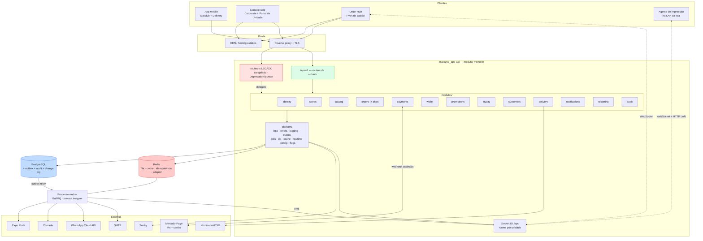

# 06 — Arquitetura de back-end

> PARTES 5, 6 e 10 do briefing. Decisão travada: **evoluir a API existente (`matsuya_app-api`) como modular monolith**, no mesmo repositório, sem NestJS e sem serviço novo. Este capítulo define a estrutura-alvo, o namespace `/api/v1`, a estratégia de congelamento do legado, e as garantias de concorrência e idempotência.

---

## 1. Por que modular monolith, e não microsserviços

| Fator | Leitura |
|---|---|
| Tamanho do time | 1 a 3 pessoas, sem experiência prévia com fila, teste automatizado ou CI. Microsserviços multiplicam por N o custo de deploy, observabilidade e depuração |
| Escala | 6 a 12 unidades, algumas centenas de pedidos por dia. Nenhum componente tem perfil de escala independente |
| Transações | Pedido + pagamento + carteira precisam de consistência. Num monolito isso é **uma transação de banco**; distribuído, é uma saga com compensação para cada passo |
| Custo | Um processo Node + um Postgres + um Redis. Qualquer coisa além disso é despesa sem retorno neste estágio |
| Evolução | Fronteiras de módulo bem definidas permitem extrair um contexto depois. Fronteiras que não existem hoje não vão aparecer sozinhas depois |

**Escolha:** um processo, um banco, uma unidade de deploy. **Redis entra** como infraestrutura nova (fila, cache de permissão, idempotência, rate limit e, mais tarde, adapter do Socket.IO). Nada além disso.

Kafka, RabbitMQ, SQS, CQRS e event sourcing são **rejeitados explicitamente** neste estágio, e o motivo está registrado em [13 §3](./13-eventos.md).

---

## 2. Estado-alvo

| Dimensão | Hoje | Alvo (fim da Fase 3) |
|---|---|---|
| Roteamento | um `src/routes.ts` plano de 508 linhas, sem prefixo | roteador legado congelado + `/api/v1` modular |
| Organização | `controllers/` `services/` `models/` planos | `src/modules/<contexto>/…` + `src/platform/…`, pastas legadas congeladas |
| Autorização | `role STRING` com 3 valores, `ensureRole` usado uma vez | tabelas RBAC + permissões + escopo multivalorado + repositório que impõe escopo |
| Catálogo | linhas `products` duplicadas por unidade + gambiarra `cart/remap` | catálogo mestre da rede + override por unidade; `products` vira projeção derivada |
| Assíncrono | chamadas HTTP inline, fire-and-forget | outbox transacional → workers BullMQ/Redis |
| Tempo real | inexistente | Socket.IO no processo + endpoint de resync por cursor |
| Pagamentos | inexistente | contexto `payments` + webhook + registro de idempotência |
| Auditoria | inexistente | `audit_logs` gravado na mesma transação da mutação |
| Operação | ts-node em produção, `dist/` e `.env.*` versionados, `console.log` | `node dist/`, segredos em env, pino + request-id + Sentry, Docker + GitHub Actions |

---

## 3. Estrutura de diretórios

```
src/
  server.ts                     # enxuto: apenas composition root
  routes.ts                     # ⛔ ROTEADOR LEGADO CONGELADO (só bug e segurança)
  controllers/                  # ⛔ legado congelado (25 arquivos)
  services/                     # ⛔ legado congelado (30 arquivos)
  models/                       # ✅ COMPARTILHADO — permanece central (ver §3.2)
  database/                     # migrations + seeders (ferramental inalterado)
  adminjs/                      # inalterado; aposentado na Fase 4

  platform/                     # transversal, de ninguém, usado por todos
    http/
      app.ts                    # montagem do app Express (extraída de server.ts)
      apiV1.ts                  # monta todo router de módulo sob /api/v1
      middlewares/
        requestContext.ts       # AsyncLocalStorage: requestId, actor, scope, ip, ua
        requestId.ts
        requestLogger.ts        # pino-http
        errorHandler.ts         # ÚLTIMO middleware; mapeia AppError → HTTP
        authenticate.ts         # verificação de JWT v1 (sem ida ao banco)
        authorize.ts            # authorize('orders:accept', scopeFrom.param('storeId'))
        idempotency.ts          # tratamento do header Idempotency-Key
        rateLimit.ts
        validate.ts             # schema zod → 422
        deprecation.ts          # headers Deprecation/Sunset nas rotas legadas
    errors/AppError.ts
    logging/logger.ts
    events/
      DomainEvent.ts
      outbox.ts                 # publish(event, { transaction })  → INSERT outbox_messages
      relay.ts                  # worker de relay do outbox
      registry.ts               # tipo de evento → schema zod do payload
    jobs/
      queues.ts                 # definição das filas BullMQ
      worker.ts                 # entrypoint do processo worker (npm run worker)
      handlers/                 # um arquivo por tipo de job
    db/
      transaction.ts            # helper withTransaction(fn)
      ScopedRepository.ts       # ⚠️ ponto de imposição do escopo por unidade
    cache/redis.ts
    realtime/
      io.ts                     # servidor Socket.IO + adapter
      namespaces/ops.ts
    config/index.ts             # env validado por zod, fonte única
    featureFlags/index.ts

  modules/
    identity/                   # usuários, sessões, papéis, permissões, escopos
      routes.ts controller.ts service.ts repository.ts dto.ts events.ts
    stores/
    catalog/
    orders/
      routes.ts controller.ts
      orderService.ts  orderStateMachine.ts  orderRepository.ts
      chat/                     # submódulo, escopo de pedido
      dto/ events.ts
    payments/
    wallet/
    promotions/
    loyalty/
    customers/
    delivery/
    notifications/
    reporting/
    audit/
```

### 3.1 Regra do que vai onde

| Pergunta | Regra |
|---|---|
| Endpoint novo? | Sempre em `src/modules/<ctx>/routes.ts`, sob `/api/v1`. **Nunca** em `src/routes.ts` |
| Bug num endpoint legado? | Corrigir no arquivo legado, sem refatorar. Se for bug de **regra de negócio**, mover a regra para o serviço do módulo e fazer o controller legado chamá-la |
| Endpoint legado precisa de gêmeo v1? | Escrever o serviço do módulo e **reescrever o controller legado como um delegate de 5 linhas**. Duas rotas, uma implementação, zero deriva |
| Chamada entre módulos? | Só pela **interface pública do serviço** do outro módulo (`import { catalogService } from '../catalog/service'`). Nunca o repositório nem o model alheio |
| **Escrita** entre módulos? | Proibida de forma síncrona entre contextos, exceto dentro de um orquestrador explícito (checkout). Caso contrário: emitir evento de domínio pelo outbox |
| Preciso de uma tabela de outro módulo? | Ler pelo serviço dele, ou por uma view somente-leitura documentada. **Nunca** um `Model.findAll` na tabela alheia |

A imposição inicial é por convenção e revisão de código; na Fase 2 entra uma regra de ESLint `no-restricted-imports` (o `repository.ts` de um módulo só é importável de dentro da própria pasta) — barata e mecânica.

### 3.2 Por que os models continuam em `src/models/`

As associações Sequelize são declaradas centralmente em `src/models/index.ts`, e as consultas do domínio dependem delas. Distribuir os models pelos módulos exigiria reescrever essa camada de associações — trabalho puro de refatoração, com risco em código de produção e nenhum ganho funcional. Os models continuam compartilhados; **a fronteira é imposta na camada de repositório**, não na de model. Um módulo só toca o próprio repositório, e o repositório é o único lugar onde um model é acessado.

---

## 4. `/api/v1` e o congelamento do legado

O caminho `/api/v1` está livre: hoje só existem `GET /api`, `GET /api/spec.json` e `GET /api/app-version*` sob `/api`, e nenhum colide.

**Mecânica do congelamento:**

1. Comentário no cabeçalho de `src/routes.ts`: *FROZEN — nenhuma rota nova. Ver `src/modules/`.* Mais uma checagem de CI que **reprova o build se a contagem de linhas de `src/routes.ts` aumentar**.
2. `deprecation.ts` adiciona `Deprecation: true`, `Sunset: <data RFC 1123>` e `Link: </api/v1/…>; rel="successor-version"` em toda resposta legada, e registra `{route, appVersion, platform, userId}`. **Esse log é o painel da migração**: uma rota é aposentada quando o tráfego não-mobile é zero e o tráfego mobile está abaixo do piso de atualização forçada.

**Alavanca de migração do app (já existe no código):** `app_versions` tem `min_version` e `force_update`, e o cliente consulta `GET /api/app-version`.

| Passo | Ação | Risco |
|---|---|---|
| 1 | Publicar o gêmeo v1; o legado delega ao mesmo serviço | nenhum |
| 2 | Publicar build N do app chamando só `/api/v1` | nenhum (os dois no ar) |
| 3 | Esperar ≥ 60 dias observando o tráfego legado por versão de app | nenhum |
| 4 | Subir `min_version` para N com `force_update = true` | usuários de builds antigos precisam atualizar |
| 5 | Rota legada devolve `410 Gone` por 30 dias, depois é removida | builds antigos já bloqueados |

**Nunca aposentar `POST /auth/login` nem `GET /api/app-version`** — são o caminho de bootstrap e precisam responder para sempre.

**Envelope de resposta v1** (só na v1; as formas legadas ficam intactas):

```jsonc
// sucesso
{ "data": {...}, "meta": { "requestId": "…", "page": { "limit": 50, "cursor": "…" } } }
// erro
{ "error": { "code": "ORDER_STATUS_CONFLICT", "message": "…", "details": [...], "requestId": "…" } }
```

---

## 5. Diagrama arquitetural (PARTE 6)



---

## 6. Concorrência e idempotência

Este é o ponto mais crítico do sistema. Cada cenário tem uma estratégia nomeada e um idioma concreto.

### 6.1 Dois operadores aceitam o mesmo pedido — lock otimista com guarda de status

```ts
// modules/orders/orderRepository.ts
const [affected] = await Order.update(
  { status: 'confirmed', version: sequelize.literal('version + 1'),
    acceptedAt: new Date(), acceptedBy: ctx.actor.userId },
  { where: { id, status: 'pending', version: expectedVersion,
             unityId: { [Op.in]: ctx.scope.unitIds } }, transaction: t }
);
if (affected === 0) {
  const current = await Order.findByPk(id, { transaction: t });
  throw new ConflictError('ORDER_STATUS_CONFLICT',
    { currentStatus: current?.status, currentVersion: current?.version });
}
```

Migration adiciona `orders.version int NOT NULL DEFAULT 0`. O `where` carrega **tanto a versão** (detecta qualquer edição concorrente) **quanto o status** (codifica a máquina de estados na camada de armazenamento). O `version: true` nativo do Sequelize é deliberadamente **não** usado: lança um `OptimisticLockError` opaco e não permite acrescentar o predicado de status. O cliente envia `If-Match: <version>`; no 409, a resposta traz o estado atual, para o Hub re-renderizar sem nova ida ao servidor.

### 6.2 Webhook de pagamento duplicado — idempotência por inserção

```sql
CREATE TABLE payment_provider_events (
  provider          text NOT NULL,
  provider_event_id text NOT NULL,
  payload           jsonb NOT NULL,
  signature_ok      boolean NOT NULL,
  received_at       timestamptz NOT NULL DEFAULT now(),
  processed_at      timestamptz,
  PRIMARY KEY (provider, provider_event_id)
);
```

```ts
const [row, created] = await PaymentProviderEvent.findOrCreate({
  where: { provider, providerEventId: eventId },
  defaults: { payload: body, signatureOk: true }, transaction: t
});
if (!created) { await t.commit(); return res.status(200).json({ ok: true, duplicate: true }); }
await paymentsService.applyProviderEvent(row, { transaction: t });
```

**Sempre responder `200` a uma duplicata** — qualquer não-2xx faz o provedor reenviar para sempre. A verificação de assinatura acontece **antes** da inserção, sobre o corpo cru, então `express.raw({type:'application/json'})` precisa ser montado na rota do webhook **antes** do `express.json()` — bug comum e silencioso. Provedores também reordenam: `applyProviderEvent` recusa mover `paid → pending` afirmando uma precedência de estado, e não confiando na ordem de chegada.

### 6.3 Duplo clique do cliente — `Idempotency-Key`

```sql
CREATE TABLE idempotency_keys (
  key             text NOT NULL,
  user_id         int  NOT NULL,
  endpoint        text NOT NULL,
  request_hash    text NOT NULL,      -- sha256(método + path + corpo canônico)
  status          text NOT NULL,      -- 'in_progress' | 'completed'
  response_status int, response_body jsonb,
  created_at      timestamptz NOT NULL DEFAULT now(),
  expires_at      timestamptz NOT NULL DEFAULT now() + interval '24 hours',
  PRIMARY KEY (key, user_id)
);
```

Middleware aplicado a `POST /orders`, `POST /orders/:id/accept|reject|cancel`, `POST /payments/*` e `POST /wallet/adjust`:

- `findOrCreate` com `status='in_progress'`; criado → segue e grava a resposta ao final.
- Existe + `completed` + mesmo `request_hash` → **replica a resposta armazenada, literalmente**.
- Existe + `completed` + hash **diferente** → `422 IDEMPOTENCY_KEY_REUSED` (é bug de cliente e precisa ser barulhento).
- Existe + `in_progress` → `409 REQUEST_IN_PROGRESS` com `Retry-After: 1`.

### 6.4 Cancelamento correndo contra a captura do pagamento — lock pessimista

```ts
await sequelize.transaction(async t => {
  const order = await Order.findByPk(id, { lock: t.LOCK.UPDATE, transaction: t }); // SELECT … FOR UPDATE
  if (TERMINAL.includes(order.status)) throw new ConflictError('ORDER_ALREADY_TERMINAL');
  await orderRepo.transition(order, 'cancelled', { reason, t });
  if (order.paymentStatus === 'paid')         await outbox.publish(refundRequested(order), { transaction: t });
  else if (order.paymentStatus === 'pending') await outbox.publish(paymentVoidRequested(order), { transaction: t });
  await walletService.releaseHolds(order.id, { transaction: t });
});
```

O handler do webhook toma o **mesmo** lock `FOR UPDATE` na mesma linha, então cancelamento e captura serializam estritamente. Quem perde vê o estado já commitado do outro: captura-depois-de-cancelamento **não ressuscita o pedido** — ela enfileira um estorno.

**A ordem de lock é fixa em todo o sistema — `orders` → `payments` → `wallet_*` — tornando deadlock estruturalmente impossível.**

### 6.5 Duplo gasto de cashback — regra vinculante

O detalhe está em [10](./10-cashback-ledger.md), mas a regra de lock é fixada aqui e é **vinculante** sobre aquele capítulo:

> Toda mutação de saldo adquire `pg_advisory_xact_lock(hashtext('wallet:' || user_id))` como **primeira instrução** da transação, e então recalcula o saldo disponível **dentro** dessa transação. Um checkout **nunca debita**: ele grava uma reserva com TTL, convertida em débito no `payment.captured` e liberada no cancelamento ou na expiração. A tabela de lançamentos é **append-only** (sem UPDATE, sem DELETE) e carrega um `UNIQUE (source_type, source_id)`, de modo que reprocessar qualquer evento jamais credita em dobro.

Lock consultivo em vez de `SELECT … FOR UPDATE` numa linha de saldo porque o ledger não tem uma linha única para travar — e porque nos recusamos a transformar uma linha de saldo disputada na fonte da verdade; ela permanece projeção.

---

## 7. Auditoria

```sql
CREATE TABLE audit_logs (
  id            bigserial PRIMARY KEY,
  occurred_at   timestamptz NOT NULL DEFAULT now(),
  actor_user_id int NULL REFERENCES users(id),
  actor_type    text NOT NULL DEFAULT 'user',   -- 'user' | 'system' | 'integration'
  actor_label   text NULL,                      -- nome/e-mail desnormalizado: sobrevive à exclusão do usuário
  action        text NOT NULL,                  -- 'orders.accept', 'catalog.price.override'
  entity_type   text NOT NULL,
  entity_id     text NOT NULL,
  unity_id      int  NULL,                      -- escopo para a UI do Corporate
  old_values    jsonb NULL,                     -- apenas as chaves alteradas
  new_values    jsonb NULL,
  metadata      jsonb NULL,                     -- motivo, ticket, totais antes/depois
  ip            inet NULL,
  user_agent    text NULL,
  request_id    text NULL,                      -- junta com a linha de log do pino
  created_at    timestamptz NOT NULL DEFAULT now()
);
CREATE INDEX audit_entity ON audit_logs (entity_type, entity_id, occurred_at DESC);
CREATE INDEX audit_actor  ON audit_logs (actor_user_id, occurred_at DESC);
CREATE INDEX audit_unity  ON audit_logs (unity_id, occurred_at DESC);
CREATE INDEX audit_action ON audit_logs (action, occurred_at DESC);
```

**Regras:**

1. `transaction` é **parâmetro obrigatório** para toda ação da lista crítica. Se a mudança de negócio der rollback, a linha de auditoria dá rollback junto — sem registro fantasma e, mais importante, **sem mudança commitada sem o seu registro**.
2. Só as **chaves alteradas** são gravadas (via helper `diff(before, after)`), e uma lista de redação (`password`, `resetCode`, `token`, `document`, `cpf`, dados de cartão) substitui o valor por `'[redacted]'`. Snapshot de linha inteira faria de `audit_logs` a maior tabela do banco em um ano.
3. `actor_label` é desnormalizado para que o log continue legível depois que um usuário for excluído — a exclusão por LGPD remove o dado pessoal e preserva a trilha.
4. **Append-only**: o papel da aplicação não recebe grant de `UPDATE` nem `DELETE` nessa tabela.

**Lista crítica (na transação, não negociável):** toda transição de status de pedido, ajuste de item, cancelamento e estorno, todos os ajustes e créditos manuais de carteira, overrides de preço e edições do catálogo mestre, concessão e revogação de papel, criação e desativação de usuário, mudanças de configuração/horário/pausa de loja, mudanças de promoção e cupom, exportações de relatório contendo PII, e sucesso/falha de login e eventos de MFA (estes dois fora de transação de negócio, na sua própria).

**Não auditado:** leituras e listagens comuns (volume alto, valor nulo), com **uma exceção** — `reports:export` e qualquer visualização de detalhe com PII de cliente, por obrigação de trilha de acesso da LGPD.

**Retenção:** 12 meses quentes, com **particionamento declarativo mensal por `occurred_at` desde o dia 1**, para que o arquivamento seja `DETACH PARTITION` + dump, e não um `DELETE` varrendo a tabela. Ações financeiras e de identidade retidas por 5 anos.

**Exposição:** `GET /api/v1/audit?entityType&entityId&actorUserId&action&unityId&from&to&cursor` sob `audit:read`, filtrado por escopo como tudo o mais. Mais uma aba "Histórico" **em toda tela de detalhe** de pedido, usuário e item de catálogo — auditoria que não está a um clique da entidade não é usada.

---

## 8. Operação e deploy

### 8.1 Correções obrigatórias

| Problema | Correção |
|---|---|
| `"start": "ts-node dist/server.js"` | `"start": "node dist/server.js"`, `"build": "tsc -p ."`, `ts-node` para `devDependencies`. Rodar o loader de TypeScript sobre JS já compilado custa ~1 s de boot, memória, e coloca uma dependência de desenvolvimento no caminho de confiança de produção |
| `dist/` versionado | `git rm -r --cached dist` + `dist/` no `.gitignore`. Build no CI/Docker |
| `.env.development` / `.env.production` versionados | `git rm --cached .env.*`, `.env*` no `.gitignore` (mantendo `!.env.example`), **rotacionar toda credencial** (banco, Twilio, Comtele, WhatsApp, SMTP, Expo) e **assumir comprometimento total** — revisar logs de acesso e uso dos provedores |
| Sem validação de configuração | `src/platform/config/index.ts` parseia `process.env` com zod no boot e **sai com código diferente de zero** se faltar chave obrigatória. Falhar no deploy, não às 2 da manhã na primeira requisição que precisa de `TWILIO_SID` |
| CORS hardcoded (`server.ts:10-22`) | `CORS_ORIGINS` por env, separado por vírgula, lido no boot — as três origens novas viram configuração, não deploy |

### 8.2 Docker, CI e migrations

**Dockerfile** multi-stage: builder `node:20-alpine` roda `npm ci && npm run build`; o estágio de runtime copia `dist/`, `package*.json` e `public/`, roda `npm ci --omit=dev`, cai para o usuário `node`, define `HEALTHCHECK` em `/healthz` e `CMD ["node","dist/server.js"]`. Um segundo alvo `worker` com `CMD ["node","dist/platform/jobs/worker.js"]` — **mesma imagem, comando diferente**, para que API e workers nunca divirjam de versão.

**CI (GitHub Actions).** Em PR: `tsc --noEmit`, ESLint, `jest`, `npm audit --audit-level=high`, mais duas guardas próprias (congelamento da contagem de linhas de `src/routes.ts`; nenhum acesso cru a model fora dos repositórios). Um segundo job sobe um serviço `postgres:15` e roda **migrations up → down → up** num banco limpo — isso pega o `down()` quebrado ou ausente, que é a falha de migration mais comum e a que torna rollback impossível.

**Migrations — expand/contract, sempre:**

1. Nunca renomear ou remover uma coluna na mesma release que para de usá-la: adicionar nova, escrever nas duas, backfill, trocar as leituras, remover **uma release depois**.
2. Coluna nova é anulável ou tem default.
3. `NOT NULL` só entra depois de backfill, numa migration posterior.
4. Índice em tabela com dado real usa `CREATE INDEX CONCURRENTLY`, em migration de query crua, fora de transação.
5. Toda migration tem `down()` testado.

Isso também resolve o `orders.address_snapshot` divergente (NOT NULL na migration, anulável no model): remove-se o `NOT NULL`, que é a direção correta — pedidos de retirada legitimamente não têm endereço.

**Rollback:** rollback de aplicação é redeploy da imagem anterior (instantâneo, porque as migrations são retrocompatíveis pela regra acima). Rollback de banco é o **último** recurso: o `down()` existe e é testado no CI, mas a preferência operacional é sempre corrigir para a frente. `pg_dump` diário automatizado + PITR com 7 dias, e **um ensaio de restauração por trimestre** — backup não testado não é backup.

**Feature flags:** tabela `feature_flags` (`key`, `enabled`, `rollout_units int[]`, `rollout_percent`, `updated_by`), cacheada 30 s no Redis, lida por `flags.enabled('orders.v2_state_machine', { unityId })`. Toda superfície nova sai atrás de flag com lista de rollout por unidade — é assim que um Order Hub novo entra no ar numa loja piloto sem branch.

**Ambientes:** `local` (Docker Compose com Postgres + Redis semeados), `dev` (deploy automático de `develop`), `staging` (formato de produção, com cópia anonimizada, onde as migrations são ensaiadas) e `prod`. A **mesma imagem** é promovida dev → staging → prod; só a configuração muda.
