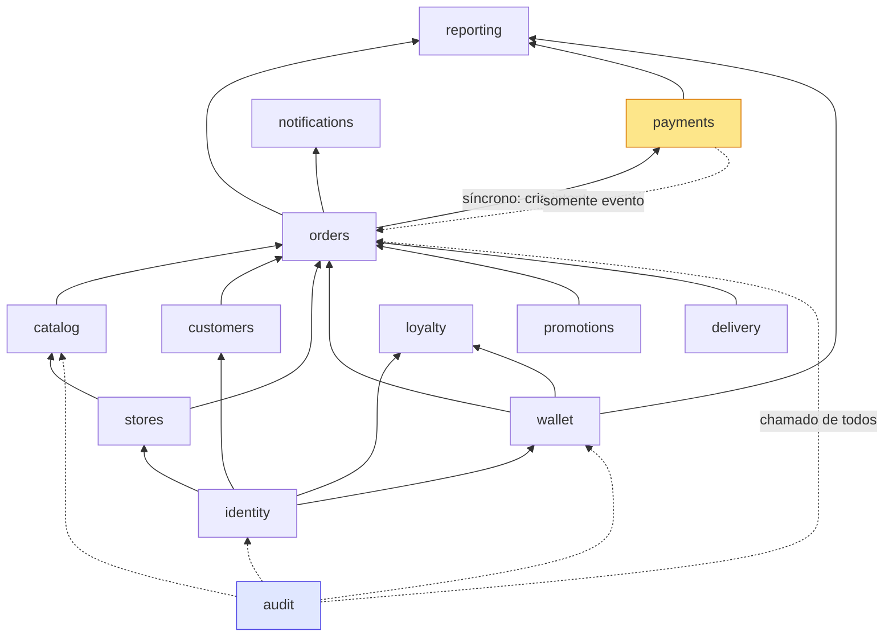

# 07 — Domínios (bounded contexts)

> PARTE 7 do briefing. O briefing propôs 17 contextos. **Sete são fundidos ou descartados.** Sobram **11 contextos + 1 kernel de plataforma**.

---

## 1. Veredito sobre a lista proposta

O risco real aqui não é subdividir de menos — é subdividir demais. Dezessete contextos para uma rede de 12 lojas significa dezessete pastas com um arquivo cada e muita cerimônia.

| Proposto | Veredito | Motivo |
|---|---|---|
| Identity + Authorization | **FUNDIR → `identity`** | Papéis e permissões não significam nada sem o usuário a que se prendem; mesmo time, mesmo conjunto de migrations, sempre implantados juntos. Uma decisão de autorização é **sempre um fato sobre um usuário** |
| Catalog/Menu + Pricing | **FUNDIR → `catalog`** | "Pricing" aqui é `base_price` + override por unidade + preço promocional. Motor de precificação é preocupação futura; uma pasta para ele hoje é cerimônia vazia. A extração depois é trivial, porque a resolução de preço já é uma função só |
| Orders + Checkout | **FUNDIR → `orders`** | Checkout é um *caso de uso* (`orders.checkout()`), não um contexto. Não possui nenhuma tabela que o pedido já não possua |
| Chat | **FUNDIR → submódulo `orders/chat`** | Toda thread é escopada a um pedido ou a uma loja; compartilha as rooms de socket e o escopo RBAC de pedidos. Tabelas próprias, rotas próprias, **dentro** da fronteira de orders |
| Support | **DESCARTAR** | Não existe organização de suporte. "Suporte" é um pacote de permissões (`orders:refund`, `wallet:adjust`, `orders:cancel:any`) concedido a papéis do Corporate, mais o chat e a auditoria que já existem. Recriar como contexto no dia em que houver um time de suporte |
| Customers | **MANTER, magro** | Não guarda credencial alguma. Guarda o lado CRM. Justifica-se porque o Corporate precisa de visão 360 do cliente sem tocar em autenticação |
| Reporting/Analytics | **MANTER, somente leitura** | Não possui nenhuma tabela de negócio; possui só `report_exports`. Existe justamente para impedir que SQL de relatório vaze para os módulos de escrita |
| Audit | **MANTER, nível de plataforma** | Transversal, não é contexto de negócio. Vive em `modules/audit`, mas é chamado de todo lugar |
| Delivery/Logistics | **MANTER** | Zonas, cotação de frete, entregadores e despacho têm ciclo próprio e são o ponto de integração futura com frota terceirizada |
| Loyalty | **MANTER, separado de wallet** | Plano e assinatura têm ciclo de vida próprio; carteira é dinheiro. Fundir tornaria impossível mudar a regra de nível sem tocar no ledger |

---

## 2. Catálogo de contextos

| Contexto | Responsabilidade | Tabelas que possui | Pode ler de |
|---|---|---|---|
| **identity** | Autentica humanos (clientes, gerentes, corporativo) e responde "quem é este e o que pode fazer, onde". Possui credenciais, sessões/refresh tokens, MFA, o modelo de papel/permissão e seus escopos de unidade. Emite os JWTs e é o **único módulo autorizado a escrever em `users`** | `users`, `sessions`, `roles`, `permissions`, `role_permissions`, `user_roles`, `mfa_factors`, `password_resets` | stores (para validar ids de escopo) |
| **stores** | A unidade como entidade operacional: identidade, endereço e geo, horários, pausas temporárias ("fechado por 30 min"), tempo de preparo, configuração de impressora, canais (delivery/retirada), e os **grupos de loja** usados para escopo de autorização e consolidação no Corporate | `unity`, `store_settings`, `store_opening_hours`, `store_pauses`, `store_groups`, `store_group_units` | — |
| **catalog** | Catálogo mestre da rede (itens, categorias, grupos de opção, opções, SKUs) mais os overrides por unidade (disponibilidade, preço dentro da política, posição, indisponível-até). Responde "qual é o cardápio da unidade X agora, a que preço". **Autoridade única sobre resolução de preço** | `catalog_categories`, `catalog_items`, `catalog_option_groups`, `catalog_options`, `unit_catalog_items`, `unit_catalog_options`, e as legadas `products` / `product_categories` / `product_option_*` como projeções derivadas | stores (estado de abertura), promotions (preço promocional) |
| **orders** | O agregado Pedido e seu ciclo de vida: criação (orquestração de checkout), máquina de estados, ajuste de itens, cancelamento parcial, ETA, eventos de status, avaliações, e o **log de mudanças por loja** que alimenta o resync do Order Hub. Contém o submódulo `chat` | `orders`, `order_items`, `order_status_events`, `order_adjustments`, `order_reviews`, `store_change_log`, `chat_threads`, `chat_messages` | catalog, customers, stores, wallet, payments, delivery, promotions |
| **payments** | Tudo que envolve movimento de dinheiro com terceiro: intents, webhooks do provedor, capturas, estornos, chargebacks, conciliação. **Único módulo que guarda credencial de provedor.** Mantido separado de orders porque é uma *fronteira de confiança externa*, com semântica própria de idempotência e retry | `payments`, `payment_events`, `payment_provider_events`, `refunds` | orders (somente leitura, para conciliar) |
| **wallet** | O ledger de cashback: lançamentos append-only, projeção de saldo, reservas durante o checkout, expiração, ajustes manuais. Absorve a acumulação legada de `points` e a deduplicação de leitura de QR — **são o mesmo ledger visto por duas portas** | `wallet_accounts`, `wallet_entries`, `wallet_lots`, `wallet_lot_consumptions`, `wallet_holds`, `points` (legado), `qrcode_uses` | identity, orders |
| **promotions** | Campanhas, cupons/vouchers, tipos de desconto, elegibilidade por unidade, janelas de tempo, limites de uso. Responde "quais descontos se aplicam a este carrinho" e reserva cupons de uso único. Vouchers fundidos aqui: **um cupom é uma promoção com código** | `promotions`, `promotion_unities`, `promotion_timeline`, `vouchers`, `voucher_types`, `voucher_discount_types`, `coupon_redemptions` | catalog, customers, stores |
| **loyalty** | Programa de associação: planos, benefícios, assinaturas Matclub e seu ciclo. Distinto de wallet (dinheiro) e de promotions (campanhas), porque o estado de assinatura tem ciclo próprio | `plans`, `plans_benefits`, `matclub_subscribers` | identity, wallet |
| **customers** | A visão CRM do cliente: enriquecimento de perfil, endereços salvos, consentimentos/LGPD, tags e notas, segmentação para campanha, consolidação de histórico. **Não escreve nenhum dado de credencial** | `addresses`, `customer_notes`, `customer_tags`, `customer_consents` | identity (leitura), orders (leitura), wallet (leitura) |
| **delivery** | Logística de cumprimento: zonas de entrega, cotação de frete, cadastro e atribuição de entregadores, estado de despacho e, depois, integração com frota de terceiros | `delivery_zones`, `couriers`, `order_dispatches` | stores, orders |
| **notifications** | Mensageria de saída em Expo Push, SMS (Comtele), WhatsApp Cloud API e e-mail. Possui templates, preferências por usuário, tokens de dispositivo, recibos de entrega e o log de saída. **Todo envio é um job, nunca uma chamada HTTP inline** | `notification_templates`, `notification_preferences`, `device_tokens`, `outbound_messages` | identity, orders (só por evento) |
| **reporting** | Agregação somente-leitura para o Corporate: vendas, ticket médio, SLA, cancelamento, cashback; exportações assíncronas. **Não possui nenhuma tabela de negócio** | `report_exports`, views materializadas `mv_*` | tudo, somente leitura |
| **audit** *(plataforma)* | Registro imutável de quem fez o quê em qual entidade. Chamado de dentro das transações de negócio | `audit_logs` | — |
| **kernel de plataforma** | Não é contexto. Outbox, jobs, idempotência, feature flags, configuração, logging, tempo real, contexto de requisição | `outbox_messages`, `idempotency_keys`, `job_executions`, `feature_flags` | — |

---

## 3. Regra de dependência

As setas apontam **para baixo** na tabela: `identity` e `stores` na base, `reporting` no topo.

O único ciclo potencial do grafo é `orders ↔ payments`, e ele é quebrado por assimetria deliberada:

- **`orders → payments` é síncrono** (criar intent de pagamento no checkout);
- **`payments → orders` é apenas por evento** (`payment.captured` → outbox → job → `orderService.markPaid`).

Essa assimetria é o que permite que o contexto de pagamentos seja extraído para um serviço próprio no futuro sem reescrever o de pedidos.

---

## 4. O que isso muda na prática

1. **`Support` não vira pasta.** Vira um pacote de permissões no seeder de RBAC ([15](./15-rbac.md)). No dia em que existir um time de suporte com fluxo próprio de ticket, cria-se o contexto — e nada do que está aqui precisa mudar para isso acontecer.
2. **`Chat` mora dentro de `orders`.** Tem tabelas e rotas próprias, mas compartilha o escopo RBAC e as rooms de socket do pedido. Extraí-lo depois é mover uma pasta.
3. **`Pricing` não existe como contexto.** A resolução de preço é uma função (`catalog/priceResolver.ts`) com três regras em ordem fixa. Quando virar motor — precificação dinâmica, preço por horário, surge —, essa função é o ponto de extração.
4. **`Wallet` é dono do dinheiro do cliente; `loyalty` é dono do relacionamento.** Um nível não muda saldo; um saldo não muda nível. O acoplamento entre eles é um evento (`orders.order.delivered` → wallet credita → loyalty recalcula o nível).
5. **`Reporting` não possui tabela de negócio.** Isso é o que impede o padrão atual em que a margem financeira é calculada no navegador sobre um payload não paginado.
