# 08 — Banco de dados

> PARTE 8 do briefing. PostgreSQL, Sequelize, `underscored: true` global. Este capítulo cobre o modelo-alvo, o ERD, e o problema mais estrutural do schema atual: **o catálogo é duplicado por unidade**.

---

## 1. Princípios

1. **Expand/contract sempre.** Nenhuma coluna é renomeada ou removida na mesma release que para de usá-la ([06 §8.2](./06-arquitetura-backend.md)).
2. **Dinheiro é `BIGINT` em centavos** nas tabelas novas. `FLOAT` não representa R$ 0,10, e um ledger cujo invariante é `SUM(lançamentos) == saldo` é inimplementável sobre ponto flutuante ([10 §0](./10-cashback-ledger.md)).
3. **Snapshot em vez de join** onde o histórico importa. `order_items` já congela nome, preço unitário e opções — é o que permite reestruturar o catálogo sem corromper pedidos antigos.
4. **Nenhuma tabela nova sem dono.** Cada tabela pertence a exatamente um contexto ([07](./07-dominios.md)); ninguém mais a lê diretamente.
5. **Toda tabela com escopo de unidade carrega `unity_id`**, para que o `ScopedRepository` tenha onde aplicar o predicado ([15 §6](./15-rbac.md)).

---

## 2. Catálogo: o problema, dito com precisão

`products.unity_id` é **NOT NULL**. "Temaki Salmão" existe como 12 linhas diferentes, com 12 ids, 12 preços e 12 históricos de edição independentes.

Consequências já visíveis hoje:

- `POST /delivery/units/:unityId/cart/remap` existe **puramente** para traduzir um carrinho entre unidades quando o cliente troca de loja no checkout.
- O Corporate não consegue mudar um preço — teria de mudar 12.
- Um item novo exige 12 criações.
- Não existe nenhum conceito de "cardápio da rede".

### 2.1 Modelo-alvo

```
catalog_categories        (mestre da rede)
catalog_items             (mestre da rede — o "produto")
catalog_option_groups     (mestre da rede)
catalog_options           (mestre da rede)
unit_catalog_items        (override por unidade)  ← a ÚNICA tabela que o Store Manager escreve
unit_catalog_options      (override de opção por unidade)
products / product_categories / product_option_*  ← PROJEÇÃO DERIVADA (ids legados preservados)
```

```sql
CREATE TABLE catalog_items (
  id             serial PRIMARY KEY,
  sku            text UNIQUE NOT NULL,             -- chave de negócio estável, usada no remap e no backfill
  category_id    int NOT NULL REFERENCES catalog_categories(id),
  name           text NOT NULL,
  description    text,
  image_url      text,
  base_price_cents bigint NOT NULL,
  price_policy   text NOT NULL DEFAULT 'fixed'
                 CHECK (price_policy IN ('fixed','range','free')),
  price_min_cents bigint, price_max_cents bigint,  -- obrigatórios quando policy='range'
  locked_fields  text[] NOT NULL DEFAULT '{name,description,image_url,sku,category_id}',
  status         text NOT NULL DEFAULT 'active'
                 CHECK (status IN ('draft','active','archived')),
  default_available boolean NOT NULL DEFAULT true, -- padrão de rollout para unidades novas
  created_at timestamptz DEFAULT now(), updated_at timestamptz DEFAULT now()
);

CREATE TABLE unit_catalog_items (
  id                serial PRIMARY KEY,
  unity_id          int NOT NULL REFERENCES unity(id) ON DELETE CASCADE,
  catalog_item_id   int NOT NULL REFERENCES catalog_items(id) ON DELETE CASCADE,
  listed            boolean NOT NULL DEFAULT true,  -- o item faz parte do cardápio desta unidade?
  available         boolean NOT NULL DEFAULT true,  -- botão de indisponível (gerente, instantâneo)
  unavailable_until timestamptz,                    -- volta sozinho ("falta até 19:00" / fim do dia)
  price_override_cents bigint,                      -- NULL = herda base_price
  position          int,                            -- NULL = herda a ordenação do mestre
  active_from       timestamptz, active_to timestamptz,  -- janela ativa por unidade (item só no almoço)
  updated_by        int REFERENCES users(id),
  updated_at        timestamptz NOT NULL DEFAULT now(),
  UNIQUE (unity_id, catalog_item_id)
);
CREATE INDEX uci_unit_listed ON unit_catalog_items (unity_id) WHERE listed;
```

**Ausência de linha = herança total.** Uma unidade sem nenhum override exibe o cardápio mestre completo, aos preços do mestre. É isso que mantém o onboarding de uma unidade nova como uma operação de um clique.

### 2.2 Resolução de preço — uma função só

```
preco_efetivo(item, unidade, agora) =
  1. promotions.promo_price(item, unidade, agora)   -- se houver promoção ativa mirando o item
  2. unit_catalog_items.price_override_cents        -- se definido E a política permitir
  3. catalog_items.base_price_cents
```

Guardada pela política: `fixed` → override ignorado **e rejeitado na escrita com 422**; `range` → o override precisa cair em `[price_min, price_max]`; `free` → qualquer valor positivo. Imposição no serviço é suficiente, porque `unit_catalog_items` tem exatamente **um** escritor.

Essa função é também o ponto de extração natural caso, no futuro, se queira um motor de precificação (preço por horário, surge, precificação dinâmica).

### 2.3 Quem controla o quê

| Campo | Corporate (`catalog:master:write`) | Store Manager |
|---|---|---|
| nome / descrição / imagem / SKU / categoria | ✅ | ❌ nunca (está em `locked_fields`) |
| preço base + política + faixa | ✅ | ❌ |
| item existe na rede | ✅ criar/arquivar | ❌ |
| listado nesta unidade | ✅ por unidade ou em massa | ⚠️ só se o Corporate marcar o item como opcional |
| **disponível + `unavailable_until`** | ✅ | ✅ **ação primária do gerente — precisa ser 2 toques e instantânea** |
| override de preço | ✅ | ✅ só quando `price_policy != 'fixed'`, dentro da faixa |
| posição | ✅ ordem mestre | ✅ reordenação local |
| janela ativa | ✅ | ✅ |
| disponibilidade de opção | ✅ | ✅ |

Toda escrita em `unit_catalog_items` emite `catalog.unit_item.changed` → socket `store:{id}:catalog` (o Portal da Unidade atualiza ao vivo) e invalida a chave de cache `menu:{unityId}:v{version}`.

### 2.4 Backfill e deduplicação — sem passo destrutivo

1. **Expandir.** Migration adiciona `products.catalog_item_id int NULL` com índice, e cria as seis tabelas novas.
2. **Agrupar.** Um script **somente-leitura** (`scripts/catalog-cluster-report.js`) normaliza `products.name` (minúsculas, sem acento, espaços colapsados, sufixos de tamanho removidos) e emite um CSV de clusters: `sku_proposto, nome_normalizado, [unity_id:product_id:preço]…`, mais uma coluna `price_spread`. **Deliberadamente um relatório, não uma fusão automática** — a deriva de nomenclatura ("Temaki Salmão" vs. "Temaki de Salmao G") não pode ser resolvida com segurança por algoritmo, e uma fusão errada corrompe o relatório histórico de pedidos.
3. **Revisão humana** em planilha; o Corporate confirma os SKUs e o nome/preço canônicos.
4. **Importar.** Script idempotente cria os `catalog_items` (preço base = preço modal entre as unidades) e, para cada produto legado, define `catalog_item_id` e cria uma linha em `unit_catalog_items` **apenas quando a linha legada divergir** do mestre (preço diferente → `price_override`; `active=false` → `available=false`). Inserir só na divergência mantém a tabela de override pequena e significativa.
5. **Não casados** (itens locais de uma loja só) ganham o próprio `catalog_item` com `default_available=false` e uma única linha de override — **"item local" é apenas um item mestre listado em uma unidade**. Não existe um segundo conceito.
6. **Contrair (Fase 3+).** `products` torna-se somente-leitura, mantida por um projetor: qualquer mudança no mestre ou no override reescreve as linhas afetadas **na mesma transação**. Isso preserva a estabilidade dos `product_id` legados para o app mobile, para o AdminJS e — criticamente — para as FKs de `order_items` e os relatórios históricos. `products` só é removida depois que o app estiver inteiramente na v1.

`order_items` já faz snapshot de nome e preço no momento do pedido, então pedidos históricos não são afetados por nada disso. **Verificar esse snapshot antes do passo 4**; se algum campo for join ao vivo, congelar antes.

### 2.5 O destino do `cart/remap`

**Ele se torna desnecessário — vale dizer isso com todas as letras.** O remap existe só porque o mesmo prato tem `product_id` diferente por unidade.

| Fase | O que acontece |
|---|---|
| 2 | `POST /delivery/units/:unityId/cart/remap` é reimplementado sobre `catalog_item_id` (lookup em vez de casamento aproximado por nome) — **mesma rota, mesma forma de resposta, resultado mais preciso, zero mudança no app**. `src/services/cartRemapService.ts` encolhe para um join |
| 3 | A v1 substitui por `POST /api/v1/carts/validate` (`{unityId, items:[{catalogItemId, qty, optionIds}]}` → por linha `{ok\|unavailable\|price_changed}` + totais recalculados). É estritamente mais útil: também pega itens indisponíveis e preços defasados, o que o remap nunca fez |
| 4 | A rota legada é aposentada junto com o resto do roteador plano |

---

## 3. ERD

```mermaid
erDiagram
  users ||--o{ user_roles : possui
  roles ||--o{ user_roles : concedido
  roles ||--o{ role_permissions : concede
  permissions ||--o{ role_permissions : em
  store_groups ||--o{ store_group_units : contem
  unity ||--o{ store_group_units : pertence
  users ||--o{ sessions : abre

  unity ||--o{ store_settings : configura
  unity ||--o{ store_opening_hours : abre_em
  unity ||--o{ store_pauses : pausa

  catalog_categories ||--o{ catalog_items : agrupa
  catalog_items ||--o{ catalog_option_groups : oferece
  catalog_option_groups ||--o{ catalog_options : contem
  catalog_items ||--o{ unit_catalog_items : sobrescrito_em
  unity ||--o{ unit_catalog_items : sobrescreve
  catalog_options ||--o{ unit_catalog_options : sobrescrito_em
  catalog_items ||--o{ products : projeta

  users ||--o{ addresses : salva
  users ||--o{ customer_consents : consente
  users ||--o{ customer_notes : anotado

  unity ||--o{ orders : recebe
  users ||--o{ orders : faz
  orders ||--o{ order_items : contem
  order_items ||--o{ order_adjustments : ajustado
  orders ||--o{ order_status_events : historia
  orders ||--o| order_reviews : avaliado
  orders ||--o{ chat_threads : conversa
  chat_threads ||--o{ chat_messages : contem
  products ||--o{ order_items : referenciado

  orders ||--o{ payments : cobra
  payments ||--o{ payment_events : registra
  payments ||--o{ refunds : estorna
  payment_provider_events }o--|| payments : concilia

  users ||--|| wallet_accounts : possui
  wallet_accounts ||--o{ wallet_entries : lanca
  wallet_accounts ||--o{ wallet_lots : acumula
  wallet_lots ||--o{ wallet_lot_consumptions : consumido
  wallet_entries ||--o{ wallet_lot_consumptions : consome
  wallet_accounts ||--o{ wallet_holds : reserva
  orders ||--o{ wallet_holds : origina

  plans ||--o{ plans_benefits : oferece
  plans ||--o{ matclub_subscribers : classifica
  users ||--o{ matclub_subscribers : assina

  promotions ||--o{ promotion_unities : vale_em
  unity ||--o{ promotion_unities : aceita
  promotions ||--o{ vouchers : gera
  vouchers ||--o{ coupon_redemptions : resgatado
  users ||--o{ coupon_redemptions : resgata

  unity ||--o{ delivery_zones : atende
  unity ||--o{ couriers : emprega
  orders ||--o| order_dispatches : despachado
  couriers ||--o{ order_dispatches : leva

  unity ||--o{ store_change_log : registra
  users ||--o{ audit_logs : audita
  outbox_messages }o--|| orders : origina
```



---

## 4. Tabelas por contexto

### identity
`users` (existente; ganha `permissions_version`, `disabled_at`, `mfa_enabled`) · `sessions` · `roles` · `permissions` · `role_permissions` · `user_roles` · `mfa_factors` · `password_resets` · `store_groups` · `store_group_units`
DDL completo em [15 §1](./15-rbac.md).

### stores
`unity` (existente, já com o bloco geográfico) · `store_settings` (SLA, tempo de preparo, canais, troco máximo, config de impressora) · `store_opening_hours` (grade semanal por canal + exceções e feriados) · `store_pauses` (`unity_id`, `paused_at`, `resume_at`, `reason`, `actor`)

### catalog
`catalog_categories` · `catalog_items` · `catalog_option_groups` · `catalog_options` · `unit_catalog_items` · `unit_catalog_options` · e as legadas `products`, `product_categories`, `product_option_groups`, `product_options` como projeção

### orders
`orders` (+ colunas de [09 §5](./09-pedidos.md)) · `order_items` (+ `cancelled_qty`, `catalog_item_id`) · `order_status_events` (existente) · `order_adjustments` · `order_reviews` (existente) · `store_change_log` ([14 §5](./14-websockets.md)) · `chat_threads` · `chat_messages`

### payments
`payments` · `payment_events` · `payment_provider_events` · `refunds` — DDL em [11](./11-pagamentos.md)

### wallet
`wallet_accounts` · `wallet_entries` · `wallet_lots` · `wallet_lot_consumptions` · `wallet_holds` · `points` (legado, vira fonte de lançamento) · `qrcode_uses` (existente) — DDL em [10](./10-cashback-ledger.md)

### promotions / loyalty
`promotions` · `promotion_unities` · `promotion_timeline` · `vouchers` · `voucher_types` · `voucher_discount_types` · `coupon_redemptions` · `plans` · `plans_benefits` · `matclub_subscribers` — todas existentes, exceto `coupon_redemptions`

### customers
`addresses` (existente) · `customer_notes` · `customer_tags` · `customer_consents`

### delivery
`delivery_zones` (existente; ganha suporte a polígono além de raio) · `couriers` · `order_dispatches`

### notifications
`notification_templates` · `notification_preferences` (hoje é um JSONB em `users`; migra para tabela) · `device_tokens` (hoje é `users.expo_push_token`, chaveado por telefone — passa a ser por usuário e dispositivo) · `outbound_messages`

### reporting / audit / plataforma
`report_exports` · views materializadas `mv_*` · `audit_logs` (particionada por mês) · `outbox_messages` · `idempotency_keys` · `job_executions` · `feature_flags`

---

## 5. Correções de integridade herdadas

| Problema | Correção | Quando |
|---|---|---|
| `points.user_document` é CPF em texto, sem FK e sem índice | Adicionar `ix_points_user_document` **imediatamente**; migrar para `customer_id` FK no backfill do ledger | Fase 0 (índice) / Fase 2 (FK) |
| `points.unity` é o **nome** da unidade, não FK | Resolver para `unity_id` no backfill; manter a coluna de nome durante a transição | Fase 2 |
| `users.document` sem unicidade garantida | `ux_users_document` (após limpeza de duplicatas) | Fase 0 |
| `orders.address_snapshot` NOT NULL na migration, anulável no model, e pedidos de retirada gravam null | `ALTER … DROP NOT NULL` — a direção correta, já que retirada legitimamente não tem endereço | Fase 0 |
| Dinheiro em `FLOAT` em `points` e `orders` | Colunas `*_cents bigint` novas, dual-write, backfill, troca de leitura, remoção | Fase 0 a 1 |
| `Point` sem nenhuma associação declarada | Resolvido pela migração para o ledger | Fase 2 |
| `audit_logs` inexistente | Criada já particionada por mês | Fase 0 |
| Sem índice em `orders (unity_id, status, created_at)` para o board do Hub | Índice composto criado com `CONCURRENTLY` | Fase 1 |

---

## 6. Views materializadas para relatório

Existem para tirar o SQL de agregação do caminho OLTP — hoje a margem financeira é calculada **no navegador** sobre um payload não paginado.

| View | Grão | Refresh |
|---|---|---|
| `mv_sales_daily` | unidade × dia × canal × meio de pagamento | cron 10 min |
| `mv_order_sla_daily` | unidade × dia: p50/p95 de aceite, preparo e entrega | cron 10 min |
| `mv_cancellations_daily` | unidade × dia × `reason_code` | cron 1 h |
| `mv_catalog_performance` | unidade × item × dia: quantidade, receita, indisponibilidade | cron 1 h |
| `mv_wallet_liability` | dia: emitido, usado, expirado, **saldo circulante** | cron 1 h |
| `mv_customer_rollup` | cliente: LTV, frequência, ticket médio, unidade preferida, último pedido | cron diário |

`mv_wallet_liability` é a mais importante das seis: é o **passivo de cashback** da empresa, e hoje ninguém consegue responder qual é.
