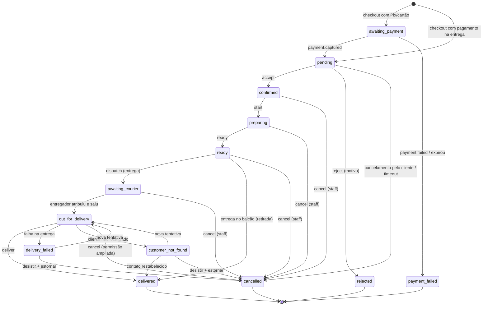

# 09 — Arquitetura de pedidos

> PARTE 9 do briefing. Ciclo de vida completo, máquina de estados e as garantias de consistência.

---

## 1. A máquina atual não é suficiente

`src/services/orderService.ts:48-55` define seis estados:

```
pending → confirmed → preparing → out_for_delivery → delivered
qualquer um dos quatro primeiros → cancelled
```

Falta tudo que o briefing pede e que a operação real produz: recusa pela loja (que é um KPI diferente de cancelamento pelo cliente), aguardando pagamento, falha de pagamento, pronto (o balcão de retirada e o ponto de entrega ao entregador), aguardando entregador, falha na entrega e cliente não localizado.

---

## 2. Máquina de estados alvo



### 2.1 O que **não** é estado

Duas coisas que o briefing lista como estado e que deliberadamente não são:

| Conceito | Como é modelado | Por quê |
|---|---|---|
| **Cancelamento parcial** | `orders.has_partial_cancellation` + `order_items.cancelled_qty` e `cancel_reason` + linhas em `order_adjustments`. O pedido **continua no estado em que estava** | Se fosse estado, o operador teria de tirar o pedido da fila de trabalho para consertar um item. É o oposto do que ele precisa às 12h30. A coluna do quadro tem de significar **onde o pedido está fisicamente** |
| **Reembolso** | `payment_status = 'refunded'` + lançamentos `REFUND` no ledger. Um pedido `delivered` reembolsado continua `delivered` | O ciclo financeiro é uma dimensão **ortogonal** ao ciclo operacional. Fundir os dois cria estados como "entregue-mas-estornado" que multiplicam a máquina sem informar nada |

### 2.2 Compatibilidade com o app mobile

`rejected`, `ready`, `awaiting_payment`, `payment_failed`, `awaiting_courier`, `delivery_failed` e `customer_not_found` são **strings aditivas**. O app precisa ser verificado quanto a `switch` exaustivo sobre status. Se for exaustivo, o **serializador legado** — e só ele — mapeia:

| Estado real | Devolvido pela rota legada |
|---|---|
| `awaiting_payment` | `pending` |
| `payment_failed` | `cancelled` |
| `ready` | `preparing` |
| `awaiting_courier` | `preparing` |
| `delivery_failed` | `out_for_delivery` |
| `customer_not_found` | `out_for_delivery` |
| `rejected` | `cancelled` |

A rota `/api/v1` devolve **sempre o valor verdadeiro**. Quando o app migrar para v1, o mapeamento morre com o serializador legado.

---

## 3. Ciclo de vida completo

### 3.1 Criação (checkout)

`orders.checkout()` é um **orquestrador**, não um contexto. Executa numa única transação:

```
1. Validar a loja: aberta, não pausada, dentro do horário, canal habilitado
2. Validar o endereço (pertence ao cliente) OU marcar como retirada
3. Resolver o cardápio: itens ativos e disponíveis NA UNIDADE, com preço efetivo
   → rejeitar optionIds que não pertencem ao item (já implementado, orderService.ts:247)
4. Calcular subtotal, snapshot de nome/preço/opções por item
5. Resolver frete: zona ativa mais barata que atende o minOrder
6. Aplicar cupom (promotions.reserve) — reserva de uso único
7. RESERVAR cashback (wallet.hold) com TTL — nunca debitar aqui
8. INSERT orders + order_items + order_status_events(inicial)
9. INSERT store_change_log (para o resync do Hub)
10. INSERT audit_logs
11. Criar payment intent (se pix/card) — chamada síncrona ao contexto payments
12. outbox.publish(orders.order.placed)
COMMIT
```

O estado inicial depende do meio de pagamento: `on_delivery` entra direto em `pending`; `pix` e `card` entram em `awaiting_payment` e só passam a `pending` quando o `payment.captured` chegar. **Um pedido não pago nunca ocupa a fila da cozinha.**

### 3.2 Aceite

Guardado por lock otimista com predicado de status ([06 §6.1](./06-arquitetura-backend.md)). Efeitos, todos na mesma transação: transição, evento de status, `store_change_log`, auditoria, cancelamento do job atrasado de SLA, e `outbox.publish(orders.order.accepted)` — que, no worker, dispara a impressão da comanda e o push ao cliente.

### 3.3 SLA e escalada

O job atrasado é criado no `placed`, agendado para `placed_at + slaSeconds`, e **cancelado no aceite**. Se disparar:

| Momento | Ação |
|---|---|
| 0:00 | Pedido marcado `sla_expired_at`; sobe ao topo do rail com contador crescente; push único ao cliente |
| +2 min | Escalada: push + e-mail aos usuários com `orders:accept` no escopo da unidade; entra na faixa de Exceções e no dashboard do Store Manager |
| +10 min | **Auto-recusa** com motivo `REJ_SEM_RESPOSTA_DA_LOJA`, reembolso integral (estorno de cartão/Pix, `RELEASE`/`REFUND` de cashback) e alerta ao Corporate |

O limite de +10 min é configurável **apenas no Corporate**, nunca na unidade.

### 3.4 Ajustes após o aceite

`order_adjustments` registra toda alteração pós-aceite — cancelamento de item, redução de quantidade, substituição, mudança de ETA — com ator, motivo, delta financeiro e o efeito no ledger. Nunca se edita `order_items` destrutivamente: a quantidade cancelada é uma coluna, e o snapshot original permanece. Isso é o que mantém o histórico e o relatório corretos.

### 3.5 Entrega e crédito de cashback

`orders.order.delivered` é o evento que **credita o cashback** ([10 §4.3](./10-cashback-ledger.md)). Deliberadamente não é a confirmação de pagamento: creditar antes da entrega significaria creditar sobre pedidos que ainda vão ser cancelados, e depois ter de estornar crédito que o cliente pode já ter gasto.

---

## 4. Consistência

| Cenário | Estratégia | Detalhe |
|---|---|---|
| Dois operadores aceitam o mesmo pedido | Lock otimista + guarda de status | [06 §6.1](./06-arquitetura-backend.md) |
| Cliente clica pagar duas vezes | `Idempotency-Key` com replay de resposta | [06 §6.3](./06-arquitetura-backend.md) |
| Webhook duplicado | Chave primária `(provider, provider_event_id)`, sempre responder 200 | [06 §6.2](./06-arquitetura-backend.md) |
| Cancelamento durante a captura | `SELECT … FOR UPDATE` na linha do pedido, ordem de lock fixa | [06 §6.4](./06-arquitetura-backend.md) |
| Cashback consumido em dois pedidos | `pg_advisory_xact_lock` por carteira + reserva com TTL | [10 §2.2](./10-cashback-ledger.md) |
| Operador atualiza em dois dispositivos | `If-Match: <version>` → 409 com o estado atual no corpo | [06 §6.1](./06-arquitetura-backend.md) |
| Evento perdido pelo Hub | `store_change_log` + resync por cursor | [14 §5](./14-websockets.md) |

**Ordem de lock fixa em todo o sistema: `orders` → `payments` → `wallet_*`.** Isso torna deadlock estruturalmente impossível, e é uma regra vinculante para qualquer código novo.

---

## 5. Tabelas do agregado

```sql
-- acréscimos a `orders`
ALTER TABLE orders
  ADD COLUMN version        int NOT NULL DEFAULT 0,
  ADD COLUMN code           text UNIQUE,           -- número curto legível: 'M-8871'
  ADD COLUMN accepted_at    timestamptz,
  ADD COLUMN accepted_by    int REFERENCES users(id),
  ADD COLUMN ready_at       timestamptz,
  ADD COLUMN dispatched_at  timestamptz,
  ADD COLUMN delivered_at   timestamptz,
  ADD COLUMN eta_at         timestamptz,
  ADD COLUMN sla_expires_at timestamptz,
  ADD COLUMN sla_expired_at timestamptz,
  ADD COLUMN reject_reason  text,
  ADD COLUMN cancel_reason  text,
  ADD COLUMN cancelled_by   int REFERENCES users(id),
  ADD COLUMN has_partial_cancellation boolean NOT NULL DEFAULT false;
-- e a correção de [02 §4.1]:
ALTER TABLE orders ALTER COLUMN address_snapshot DROP NOT NULL;

ALTER TABLE order_items
  ADD COLUMN cancelled_qty  int NOT NULL DEFAULT 0,
  ADD COLUMN cancel_reason  text,
  ADD COLUMN catalog_item_id int REFERENCES catalog_items(id);

CREATE TABLE order_adjustments (
  id           bigserial PRIMARY KEY,
  order_id     int NOT NULL REFERENCES orders(id) ON DELETE CASCADE,
  kind         text NOT NULL,     -- 'item_cancel' | 'qty_reduce' | 'substitute' | 'eta_change' | 'fee_waiver'
  order_item_id int NULL REFERENCES order_items(id),
  reason_code  text NOT NULL,
  reason_note  text,
  amount_delta_cents bigint NOT NULL DEFAULT 0,   -- negativo = devolver ao cliente
  actor_user_id int REFERENCES users(id),
  created_at   timestamptz NOT NULL DEFAULT now()
);
CREATE INDEX order_adjustments_order ON order_adjustments (order_id, created_at);
```

`order_status_events` continua como está — já grava `orderId`, `status`, `note` e `createdBy` numa transação, e essa parte do código atual está correta.

---

## 6. Taxonomia de motivos

Os códigos são **dados**, não texto livre: alimentam o relatório de cancelamento e o alerta de anomalia do Corporate. A lista completa em pt-BR está em [03 §3.8](./03-tres-aplicacoes.md); resumo dos prefixos:

| Prefixo | Uso | Permissão |
|---|---|---|
| `REJ_*` | Recusa antes do aceite (9 códigos) | `orders:reject` |
| `CAN_*` | Cancelamento após o aceite (11 códigos) | `orders:cancel` |
| `ENT_*` | Falha na entrega (6 códigos) | `orders:delivery:fail` |

`REJ_OUTRO`, `CAN_OUTRO` exigem texto livre com no mínimo 10 caracteres. `REJ_SEM_RESPOSTA_DA_LOJA` é reservado ao sistema e não aparece na UI.

---

## 7. Estado da implementação — Fase 1

Branch `feature/phase-1-order-hub` da API. Nada implantado; o delivery, que vivia num branch à parte e nunca foi implantado, foi absorvido nessa mesma linha.

| Item | Situação |
|---|---|
| 13 estados, transições, permissões e taxonomia de motivos | ✅ `src/modules/orders/orderStateMachine.ts` |
| Colunas do §5 (`version`, `code`, carimbos, motivos) + `order_adjustments` | ✅ migration `20260816090000` |
| `store_change_log` + `GET /stores/:id/orders/changes?since=` | ✅ |
| Lock otimista com guarda de status (§4, [06 §6.1](./06-arquitetura-backend.md)) | ✅ verificado: 409 traz `currentStatus` e `currentVersion` |
| Lock pessimista `FOR UPDATE` (§4, [06 §6.4](./06-arquitetura-backend.md)) | ✅ |
| Serializador legado do §2.2 | ✅ verificado: `awaiting_courier` chega ao app como `preparing` |
| `code` retrocompatível (`M-<id>`) | ✅ backfill determinístico na migration |
| SLA, escalada e auto-recusa (§3.3) | ⬜ depende de BullMQ, da trilha de plataforma da Fase 0 |
| Ajustes pós-aceite (§3.4) | ⬜ tabela criada, endpoints ainda não |
| Checkout como orquestrador (§3.1) | ⬜ depende do ledger (Fase 2) |
| Crédito de cashback no `delivered` (§3.5) | ⬜ Fase 2 |

### 7.1 Detalhes que só apareceram na implementação

**Retirada no balcão não é despachada.** `dispatch` num pedido `deliveryType='pickup'` devolve `409 ORDER_PICKUP_NOT_DISPATCHABLE`. O caminho legítimo é `ready → delivered`: quem "entrega" é o próprio balcão. A máquina do §2 permitia as duas arestas a partir de `ready` sem dizer qual valia para cada tipo.

**O serializador legado precisa alcançar o histórico.** Traduzir só o `status` do pedido não basta: `GET /delivery/orders/:id/tracking` devolve `statusEvents`, e é dele que o app desenha a linha do tempo. Um evento `awaiting_courier` no meio do histórico quebra a mesma tela por outro caminho.

**O cursor do diário viaja junto com o snapshot.** `GET /stores/:id/orders` devolve `cursor` no mesmo corpo. Buscar snapshot e cursor em requisições separadas abre uma janela entre as duas em que um evento cai no vão — e o Hub começaria já com uma lacuna que não sabe que tem.

**`snapshotRequired` cobre dois casos, não um.** O previsto era cursor anterior à retenção. O outro é cursor **à frente** do servidor, que acontece com banco restaurado para um ponto anterior ou com um Hub reaproveitando o cursor de outra unidade. Nos dois, a resposta honesta é mandar recarregar.

**A máquina tem um estado sem saída por ação humana, e é de propósito.** De `awaiting_payment` só se sai por `payment.captured` ou por falha/expiração — nenhuma ação de loja o move. Um pedido não pago nunca ocupa a fila da cozinha. Um teste verifica que ele é o **único** nessa condição: qualquer outro estado sem saída seria um pedido preso, e disso a gente só fica sabendo por telefone.
