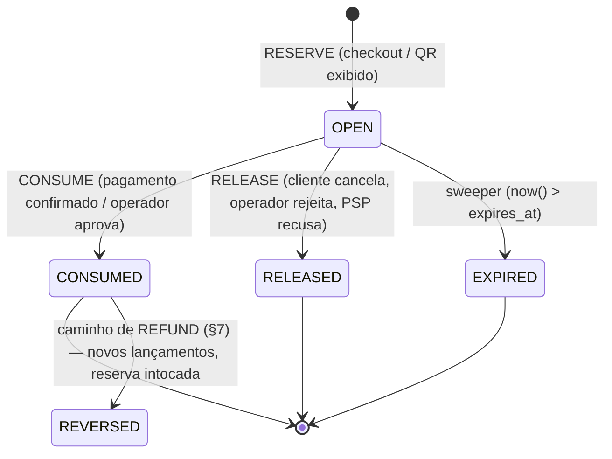

# 10 — Arquitetura do cashback (ledger)

> PARTE 10 do briefing. Este é o capítulo de maior risco do documento: trata de dinheiro de cliente, em produção, num programa de fidelidade em operação. Toda decisão aqui carrega um invariante escrito como asserção testável.

---

## 0. Dois defeitos bloqueantes, antes de qualquer coisa

### 0.1 Dinheiro está armazenado em `FLOAT`

`Point.cashback`, `Point.points` e todos os valores de `orders` (`subtotal`, `total`, `discountTotal`, `cashbackUsed`, `cashbackEarned`) são `DataTypes.FLOAT`. IEEE-754 binário **não representa R$ 0,10**. Um ledger cujo invariante é `SUM(lançamentos) == saldo` é inimplementável sobre floats: a soma depende da ordem de associação, então o job de reconciliação alarmaria por deriva fantasma para sempre.

**Decisão: todo dinheiro no schema novo é `BIGINT` em centavos (`*_cents`).** Não `NUMERIC` — centavo inteiro é mais rápido, indexa melhor, e não existe cashback de sub-centavo (o arredondamento é uma regra de negócio aplicada uma única vez, no momento da acumulação). As colunas float legadas de `points` e `orders` permanecem durante o período de sombra e são convertidas na fronteira com `Math.round(x * 100)`.

> **INVARIANTE M1** — Nenhum valor monetário atravessa uma fronteira de função como float. A API do ledger aceita e devolve `amountCents: number` **inteiro**, e uma guarda de runtime `assertInt(amountCents)` lança em não-inteiro.

### 0.2 A fórmula atual paga cashback que o cliente não tem

A fórmula em produção (`pointService.generatedBenefit()`, `src/services/pointService.ts:189-254`) compensa expiração **em agregado**:

```
realExpired = max(0, expired − used)
balance     = max(0, benefit − used − realExpired)
```

Isso pressupõe que *qualquer* débito poderia ter consumido *qualquer* lote expirado. Não poderia. Falha concreta:

| Data | Evento | `cashback` | `expiration_date` |
|---|---|---|---|
| 01 jan | crédito | R$ 100 | 01 fev |
| 10 fev | crédito | R$ 100 | 01 ago |
| 20 fev | débito | R$ 100 (em `points`) | — |

Em 21 de fevereiro: `benefit = 200`, `used = 100`, `expired = 100` (o lote de janeiro), `realExpired = max(0, 100 − 100) = 0`, e portanto `balance = 200 − 100 − 0 = ` **R$ 100**.

A verdade: o lote de janeiro morreu em 01/fev **sem nunca ter sido gasto**. O lote de fevereiro recebeu R$ 100 e foi integralmente gasto em 20/fev. **Saldo verdadeiro = R$ 0.** O sistema está exibindo — e vai deixar o cliente resgatar — R$ 100 de cashback fantasma.

O erro é **direcional**: o débito "absorve" expiração que cronologicamente não poderia ter consumido, então a fórmula legada devolve um saldo **maior ou igual** ao saldo FIFO verdadeiro, nunca menor. Isso significa que:

- é um vazamento de receita puro e unidirecional (nunca gera reclamação de cliente — que é exatamente por que ninguém reportou);
- o tamanho por cliente é limitado por `Σ lotes expirados que nunca foram consumíveis`, ou seja, **cresce com a idade do programa**;
- **o passivo circulante que o Corporate reportaria hoje está superestimado no mesmo montante** (§9).

Essa é a justificativa central para FIFO por lote com consumo persistido. Compensação agregada não pode ser corrigida com remendo — ela **não tem como saber de qual lote um débito saiu**.

---

## 1. Modelo-alvo

### 1.1 Forma do modelo

Não é partida dobrada completa com plano de contas — isso seria excesso de engenharia para um passivo de fidelidade de moeda única e emissor único. É **inspirado em partida dobrada, de lado único**: uma conta por cliente, lançamentos imutáveis e assinados, e a conta de passivo do sistema materializada **apenas no relatório** (§9). Adicionar pares `debit_account_id`/`credit_account_id` em toda linha dobraria o volume de escrita sem comprar nada que um `SUM()` noturno na view de relatório não entregue.

O que **se mantém** da partida dobrada: **lançamentos são imutáveis e append-only; correções são novos lançamentos compensatórios, nunca `UPDATE`s.**

| Tabela | Papel |
|---|---|
| `wallet_accounts` | uma linha por cliente; é o **alvo do lock** e o saldo cacheado |
| `wallet_entries` | log imutável append-only; **a fonte da verdade** |
| `wallet_lots` | lotes de crédito com `expires_at` e `consumed_cents` mutável (o balde FIFO) |
| `wallet_lot_consumptions` | qual débito tirou quanto de qual lote |
| `wallet_reservations` | as reservas em aberto; é também a fila de trabalho do sweeper |

### 1.2 DDL

```sql
-- ============ CONTAS ============
CREATE TABLE wallet_accounts (
  id                BIGSERIAL PRIMARY KEY,
  user_id           INTEGER NOT NULL UNIQUE REFERENCES users(id) ON DELETE RESTRICT,
  status            TEXT NOT NULL DEFAULT 'active'
                    CHECK (status IN ('active','frozen','closed')),
  balance_cents            BIGINT NOT NULL DEFAULT 0,  -- liquidado, antes das reservas
  reserved_cents           BIGINT NOT NULL DEFAULT 0,  -- retido por reservas abertas
  lifetime_credited_cents  BIGINT NOT NULL DEFAULT 0,
  lifetime_debited_cents   BIGINT NOT NULL DEFAULT 0,
  lifetime_expired_cents   BIGINT NOT NULL DEFAULT 0,
  version           BIGINT NOT NULL DEFAULT 0,
  last_entry_id     BIGINT,
  created_at        TIMESTAMPTZ NOT NULL DEFAULT now(),
  updated_at        TIMESTAMPTZ NOT NULL DEFAULT now(),
  CONSTRAINT wallet_accounts_balance_nonneg      CHECK (balance_cents  >= 0),
  CONSTRAINT wallet_accounts_reserved_nonneg     CHECK (reserved_cents >= 0),
  CONSTRAINT wallet_accounts_reserved_le_balance CHECK (reserved_cents <= balance_cents)
);

-- ============ LANÇAMENTOS (imutáveis) ============
CREATE TYPE wallet_entry_type AS ENUM (
  'CREDIT',     -- cashback ganho ou concedido      (+saldo, cria lote)
  'DEBIT',      -- cashback gasto                   (−saldo, consome lotes)
  'RESERVE',    -- reserva                          (+reservado, saldo inalterado)
  'RELEASE',    -- reserva cancelada                (−reservado)
  'REFUND',     -- devolução ao cliente             (+saldo, cria lote)
  'EXPIRE',     -- resto do lote morto              (−saldo)
  'ADJUSTMENT', -- manual, assinado                 (± saldo, pode criar lote)
  'CLAWBACK',   -- reversão de um CREDIT anterior   (−saldo)
  'WRITE_OFF'   -- clawback que não pôde ser cobrado (0 no saldo, registra a perda)
);

CREATE TABLE wallet_entries (
  id                   BIGSERIAL PRIMARY KEY,
  account_id           BIGINT NOT NULL REFERENCES wallet_accounts(id),
  entry_type           wallet_entry_type NOT NULL,
  amount_cents         BIGINT NOT NULL,             -- efeito ASSINADO no saldo
  reserved_delta_cents BIGINT NOT NULL DEFAULT 0,   -- efeito assinado no reservado
  balance_after_cents  BIGINT NOT NULL,             -- saldo APÓS este lançamento
  reserved_after_cents BIGINT NOT NULL,

  reference_type   TEXT NOT NULL,   -- 'order'|'pos_redemption'|'voucher'|'lot_expiry'
                                    -- |'admin_adjustment'|'refund'|'migration'|'campaign'
  reference_id     TEXT NOT NULL,
  reservation_id   BIGINT,
  unity_id         INTEGER REFERENCES unity(id),    -- ONDE aconteceu (era texto livre)
  campaign_id      BIGINT REFERENCES cashback_campaigns(id),

  actor_type       TEXT NOT NULL DEFAULT 'system'
                   CHECK (actor_type IN ('system','customer','operator','admin','job','psp')),
  actor_id         TEXT,
  description      TEXT,
  metadata         JSONB NOT NULL DEFAULT '{}'::jsonb,
  created_at       TIMESTAMPTZ NOT NULL DEFAULT now()
);

-- Idempotência natural: um lançamento de cada tipo por evento de negócio (§6)
CREATE UNIQUE INDEX ux_wallet_entries_ref
  ON wallet_entries (reference_type, reference_id, entry_type);

CREATE INDEX ix_wallet_entries_account_created ON wallet_entries (account_id, created_at DESC, id DESC);
CREATE INDEX ix_wallet_entries_type_created    ON wallet_entries (entry_type, created_at);
CREATE INDEX ix_wallet_entries_unity_created   ON wallet_entries (unity_id, created_at);

-- Imutabilidade dura (cinto e suspensório; o ORM jamais deve dar UPDATE aqui)
CREATE RULE wallet_entries_no_update AS ON UPDATE TO wallet_entries DO INSTEAD NOTHING;
CREATE RULE wallet_entries_no_delete AS ON DELETE TO wallet_entries DO INSTEAD NOTHING;

-- ============ LOTES (baldes FIFO) ============
CREATE TABLE wallet_lots (
  id              BIGSERIAL PRIMARY KEY,
  account_id      BIGINT NOT NULL REFERENCES wallet_accounts(id),
  origin_entry_id BIGINT NOT NULL UNIQUE REFERENCES wallet_entries(id),
  original_cents  BIGINT NOT NULL CHECK (original_cents > 0),
  consumed_cents  BIGINT NOT NULL DEFAULT 0 CHECK (consumed_cents >= 0),
  expired_cents   BIGINT NOT NULL DEFAULT 0 CHECK (expired_cents  >= 0),
  earned_at       TIMESTAMPTZ NOT NULL,
  expires_at      TIMESTAMPTZ NOT NULL,
  source          TEXT NOT NULL,  -- 'order_delivery'|'pos'|'campaign'|'admin'|'migration'|'refund'
  unity_id        INTEGER REFERENCES unity(id),
  campaign_id     BIGINT REFERENCES cashback_campaigns(id),
  created_at      TIMESTAMPTZ NOT NULL DEFAULT now(),
  CONSTRAINT wallet_lots_not_overconsumed
    CHECK (consumed_cents + expired_cents <= original_cents)
);

CREATE INDEX ix_wallet_lots_fifo ON wallet_lots (account_id, expires_at, id)
  WHERE consumed_cents + expired_cents < original_cents;
CREATE INDEX ix_wallet_lots_expiring ON wallet_lots (expires_at)
  WHERE consumed_cents + expired_cents < original_cents;

-- ============ CONSUMOS (a trilha de atribuição) ============
CREATE TABLE wallet_lot_consumptions (
  id           BIGSERIAL PRIMARY KEY,
  lot_id       BIGINT NOT NULL REFERENCES wallet_lots(id),
  entry_id     BIGINT NOT NULL REFERENCES wallet_entries(id),   -- o DEBIT/EXPIRE/CLAWBACK
  account_id   BIGINT NOT NULL REFERENCES wallet_accounts(id),  -- desnormalizado p/ reconciliação
  amount_cents BIGINT NOT NULL CHECK (amount_cents > 0),
  kind         TEXT NOT NULL CHECK (kind IN ('spend','expire','clawback')),
  created_at   TIMESTAMPTZ NOT NULL DEFAULT now(),
  CONSTRAINT ux_lot_consumption UNIQUE (lot_id, entry_id)
);
```

### 1.3 O saldo cacheado é autoritativo?

**Não. `wallet_entries` é a fonte da verdade. `balance_cents` é uma materialização** que é *tratada como autoritativa para leitura* porque é **correta por construção**. Três camadas garantem isso:

1. **Atualização na mesma transação.** Toda inserção de lançamento e a atualização correspondente em `wallet_accounts` acontecem numa transação Sequelize. Não existe caminho de código que escreva um sem o outro — imposto por funilar **todas** as mutações por uma primitiva única `walletService.postEntry(tx, …)`. Nada mais pode tocar `wallet_entries` nem `wallet_accounts`.
2. **`SELECT … FOR UPDATE` na linha da conta**, como primeira instrução da transação. A linha da conta é o ponto de serialização daquele cliente: todas as mutações concorrentes de um cliente ficam totalmente ordenadas, e o tráfego entre clientes diferentes não é afetado. `balance_after_cents` é, portanto, sempre uma soma-prefixo verdadeira.
3. **Job de reconciliação** (`walletReconcileJob`: de hora em hora para contas tocadas, completo à noite), que recalcula a partir dos lançamentos e alarma na deriva:

```sql
WITH recomputed AS (
  SELECT account_id, SUM(amount_cents) AS bal, SUM(reserved_delta_cents) AS res
  FROM wallet_entries GROUP BY account_id
)
SELECT a.id, a.user_id,
       a.balance_cents,  r.bal, a.balance_cents  - r.bal AS balance_drift,
       a.reserved_cents, r.res, a.reserved_cents - r.res AS reserved_drift
FROM wallet_accounts a JOIN recomputed r ON r.account_id = a.id
WHERE a.balance_cents <> r.bal OR a.reserved_cents <> r.res;
```

**Política de deriva: o job nunca se autocorrige.** Ele grava uma linha em `wallet_reconciliation_runs`, congela a conta afetada (`status='frozen'`, bloqueando gasto mas não acúmulo) e aciona alerta. Um job que se autocorrige esconde o bug que causou a deriva; num ledger financeiro, deriva é **sempre** defeito de código, e não existe fonte legítima dela.

> **INVARIANTE B1** — `wallet_accounts.balance_cents = SUM(wallet_entries.amount_cents)` da conta, sempre, fora de transação aberta.
> **INVARIANTE B2** — `reserved_cents = SUM(reserved_delta_cents)`, e `0 <= reserved_cents <= balance_cents` (CHECK no banco).
> **INVARIANTE B3** — `balance_cents = SUM(original_cents − consumed_cents − expired_cents)` sobre os lotes da conta.
> **INVARIANTE B4** — `consumed_cents + expired_cents <= original_cents` em todo lote (CHECK no banco, então nem um serviço com bug consegue violar).
> **INVARIANTE B5** — Saldo gastável `= balance_cents − reserved_cents >= 0`.

### 1.4 Ordem FIFO

Lotes são consumidos **`ORDER BY expires_at ASC, id ASC`** — o que vence antes sai primeiro, e não o mais antigo criado. Motivo: minimiza a perda do ponto de vista do cliente (gasta-se primeiro o dinheiro que ele estava prestes a perder), é o que todo programa de fidelidade maduro faz, e é o que a fórmula legada *acidentalmente* aproximava — então a migração não surpreende ninguém. `id ASC` é o desempate determinístico, necessário para reconciliação reproduzível.

```sql
-- dentro do lock da conta
SELECT id, original_cents - consumed_cents - expired_cents AS remaining_cents
FROM wallet_lots
WHERE account_id = :accountId
  AND consumed_cents + expired_cents < original_cents
  AND expires_at > now()
ORDER BY expires_at ASC, id ASC;
```

Depois, por lote, um update **guardado**, seguro mesmo se o lock da conta fosse algum dia contornado:

```sql
UPDATE wallet_lots
   SET consumed_cents = consumed_cents + :take
 WHERE id = :lotId
   AND consumed_cents + expired_cents + :take <= original_cents
RETURNING id;
-- zero linhas ⇒ aborta a transação inteira (teria sobreconsumido)
```

---

## 2. Ciclo de vida da reserva



`RESERVE` **não move `balance_cents`**; move só `reserved_cents`. Isso é deliberado: cashback reservado ainda é dinheiro do cliente até ser efetivamente gasto, e precisa aparecer como "R$ 30 em uso neste pedido", não sumir do saldo. `CONSUME` é o momento em que os lotes são tocados.

### 2.1 DDL

```sql
CREATE TABLE wallet_reservations (
  id              BIGSERIAL PRIMARY KEY,
  account_id      BIGINT NOT NULL REFERENCES wallet_accounts(id),
  amount_cents    BIGINT NOT NULL CHECK (amount_cents > 0),
  status          TEXT NOT NULL DEFAULT 'open'
                  CHECK (status IN ('open','consumed','released','expired')),
  reference_type  TEXT NOT NULL CHECK (reference_type IN ('order','pos_redemption','voucher')),
  reference_id    TEXT NOT NULL,
  unity_id        INTEGER REFERENCES unity(id),
  redeem_code     TEXT,          -- o payload do QR no fluxo de loja
  expires_at      TIMESTAMPTZ NOT NULL,
  consumed_at     TIMESTAMPTZ, released_at TIMESTAMPTZ,
  release_reason  TEXT,          -- 'customer_cancel'|'operator_reject'|'ttl'
                                 -- |'psp_declined'|'order_create_failed'
  created_by_type TEXT NOT NULL DEFAULT 'customer',
  created_by_id   TEXT,
  idempotency_key TEXT,
  created_at TIMESTAMPTZ NOT NULL DEFAULT now(),
  updated_at TIMESTAMPTZ NOT NULL DEFAULT now()
);

-- *** A restrição antidupla-gasto ***: no máximo UMA reserva aberta por objeto de negócio
CREATE UNIQUE INDEX ux_wallet_reservations_open_ref
  ON wallet_reservations (reference_type, reference_id) WHERE status = 'open';

-- Política mais estrita, RECOMENDADA no lançamento: uma reserva aberta por conta
CREATE UNIQUE INDEX ux_wallet_reservations_one_open_per_account
  ON wallet_reservations (account_id) WHERE status = 'open';

CREATE UNIQUE INDEX ux_wallet_reservations_redeem_code
  ON wallet_reservations (redeem_code) WHERE redeem_code IS NOT NULL;
CREATE INDEX ix_wallet_reservations_sweeper
  ON wallet_reservations (expires_at) WHERE status = 'open';
```

**A regra de uma reserva aberta por cliente é uma simplificação de produto, não técnica:** o cliente não pode ter, ao mesmo tempo, um QR aberto no balcão da Moema e um checkout de delivery segurando cashback. Isso elimina uma classe inteira de raciocínio (reservas parciais correndo entre canais) ao custo de um erro raro e fácil de explicar — *"Você já tem um resgate em andamento"*. Se o negócio recusar, basta remover o índice: **a correção não depende dele, só a simplicidade**.

### 2.2 Por que o duplo gasto é inalcançável

Três mecanismos independentes, cada um suficiente sozinho:

1. **Serialização** — `SELECT … FROM wallet_accounts WHERE id = ? FOR UPDATE` no topo de toda transação de mutação. Dois checkouts concorrentes do mesmo cliente ficam estritamente ordenados; o segundo enxerga o `reserved_cents` do primeiro.
2. **Restrição de banco** — `reserved_cents <= balance_cents`. Mesmo com bug de lógica, o `UPDATE` da segunda reserva **aborta a transação**.
3. **Índice único parcial** — `ux_wallet_reservations_open_ref` torna "duas reservas abertas para o pedido 123" **fisicamente impossível**, o que mata duplicatas de tempestade de retry sem nenhuma lógica de aplicação.

> **INVARIANTE R1** — No máximo uma reserva `open` por `(reference_type, reference_id)`.
> **INVARIANTE R2** — Uma reserva sai de `open` exatamente uma vez; a transição é um update guardado `WHERE id = ? AND status = 'open'`, e zero linhas afetadas significa "alguém chegou antes", o que é **sucesso no-op, não erro**. É isso que torna seguro o sweeper correr contra o operador.
> **INVARIANTE R3** — Toda reserva `open` tem um `RESERVE` correspondente e nenhum `RELEASE`/`DEBIT`.
> **INVARIANTE R4** — `SUM(amount_cents WHERE status='open') == wallet_accounts.reserved_cents`, por conta.

### 2.3 TTLs

| Fluxo | TTL | Motivo |
|---|---|---|
| QR de loja (POS) | **180 s** | O app auto-rejeita aos 120 s no cliente (`RedeemModal.tsx`). O TTL do servidor **precisa ser estritamente maior**, senão o servidor liberaria a reserva enquanto o operador está confirmando e o app ainda mostra QR válido. 180 s dá 60 s de folga |
| Delivery — `pix` | **expiração da cobrança Pix + 120 s** (padrão 30 + 2 min) | Precisa sobreviver ao QR Pix; se expirasse antes, um cliente pagando no minuto 29 teria o cashback já liberado e o total do pedido não fecharia |
| Delivery — `card` | **10 min** | Autorização de cartão é síncrona; 10 min cobrem desafio 3DS e retentativas |
| Delivery — `on_delivery` | **consumido na confirmação do pedido** (`pending → confirmed`) | Não há evento de PSP para esperar. Segurar até `delivered` congelaria o cashback do cliente por uma hora sem razão |

### 2.4 O sweeper — a correção do bug em produção

Hoje, se o app é morto durante a contagem de 120 s, `points` mantém um débito `status='pending'` **para sempre**. E como `generatedBenefit()` filtra `status='approved'`, essa linha travada é invisível — mas o resgate do cliente foi silenciosamente perdido, e o `qrcode_uses.ref` pode ter sido queimado. **Não existe job de expiração no servidor.** O sweeper é a correção.

`walletReservationSweeper`, a cada 30 s:

```sql
SELECT id, account_id, amount_cents
FROM wallet_reservations
WHERE status = 'open' AND expires_at <= now()
ORDER BY expires_at
LIMIT 200
FOR UPDATE SKIP LOCKED;
```

Por reserva reivindicada, em transação própria: trava a conta `FOR UPDATE`, faz o update guardado para `expired`, posta um `RELEASE` com `reserved_delta_cents = −amount` e, se `reference_type='order'`, transiciona o pedido para `cancelled` com motivo `payment_timeout` — **apenas a partir de `pending`**. Se o pedido já avançou, o pagamento entrou e a reserva deveria ter sido consumida: registra `RECONCILIATION_ANOMALY` e **não libera**.

**Varredura de boot:** a mesma rotina roda uma vez incondicionalmente na inicialização, porque o Render reinicia o processo e um `setInterval` não sobrevive a isso. É a rede de segurança para "o processo morreu segurando uma reserva aberta".

A idempotência do `RELEASE` é gratuita: `ux_wallet_entries_ref` sobre `('order','123','RELEASE')` faz uma segunda tentativa violar a unicidade, e o serviço mapeia isso para no-op.

**Este item é entregável isoladamente** e corrige um bug que está destruindo resgates de clientes reais hoje, sem tocar em nada do módulo de delivery.

---

## 3. Loja e delivery unificados

Os dois canais são **as mesmas três operações de ledger**. O que muda é quem dispara o `CONSUME` e qual é o TTL.

| Passo | Loja (QR + operador) | Delivery |
|---|---|---|
| RESERVE | cliente toca "Resgatar R$ X" → `POST /wallet/reservations` → devolve `redeemCode` para o QR | checkout → `POST /orders` com `cashbackAmountCents` → reserva vinculada a `order:<id>` |
| CONSUME | operador lê o QR → `POST /wallet/reservations/:code/consume` (JWT de operador + unidade compatível) | webhook Pix/cartão confirma; ou o pedido `on_delivery` chega a `confirmed` |
| RELEASE | operador rejeita, cliente cancela, **ou o sweeper de 180 s dispara** | cliente cancela, PSP recusa, Pix expira, ou o sweeper dispara |

Mapeamento dos endpoints atuais, preservando URL e forma de resposta para que o app validador não precise de release:

- `PUT /cashback/redeem/:id/confirm` → `walletService.consume(reservationId)`.
- O auto-reject de 120 s do cliente → `walletService.release(reservationId, 'customer_cancel')` — e, pelo **INVARIANTE R2**, é **sucesso no-op** se o sweeper ou o operador já moveram a reserva. É isso que torna o timer do cliente inofensivo em vez de racy.
- O polling de 3 s lê `wallet_reservations.status` (indexado por `redeem_code`), sem mudança de comportamento no cliente.
- A unicidade de `qrcode_uses.ref` permanece como camada antirreplay, agora redundante com `ux_wallet_reservations_redeem_code`, mas inofensiva.

**Vouchers** recebem tratamento idêntico com `reference_type='voucher'`, exceto que a reserva de voucher segura `amount_cents = 0` — um voucher não é dinheiro de carteira, é um desconto. Ela existe puramente para dar aos vouchers o mesmo TTL no servidor e para fazer `vouchers.redemption` incrementar exatamente uma vez. **Reutilizar a máquina; não construir uma segunda.**

> **INVARIANTE U1** — Existe exatamente **um** caminho de código que decrementa cashback gastável: `walletService.consume()`. Loja, delivery e administração passam todos por ele. É verificável por grep: `wallet_lots` só é escrita pelo `walletService`.

---

## 4. Motor de regras de acúmulo

### 4.1 Resolução

```
base_rate      = plans.cashback_percent do nível atual do cliente   (1% / 2% / 3%)
unity_override = cashback_rules WHERE scope='unity'    AND unity_id = ?
category_rule  = cashback_rules WHERE scope='category' AND category_id = ?   (0 = excluído)
product_rule   = cashback_rules WHERE scope='product'  AND product_id = ?    (0 = excluído)

effective_rate = COALESCE(product_rule, category_rule, unity_override, base_rate)
multiplier     = Π (multiplicadores de campanhas ativas que casam com o pedido)
```

**Base elegível recomendada: `subtotal − discount_total`, excluindo `delivery_fee`.** A taxa de entrega é, em boa parte, repasse ao entregador; pagar cashback sobre ela faz o custo do programa escalar com a **distância** em vez de com a receita.

### 4.2 Campanhas sem deploy

`cashback_campaigns` é declarativa: `kind` (`multiplier`/`bonus_rate`/`flat_bonus`), janela (`starts_at`, `ends_at`, `weekdays`, `time_from`/`time_to`, `timezone`), alvo (`unity_ids`, `channels`, `plan_ids`, `min_order_cents`) e — obrigatoriamente — os tetos `max_bonus_per_order_cents` e `budget_cents`.

"Cashback em dobro às terças na Moema" vira **uma linha**: `kind='multiplier', multiplier=2.00, weekdays='{2}', unity_ids='{7}'`. Sem deploy.

`consumed_budget_cents` é incrementado **dentro da transação de acumulação** com update guardado (`WHERE consumed_budget_cents + :bonus <= budget_cents`), de modo que uma campanha não estoura o orçamento sob concorrência. Estouro → cai para a taxa base, registra log, e **não falha o pedido**.

`stackable = false` por padrão. Multiplicadores empilháveis são exatamente como programas de fidelidade são explorados — só habilitar se o negócio pedir explicitamente.

### 4.3 Quando o cashback é creditado: na **entrega**, não na criação do pedido

**Decisão: o `CREDIT` é postado na transição `→ delivered`** (e, na loja, na confirmação do POS, que é o momento equivalente).

1. **O dinheiro não é nosso até a mercadoria ser entregue.** Creditar na criação do pedido cria cashback gastável lastreado num pedido que ainda pode ser cancelado, estornado ou nunca pago. O cliente poderia gastar imediatamente o cashback do pedido A no pedido B e depois cancelar o A — um laço de dinheiro grátis. **É a decisão de correção de maior valor deste capítulo.**
2. `pending → cancelled` é uma transição comum e iniciada pelo cliente; creditar antes faria do caminho de clawback (§7) o caminho **normal**, em vez da exceção.

---

## 5. Migração de `points` para o ledger

Dinheiro real, em produção, de um programa em operação. A meta de projeto é: **o saldo de nenhum cliente diminui no cutover, e toda diferença é explicada por uma linha persistida.**

| Fase | Duração | O que roda |
|---|---|---|
| **P0** Schema | dia 0 | Criar todas as tabelas. Zero leitura, zero escrita. Nenhuma mudança de app |
| **P1** Backfill | dias 0–2 | Job em lote constrói contas, lotes e lançamentos a partir de `points`. `points` continua autoritativo |
| **P2** Sombra | 2–4 semanas | **Dual-write.** Toda escrita em `points` também produz lançamentos. Toda leitura ainda vem de `points`. Relatório de comparação noturno |
| **P3** Leitura pelo ledger | 1 semana | Leituras migram atrás de flag por usuário (10% → 50% → 100%). Dual-write continua |
| **P4** Cutover | 1 dia | Ledger autoritativo para leitura **e** escrita. `points` vira write-through por adaptador |
| **P5** Sunset | +6 meses | Adaptador removido quando a integração do POS tiver migrado |

### 5.1 Algoritmo de backfill

Por `user_document` distinto em `points`:

```
1. Resolver o cliente:
     user = users WHERE document = normalizeCpf(points.user_document)
     não encontrado → balde ÓRFÃO (§5.3)
     mais de um     → balde AMBÍGUO (revisão manual)

2. Criar wallet_accounts (saldo 0).

3. Reproduzir em ordem cronológica (created_at ASC, id ASC):
     type IN ('credit','benefit') AND status='approved'
       → lançamento CREDIT, amount = round(cashback * 100)
       → wallet_lots(original_cents=amount, earned_at=created_at,
                     expires_at=expiration_date, source='migration',
                     unity_id = resolveUnityByName(points.unity))
       reference_type='migration', reference_id='point:'||points.id

     type='debit' AND status='approved'
       → lançamento DEBIT, amount = −round(points.points * 100)   ← débitos usam `points`, não `cashback`
       → consumir lotes em FIFO que estavam NÃO EXPIRADOS EM points.created_at:
             WHERE expires_at > points.created_at ORDER BY expires_at ASC, id ASC

     type='debit' AND status='pending'  → §5.4
     status='rejected'                  → ignorado (nunca afetou saldo)

4. Passe de expiração: todo lote com expires_at <= now() e resto > 0 recebe
   um EXPIRE datado no expires_at do lote, consumo kind='expire'.

5. Comparar ledgerBalance vs. fórmula legada (§0.2) e reconciliar.
```

Duas esquisitices que a reprodução **precisa** honrar, ambas verificadas no código de produção: créditos e benefícios carregam o valor em `cashback`, enquanto débitos carregam em `points` com `cashback: 0`; e `unity` é um **nome em texto livre** que precisa ser resolvido contra `unity.name` — construir a tabela de mapeamento **à mão, uma vez**, e **falhar o backfill em qualquer nome não mapeado** em vez de adivinhar.

### 5.2 A regra de preservação de saldo

Pela §0.2, o delta é **sempre ≥ 0** (legado ≥ verdade). Qualquer linha com `delta_cents < 0` é bug de backfill, não questão de dado — e **bloqueia o cutover**.

Não dá para apagar o saldo fantasma em silêncio. Três opções:

| Opção | Impacto no cliente | Recomendação |
|---|---|---|
| **A. Grandfather** — emitir um lote de crédito `MIGRATION_ADJUSTMENT` de `delta_cents`, com `expires_at = cutover + 90 dias` | Ninguém perde nada; o passivo fantasma é tornado real, limitado, e recebe validade para queimar em 90 dias | **Recomendada.** Ledger verdadeiro desde o dia 1, zero ticket de suporte, o vazamento é fechado dali para a frente e o passivo legado se autoliquida |
| B. Truncar | Saldos caem; tempestade de suporte | Rejeitada |
| C. Grandfather sem validade | Carrega o passivo fantasma para sempre | Rejeitada |

**Calcular o custo agregado da opção A antes de commitar** (`SELECT SUM(delta_cents) …`) e obter aval por escrito do financeiro — é uma despesa única de resultado, e o financeiro precisa ver o número.

### 5.3 CPF em texto → FK

1. Normalizar os dois lados: só dígitos, preenchimento à esquerda até 11, validação dos dígitos verificadores.
2. `CREATE INDEX CONCURRENTLY ix_points_user_document ON points (user_document);` — necessário de qualquer forma, já que o backfill varre por CPF.
3. `wallet_accounts.user_id` é FK real desde o dia 1. **CPF não aparece em lugar nenhum do schema da carteira.**
4. **CPF órfão** (linhas de `points` sem usuário correspondente): estacionar o saldo em `wallet_orphan_balances(user_document, balance_cents, lots JSONB)`. **Não** criar conta. No cadastro/login, `walletService.claimOrphanBalance(userId, cpf)` materializa os lotes numa conta real, em uma transação, guardado por índice único em `user_document` para só poder ser reivindicado uma vez. **Esse balde não será pequeno** — o POS concede cashback por CPF a pessoas que podem nunca ter instalado o app.
5. **CPF ambíguo** (usuários duplicados com o mesmo documento — provável, já que `users.document` pode não ser único): congelar, produzir lista de trabalho para o Corporate, resolver à mão antes do cutover, e depois `CREATE UNIQUE INDEX CONCURRENTLY ux_users_document` para estancar.

### 5.4 Débitos pendentes em voo

- `created_at > now() − 10 minutos` → criar reserva `open` com `reference_type='pos_redemption'` e `expires_at = created_at + 180s`. O sweeper resolve segundos depois.
- Mais antigos → tratar como **nunca ocorridos**. Nenhum lançamento. `UPDATE points SET status='rejected'` com nota de migração — é o **único** `UPDATE` legado que a migração faz, e é a interpretação correta: aqueles resgates nunca se completaram. **Contá-los no relatório** — o número é uma boa medida de quanto dinheiro o bug do timer de 120 s vem comendo em silêncio.

### 5.5 Sombra, cutover e rollback

**Direção: legado-primário, ledger-sombra.** Os controllers existentes continuam escrevendo em `points`; um `legacyPointsBridge` fino é chamado **na mesma transação Sequelize** e espelha a escrita no ledger. Falha do ledger durante o P2 é capturada, registrada como `SHADOW_WRITE_FAILED` e **não** dá rollback na escrita legada — a sombra jamais pode quebrar a produção. Isso gera lacunas de sombra, e a comparação noturna existe exatamente para pegá-las.

**Portão de cutover: sete noites consecutivas com zero linhas `unexplained` e zero deltas negativos.**

No P3, se as duas leituras divergirem para um usuário sorteado, a resposta serve o valor **legado (mais alto)** e registra log — o cliente nunca vê o saldo cair no meio da rampa.

**Rollback:** virar `WALLET_LEDGER_MODE=legacy`. Funciona *porque* o adaptador mantém `points` completo e correto. A única coisa não reversível são os créditos de grandfather — que existem só no ledger, então um rollback pós-cutover faz o cliente ver o saldo legado (mais alto), o que é seguro na direção favorável ao cliente. **Janela de rollback: os 6 meses inteiros do P5.**

### 5.6 `points` é mantido?

**Sim — como adaptador write-through, por no mínimo 6 meses, com o prazo ditado pela integração do POS, não por nós.** O POS de loja lê e escreve `points` por CPF, e não controlamos o ciclo de release daquela integração.

- `points` torna-se **derivada**: o adaptador escreve uma linha por `CREDIT`/`DEBIT` do ledger, remapeando a esquisitice `cashback`-vs-`points` para que o POS continue vendo o que espera.
- `points` **nunca mais é lida** para saldo pelo nosso código após o cutover.
- Qualquer escrita **de entrada** do POS direto em `points` precisa ser detectada: uma linha sem `wallet_entries.metadata->>'legacy_point_id'` correspondente é sinalizada pelo job noturno como `LEGACY_UNMIRRORED_WRITE` e importada. **Este é o risco a vigiar** — se o POS escreve direto, o adaptador é bidirecional, o que é materialmente mais difícil. **Confirmar o caminho real de escrita do POS antes do P0**; isso muda a forma desta fase.
- Uma view `points_v` sobre o ledger **não** é recomendada como camada de compatibilidade: `points.id` é referenciado por `qrcode_uses` e pela tela de histórico do app, e uma view não preserva esses ids.

---

## 6. Idempotência

O que torna cada lançamento naturalmente idempotente é o índice `ux_wallet_entries_ref (reference_type, reference_id, entry_type)`. Reprocessar `('order','8871','DEBIT')` viola a unicidade; o serviço mapeia a violação para no-op de sucesso. **Isso significa que replay de evento, retry de fila e webhook duplicado são estruturalmente incapazes de creditar ou debitar em dobro** — sem nenhuma lógica de aplicação envolvida.

O contrato de `Idempotency-Key` para as rotas de mutação está em [06 §6.3](./06-arquitetura-backend.md); a deduplicação de evento de PSP em [11](./11-pagamentos.md).

---

## 7. Estorno, cancelamento parcial e clawback

### 7.1 Desfazimento proporcional

Quando só parte dos itens é cancelada, a devolução segue a **ordem inversa do pagamento**: primeiro o cashback usado, depois cartão/Pix.

O cashback devolvido volta **ao lote de origem**, com a validade preservada — não vira lote novo com validade nova. A escolha beneficia a empresa de forma legítima (não estende o passivo) e é o que o cliente espera: ele recuperou o que gastou, não ganhou um prazo extra.

> **INVARIANTE F1** — `SUM(refunds.total_refund_cents)` por pedido `<= orders.total_cents` (imposto no serviço sob `FOR UPDATE` na linha do pedido, e por CHECK no banco).
> **INVARIANTE F2** — O estorno da parcela de cashback nunca excede `orders.cashback_used_cents`.

### 7.2 O problema do "ele já gastou"

Cashback **já creditado e já gasto**, num pedido posteriormente estornado, é o caso desconfortável. Política recomendada:

1. Tentar o `CLAWBACK` até o limite do saldo disponível.
2. O restante vira um lançamento **`WRITE_OFF`** — efeito zero no saldo, registrando a perda e mantendo a trilha.
3. **Nunca gerar saldo negativo.** Saldo negativo é atrito grave de suporte, ilegível para o cliente, e transforma a próxima compra dele numa cobrança surpresa. O valor é baixado como perda e reportado.

Creditar só na entrega (§4.3) é justamente o que torna esse caminho **raro**.

---

## 8. Ajuste manual e auditabilidade

O ajuste manual de cashback é a ação mais perigosa de todo o Corporate. Requisitos:

| Requisito | Detalhe |
|---|---|
| Campos obrigatórios | ator, código de motivo (taxonomia fechada), justificativa em texto livre, valor, saldo antes e depois, IP, user agent, timestamp |
| Permissão | `cashback:adjust`; acima de um teto configurável, `cashback:adjust:high` |
| Quatro olhos | Acima do teto, exige **aprovação de um segundo usuário** com o papel financeiro; a solicitação fica pendente e visível na central de aprovações |
| Trilha | Linha em `audit_logs` **na mesma transação** do lançamento ([06 §7](./06-arquitetura-backend.md)) |
| Reversibilidade | Ajustes não são editáveis nem deletáveis; correção é um novo `ADJUSTMENT` compensatório |
| Notificação | O cliente recebe push de extrato quando o saldo muda por ajuste |

**Sinais de fraude que valem a pena expor** no Corporate: o `suspicious` que já existe em `points`, velocidade de acúmulo por CPF, múltiplas contas com o mesmo dispositivo, resgates repetidos na mesma unidade em janela curta, e razão anormal entre cashback gerado e consumo.

**Relatório de conciliação diário**, por e-mail ao financeiro às 06:00 BRT: contas com deriva, reservas expiradas na véspera, lotes que expiraram (breakage do dia), ajustes manuais com ator e motivo, e a variação do passivo circulante.

---

## 9. Primitivas de relatório financeiro

| Pergunta do Corporate | Como é respondida |
|---|---|
| **Qual é o passivo de cashback circulante?** | `SUM(original_cents − consumed_cents − expired_cents)` sobre lotes não expirados — a `mv_wallet_liability`. Hoje **ninguém consegue responder isso**, e o número que a fórmula legada produziria estaria superestimado (§0.2) |
| Concedido vs. usado vs. expirado por período e unidade | Agregação de `wallet_entries` por `entry_type`, `unity_id` e `created_at` |
| Taxa de breakage | `SUM(EXPIRE) / SUM(CREDIT)` na janela |
| Custo do programa como % da receita | `SUM(CREDIT) / receita` do período |
| Receita financiada por cashback por unidade | `SUM(DEBIT)` por `unity_id` — agora possível, porque o lançamento carrega `unity_id` FK em vez de nome em texto |
| Quanto vai expirar nos próximos 30 dias | Lotes com `expires_at` na janela e resto positivo — alimenta campanha de reativação |

---

## 10. Estratégia de testes das rotas de dinheiro

**Invariantes como asserções executáveis** (testes de propriedade, não de exemplo):

- `balance_cents` nunca negativo, em nenhuma sequência de operações.
- `SUM(wallet_entries.amount_cents) == wallet_accounts.balance_cents` após qualquer sequência.
- Nenhum lote sobreconsumido: `consumed + expired <= original`.
- `SUM(reservas abertas) == reserved_cents`.
- Estorno nunca excede a captura; estorno de cashback nunca excede `cashback_used`.

**Cenários nomeados que precisam ter teste de integração:**

1. Dois checkouts concorrentes do mesmo cliente com saldo suficiente para apenas um.
2. Webhook de pagamento chegando **duas vezes**, fora de ordem.
3. Cancelamento durante a captura.
4. Sweeper disparando exatamente no instante em que o operador confirma.
5. Expiração de lote no meio de um consumo FIFO.
6. Cancelamento parcial com desfazimento proporcional.
7. Estorno de pedido cujo cashback já foi gasto (caminho `WRITE_OFF`).
8. Reprocessamento completo da fila de eventos (nada pode duplicar).
9. Backfill de migração produzindo delta negativo (**precisa falhar**).
10. Campanha estourando o orçamento sob concorrência.

**Concorrência e carga:** simular 50 checkouts simultâneos do mesmo cliente e verificar que exatamente um obtém a reserva; e 500 clientes distintos em paralelo, verificando que o lock por conta não serializa o sistema inteiro.
