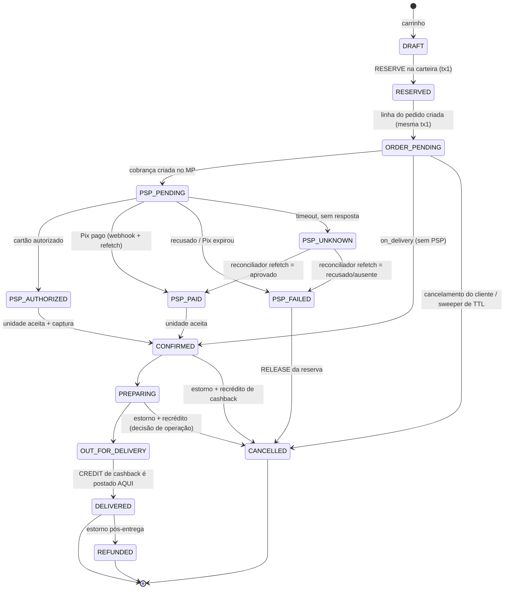
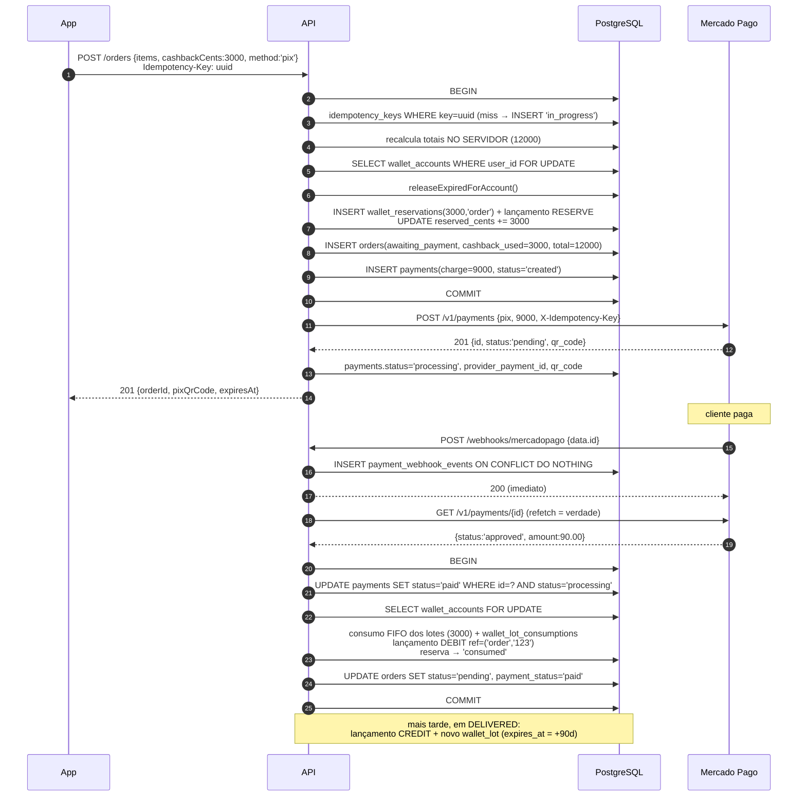
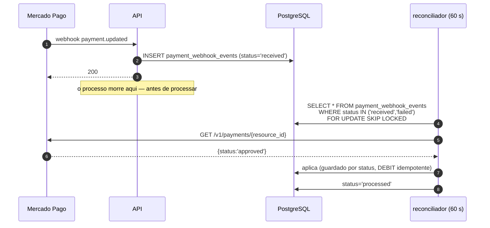

# 11 — Pagamentos

> PARTE 11 do briefing. Hoje **não existe nenhuma integração de pagamento** no código: grep por `mercadopago|stripe|pagseguro|webhook.*pay` em `src/` devolve zero. `orders.payment_status` é gravado como `'pending'` na criação e **nunca atualizado por nenhum caminho de código**. Do lado do app, o Pix é uma string BR Code estática mockada e os cartões salvos ficam em texto puro no AsyncStorage.

---

## 0. Bloqueadores de segurança antes da release de pagamentos

| # | Problema | Ação |
|---|---|---|
| 1 | **Números de cartão em texto puro no AsyncStorage** (`delivery_payment_methods`) | **Apagar, não migrar.** Publicar uma purga única no upgrade do app (`AsyncStorage.removeItem` nas chaves de cartão) e tratar os PANs já armazenados como **incidente de segurança** a ser reportado conforme a política da empresa. Bloqueador duro da release |
| 2 | **Tela de Pix com BR Code mockado e sem polling de status** | É um **defeito em produção**, não um item de Fase 2. Qualquer cliente no build atual que "pague" aquele mock está pagando nada — ou, pior, pagando uma chave desconhecida. Esconder o Pix no servidor para builds antigos (a lista de meios de pagamento passa a ser **servida pelo servidor**, não fixa no cliente) e liberar o fluxo real atrás de `min_version` |
| 3 | Cupom de checkout embutido em `notes` como texto livre | O código de cupom passa a ser enviado em `voucherCode` e validado no servidor |

---

## 1. Princípios

1. **O PSP é a fonte da verdade sobre dinheiro.** A tabela `payments` é um espelho. Em qualquer ambiguidade, refazemos o `GET` no Mercado Pago e sobrescrevemos nosso estado. **Nunca inferimos status de pagamento a partir dos nossos próprios timers.**
2. **Webhook é dica, não é dado.** O webhook diz "o pagamento X mudou"; nós então fazemos `GET /v1/payments/{id}` e agimos sobre o corpo obtido. Isso torna spoofing, replay e entrega fora de ordem todos inofensivos de uma vez só.
3. **Nenhum dado de cartão toca nossos servidores.** O SDK de tokenização do MP no cliente devolve um `card_token`; enviamos o token. Isso mantém o escopo de PCI DSS no mínimo (SAQ A).

---

## 2. Cartão: autorização e captura

Usamos **duas etapas**: `POST /v1/payments` com `capture: false` → status `authorized` → depois `PUT /v1/payments/{id}` com `capture: true`.

**A captura acontece na transição `pending → confirmed`** — quando a unidade aceita o pedido —, e não na entrega. O motivo real não é o prazo da autorização (que dura dias): é que **depois que a cozinha começa a cozinhar, o custo do alimento é irrecuperável**. Manter apenas autorizado até o restaurante aceitar significa que uma captura recusada custa nada além de um pedido cancelado.

Se a captura falhar no `confirmed` (raro, já que a autorização passou): cancelar o pedido, liberar a reserva de cashback, notificar o cliente e alarmar. **Não iniciar o preparo.**

## 3. Pix

`POST /v1/payments` com `payment_method_id: 'pix'` e `date_of_expiration = now + 30 min`. Guardamos `point_of_interaction.transaction_data.qr_code` (o copia-e-cola) e `qr_code_base64`. A confirmação chega por webhook; o pedido fica em `awaiting_payment` até lá.

**Cinto e suspensório: um poller de Pix a cada 60 s** faz `GET /v1/payments/{id}` para toda linha em `processing` criada nos últimos 40 min. **Webhooks se perdem** — no Render, um redeploy durante a entrega de um webhook o descarta em silêncio. O poller tem umas 20 linhas e elimina uma classe inteira de falha.

## 4. Pagamento na entrega

Sem PSP. `payments.provider = 'on_delivery'`, `status = 'pending'` até o entregador marcar o recebimento. A reserva de cashback é consumida em `pending → confirmed` ([10 §2.3](./10-cashback-ledger.md)). A loja concilia dinheiro e maquininha no fechamento do turno contra um **relatório**, não contra uma integração de pagamento.

**Risco a sinalizar:** pedidos `on_delivery` que consumiram cashback e são **recusados na porta** já gastaram o cashback. Política: consumir cashback em `on_delivery` é permitido, e a recusa na porta é tratada como cancelamento-após-consumo (§7, linha 8) — o cashback é recreditado como novo lote **preservando o `expires_at` original**.

## 5. Pagamento híbrido

`Total R$ 120,00 = R$ 30,00 de cashback + R$ 90,00 no cartão`

**Ordem: reservar o cashback PRIMEIRO, cobrar o PSP DEPOIS.**

Por que nesta ordem e não na inversa: a reserva de cashback é local, transacional e instantaneamente reversível. A cobrança no PSP é remota, lenta e cara de reverter (um estorno custa taxa, leva dias e assusta o cliente no extrato). **Sempre faça a coisa barata e reversível primeiro, para que a coisa cara e irreversível aconteça contra um estado já inteiramente validado.**

```
1. Validar o carrinho e computar os totais NO SERVIDOR (nunca confiar no total do cliente).
2. BEGIN
     lock da conta de carteira FOR UPDATE
     RESERVE 3000 centavos              → reserva R
     cria pedido (status=awaiting_payment, cashback_used_cents=3000, total=12000)
     cria linha em payments (charge_amount_cents=9000, status=created)
   COMMIT
3. Chamar o MP por 9000 centavos (autorização de cartão com capture=false, ou cobrança Pix).
4a. Autorizado/pago → BEGIN CONSUME(R); pedido→pending/confirmed; payment→authorized|paid COMMIT
4b. Recusado       → BEGIN RELEASE(R,'psp_declined'); pedido→cancelled; payment→failed COMMIT
4c. Sem resposta   → payment fica 'processing'; o reconciliador resolve; o TTL da reserva
                     é a rede de segurança, e é MAIOR que o timeout do PSP por construção.
```

**O que é cobrado no PSP: apenas R$ 90,00.** A parcela de cashback **nunca sai do nosso sistema** e nunca aparece no MP. Contabilmente, os R$ 30,00 são uma redução de receita liquidada contra o passivo de fidelidade — não um pagamento recebido.

**Se o PSP recusa depois de o cashback ter sido reservado** (passo 4b): a reserva é liberada **na mesma transação** do cancelamento do pedido, então não existe janela em que o pedido esteja cancelado e o cashback preso. Se o próprio 4b falhar (processo morre entre 3 e 4b), o sweeper libera no TTL e cancela o pedido. **Em toda ordenação de falha, o cashback do cliente volta.** É essa propriedade que a ordem de operações compra.

**Caso de borda que precisa ser tratado explicitamente:** o cashback cobre 100% do total. Aí **não há chamada ao PSP**: `payments.provider = 'wallet'`, consumo na confirmação do pedido. **Não criar uma cobrança de R$ 0,00 no MP.**

---

## 6. DDL

```sql
CREATE TABLE payments (
  id       BIGSERIAL PRIMARY KEY,
  order_id INTEGER NOT NULL REFERENCES orders(id),
  user_id  INTEGER NOT NULL REFERENCES users(id),
  unity_id INTEGER NOT NULL REFERENCES unity(id),
  provider TEXT NOT NULL CHECK (provider IN ('mercadopago','on_delivery','wallet')),
  method   TEXT NOT NULL CHECK (method IN ('pix','credit_card','debit_card','cash','pos_card','wallet')),

  gross_amount_cents    BIGINT NOT NULL CHECK (gross_amount_cents >= 0),  -- total do pedido
  cashback_amount_cents BIGINT NOT NULL DEFAULT 0,                        -- pago pela carteira
  charge_amount_cents   BIGINT NOT NULL CHECK (charge_amount_cents >= 0), -- enviado ao PSP
  captured_amount_cents BIGINT NOT NULL DEFAULT 0,
  refunded_amount_cents BIGINT NOT NULL DEFAULT 0,
  psp_fee_cents         BIGINT,
  net_received_cents    BIGINT,

  status TEXT NOT NULL DEFAULT 'created' CHECK (status IN (
    'created','processing','authorized','captured','paid','failed',
    'cancelled','expired','refunded','partially_refunded','chargeback')),

  provider_payment_id    TEXT,
  provider_status        TEXT,
  provider_status_detail TEXT,
  installments           SMALLINT NOT NULL DEFAULT 1,
  card_brand TEXT, card_last4 TEXT,      -- exibição apenas; NUNCA PAN, NUNCA CVV
  pix_qr_code TEXT, pix_qr_code_base64 TEXT, pix_expires_at TIMESTAMPTZ,
  wallet_reservation_id BIGINT REFERENCES wallet_reservations(id),
  idempotency_key TEXT NOT NULL,
  authorized_at TIMESTAMPTZ, captured_at TIMESTAMPTZ, failed_at TIMESTAMPTZ,
  failure_code TEXT, failure_message TEXT,
  raw_payload JSONB,
  created_at TIMESTAMPTZ NOT NULL DEFAULT now(),
  updated_at TIMESTAMPTZ NOT NULL DEFAULT now(),

  CONSTRAINT payments_split_adds_up
    CHECK (cashback_amount_cents + charge_amount_cents = gross_amount_cents),
  CONSTRAINT payments_refund_le_capture
    CHECK (refunded_amount_cents <= captured_amount_cents)
);
CREATE UNIQUE INDEX ux_payments_provider_id ON payments (provider, provider_payment_id)
  WHERE provider_payment_id IS NOT NULL;
CREATE UNIQUE INDEX ux_payments_idem ON payments (idempotency_key);
-- no máximo um pagamento não terminal por pedido
CREATE UNIQUE INDEX ux_payments_order_active ON payments (order_id)
  WHERE status IN ('created','processing','authorized');
CREATE INDEX ix_payments_poller ON payments (status, created_at)
  WHERE status IN ('created','processing');

-- toda tentativa / chamada de API / mudança de estado (append-only)
CREATE TABLE payment_transactions (
  id BIGSERIAL PRIMARY KEY,
  payment_id BIGINT NOT NULL REFERENCES payments(id),
  attempt_number SMALLINT NOT NULL DEFAULT 1,
  operation TEXT NOT NULL CHECK (operation IN
    ('authorize','capture','charge','refund','cancel','status_check','webhook_apply')),
  status TEXT NOT NULL CHECK (status IN ('pending','success','failed','timeout')),
  amount_cents BIGINT NOT NULL DEFAULT 0,
  provider_request_id  TEXT,   -- a X-Idempotency-Key que enviamos ao MP
  provider_response_id TEXT,
  http_status INTEGER,
  provider_error_code TEXT, provider_error_message TEXT,
  request_body  JSONB,         -- REDIGIDO: sem token, sem dado de cartão
  response_body JSONB,
  latency_ms INTEGER,
  triggered_by TEXT NOT NULL DEFAULT 'system',
  created_at TIMESTAMPTZ NOT NULL DEFAULT now()
);
CREATE UNIQUE INDEX ux_paytx_idem ON payment_transactions (payment_id, operation, attempt_number);

-- caixa de entrada crua de webhooks: guardar primeiro, processar depois
CREATE TABLE payment_webhook_events (
  id BIGSERIAL PRIMARY KEY,
  provider TEXT NOT NULL DEFAULT 'mercadopago',
  provider_event_id TEXT NOT NULL,
  event_type TEXT NOT NULL,        -- 'payment' | 'merchant_order' | 'chargeback'
  action TEXT,
  resource_id TEXT NOT NULL,       -- data.id → o id do pagamento no MP
  payment_id BIGINT REFERENCES payments(id),
  signature TEXT, signature_valid BOOLEAN,
  headers JSONB, payload JSONB NOT NULL,
  status TEXT NOT NULL DEFAULT 'received'
    CHECK (status IN ('received','processing','processed','ignored','failed')),
  process_attempts SMALLINT NOT NULL DEFAULT 0,
  last_error TEXT,
  received_at TIMESTAMPTZ NOT NULL DEFAULT now(),
  processed_at TIMESTAMPTZ
);
-- A chave de deduplicação de webhook
CREATE UNIQUE INDEX ux_webhook_event ON payment_webhook_events (provider, provider_event_id);
CREATE INDEX ix_webhook_unprocessed ON payment_webhook_events (status, received_at)
  WHERE status IN ('received','failed');
```

### 6.1 Contrato do handler de webhook

1. **Verificar a assinatura HMAC** `x-signature` do MP (`ts` + `x-request-id` + `data.id`). Inválida → gravar com `signature_valid=false`, `status='ignored'` e **devolver 200**. Nunca responder 4xx a um webhook que você não consegue verificar: o MP retenta para sempre e enche o log.
2. `INSERT … ON CONFLICT (provider, provider_event_id) DO NOTHING` → **zero linhas significa duplicata; devolva 200 imediatamente.** É essa a história inteira de deduplicação.
3. **Devolver 200 em ~200 ms**, antes de qualquer trabalho de negócio. O MP retenta agressivamente em resposta lenta, fabricando exatamente as duplicatas que se quer evitar.
4. Processar **assincronamente** (dreno a cada 5 s sobre `status IN ('received','failed')`, com `FOR UPDATE SKIP LOCKED`): refazer `GET /v1/payments/{resource_id}` no MP e então aplicar.
5. A aplicação é idempotente por construção: a transição é guardada (`UPDATE payments SET status='paid' WHERE id=? AND status IN ('processing','authorized')`) e o `CONSUME` da carteira é protegido por `ux_wallet_entries_ref` sobre `('order','123','DEBIT')`.

> **Armadilha de montagem:** `express.raw({ type: 'application/json' })` precisa estar montado **antes** do `express.json()` nesta rota — a assinatura é verificada sobre o corpo cru. Inverter é um bug silencioso e comum.

---

## 7. A saga pedido ↔ pagamento ↔ cashback

Não há transação distribuída aqui, e não precisa haver: **tudo exceto a chamada ao MP está num único PostgreSQL.** A saga é pequena — um único passo externo, com compensação local de cada lado.

### 7.1 Máquina combinada



Repare: `PSP_PENDING` e `PSP_UNKNOWN` vivem em **`payments.status`, não em `orders.status`** — o pedido continua em `awaiting_payment`. **A enumeração de status do pedido não é alterada por isto**, o que importa porque o app em produção faz `switch` sobre exatamente aquelas strings.

### 7.2 Matriz de compensação

| # | Ponto de falha | Detectado por | Compensação | Quem fica com a inconsistência |
|---|---|---|---|---|
| 1 | **Reserva de cashback falha** (saldo insuficiente / conta congelada) | síncrono, tx1 | tx1 dá rollback inteiro. Sem pedido, sem reserva. 422 ao cliente | Ninguém |
| 2 | **Criação do pedido falha depois da reserva** | síncrono, tx1 | Mesma transação → ambos revertem. **Estruturalmente impossível**, porque reserva e pedido são uma transação só | Ninguém |
| 3 | **PSP recusa** | resposta síncrona do MP | tx2: `RELEASE(reserva,'psp_declined')` + pedido → `cancelled` + payment → `failed` | Ninguém |
| 4 | **Chamada ao PSP dá timeout** | timeout HTTP | Payment fica `processing`. O poller refaz o `GET` pela nossa chave de idempotência. Se o MP criou e está aprovado → consome e confirma. Se não achar após N tentativas → `failed`, libera. **O TTL da reserva é maior que o timeout do PSP por construção**, garantindo que a reserva sobreviva à ambiguidade | Temporariamente: cashback do cliente retido, pedido em "processando". Limitado pelo TTL |
| 5 | **Webhook nunca chega** | poller de Pix (60 s) + reconciliador | O poller detecta `approved` no MP e aplica o mesmo handler | Ninguém, após ≤ 60 s |
| 6 | **Webhook chega duas vezes** | índice `ux_webhook_event` | Segundo insert conflita → 200, sem processamento. Mesmo se escapasse: update guardado + `ux_wallet_entries_ref` no DEBIT tornam o duplo consumo impossível | Ninguém |
| 7 | **Webhook chega e o processo morre no meio** | linha travada em `processing` | O dreno reenfileira linhas em `processing` há mais de 5 min. O trabalho é idempotente, então replay é seguro | Ninguém |
| 8 | **Pedido cancelado após a captura** | ação do cliente/operação | Estorno do valor capturado no MP (assíncrono, dias) + lançamento `REFUND` recreditando o cashback consumido **como novo lote preservando o `expires_at` original** + pedido → `cancelled`, payment → `refunded` | O cliente espera dias pelo estorno do cartão (inerente ao PSP). **O cashback volta na hora** |
| 9 | **Pedido cancelado *durante* a captura** | corrida | Captura e cancelamento tomam ambos a **linha do pedido** `FOR UPDATE`. Se a captura vencer → o cancelamento vira estorno (linha 8). Se o cancelamento vencer → a captura é pulada e a autorização é anulada no MP | Ninguém. O lock da linha do pedido é o desempate |
| 10 | **Cancelamento parcial de itens** | ação de operação | Desfazimento proporcional: estorno parcial no MP, recrédito proporcional de cashback, redução proporcional do cashback a acumular | Resto de arredondamento ≤ 1 centavo, absorvido pela empresa |
| 11 | **Estorno falha no MP** | resposta do MP | Linha `failed` em `payment_transactions`; retry com backoff, 5 tentativas; depois alerta de revisão manual. **O recrédito do cashback NÃO fica refém do estorno do dinheiro** — recreditar imediatamente | A empresa, temporariamente. É o correto: nunca fazer o cliente esperar um problema nosso de PSP para receber dinheiro que já lhe devemos |
| 12 | **Chargeback** | webhook de chargeback do MP | payment → `chargeback`; `CLAWBACK` do cashback acumulado; se já gasto → `WRITE_OFF`; conta marcada como suspeita; congelamento se recorrente | A empresa. Chargeback é custo de operação; o ledger registra a perda para que seja mensurável |
| 13 | **Reserva consumida mas atualização do pedido falha** | reconciliador | Ambos na mesma transação → impossível. Se algum dia forem separados, o reconciliador encontra `reserva.consumed && pedido.status='pending'` e **completa para a frente** | Ninguém |
| 14 | **Envio duplicado do pedido (duplo toque)** | `Idempotency-Key` | Resposta replicada, um pedido só | Ninguém |

**A escolha estrutural que sustenta tudo:** *reserva + criação do pedido + criação da linha de pagamento são uma transação; consumo + confirmação do pedido + atualização do pagamento são uma transação.* Todo modo de falha restante colapsa em "a chamada ao MP está em estado desconhecido" — que o poller e o TTL resolvem de forma determinística.

### 7.3 Caminho feliz (Pix híbrido com cashback)



### 7.4 "O pagamento confirmou mas a aplicação caiu"



O mesmo reconciliador cobre o caso simétrico — **o webhook nunca chegou** — porque ele também varre `payments` em `processing` criados nos últimos 40 min e refaz o `GET` direto no MP. As duas classes de falha convergem para o mesmo caminho de código.

---

## 8. Conciliação e relatório financeiro

| Necessidade | Como é atendida |
|---|---|
| Bater o que o MP diz que pagou contra o que registramos | `GET /reports/reconciliation?date=` cruza `payments` com o extrato do MP; divergências viram lista de trabalho no C-03 |
| Taxas do PSP e valor líquido | `psp_fee_cents` e `net_received_cents` preenchidos no refetch pós-captura |
| Fechamento de caixa de pagamento na entrega | Relatório por turno e unidade sobre `orders WHERE payment_method='on_delivery' AND status='delivered'` |
| Split por meio de pagamento e por unidade | Agregação de `payments` por `method`, `unity_id` e `created_at` |
| Estornos e chargebacks | `refunded_amount_cents`, status `refunded`/`chargeback`, com trilha completa em `payment_transactions` |
