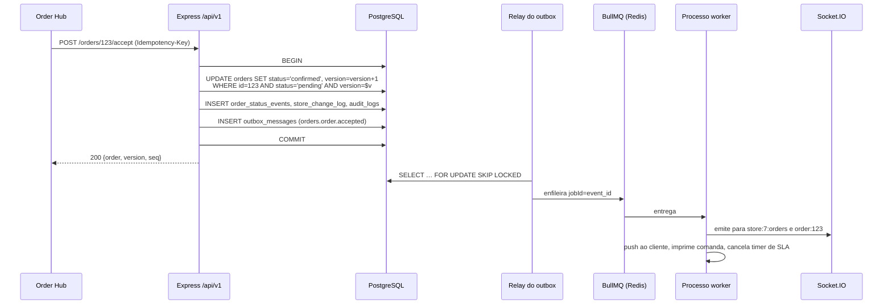

# 13 — Eventos e processamento assíncrono

> PARTE 13 e seção 14 do briefing. Hoje toda integração externa (Expo Push, Comtele, WhatsApp, SMTP) é uma chamada HTTP **dentro do handler da requisição**, sem retry e sem persistência. Isso significa que uma falha de push pode derrubar a criação de um pedido, e que um rollback de transação pode acontecer **depois** de o push já ter saído. O outbox transacional corrige as duas direções.

---

## 1. Catálogo de eventos de domínio

Nomenclatura `<contexto>.<agregado>.<verbo no passado>`, com payload versionado (`v: 1`).

| Evento | Emitido por | Consumidores principais |
|---|---|---|
| `orders.order.placed` | orders | notifications (alerta da loja + push do cliente), realtime `store:{id}:orders`, reporting, timer de SLA |
| `orders.order.accepted` | orders | notifications (cliente), realtime, cancelamento do timer de SLA, impressão |
| `orders.order.rejected` | orders | notifications, payments (void/estorno), wallet (libera reserva) |
| `orders.order.status_changed` | orders | realtime, notifications, reporting |
| `orders.order.cancelled` | orders | payments (estorno), wallet (libera/reverte), notifications, realtime |
| `orders.order.items_adjusted` | orders | payments (ajusta intent), notifications, realtime |
| `orders.order.eta_changed` | orders | notifications, realtime |
| `orders.order.delivered` | orders | **wallet (credita cashback)**, solicitação de avaliação, reporting |
| `orders.chat.message_posted` | orders/chat | realtime, notifications (se o destinatário estiver offline há mais de 60 s) |
| `payments.payment.authorized` · `.captured` · `.failed` · `.refunded` | payments | orders, notifications, reporting |
| `wallet.entry.created` · `.hold_placed` · `.hold_released` · `.expiring_soon` | wallet | notifications, reporting |
| `catalog.master_item.changed` | catalog | projetor de `products`, invalidação de cache, realtime `network:catalog` |
| `catalog.unit_item.changed` | catalog | invalidação de cache, realtime `store:{id}:catalog` |
| `stores.store.paused` · `.resumed` · `.hours_changed` | stores | realtime, notifications (clientes com carrinho aberto), cache de menu do app |
| `identity.user.role_granted` · `.role_revoked` · `.session_revoked` | identity | audit, desconexão/reautorização de socket |
| `promotions.coupon.redeemed` | promotions | reporting |
| `reporting.export.requested` · `.ready` | reporting | notifications |

---

## 2. Outbox transacional

```sql
CREATE TABLE outbox_messages (
  id              bigserial PRIMARY KEY,      -- também é a chave de ordenação global
  event_id        uuid NOT NULL UNIQUE,       -- chave de idempotência do consumidor
  event_type      text NOT NULL,
  event_version   int  NOT NULL DEFAULT 1,
  aggregate_type  text NOT NULL,
  aggregate_id    text NOT NULL,
  unity_id        int  NULL,                  -- roteamento + escopo
  payload         jsonb NOT NULL,
  request_id      text NULL,
  actor_user_id   int  NULL,
  occurred_at     timestamptz NOT NULL DEFAULT now(),
  published_at    timestamptz NULL,
  attempts        int NOT NULL DEFAULT 0,
  next_attempt_at timestamptz NOT NULL DEFAULT now(),
  last_error      text NULL
);
CREATE INDEX outbox_pending ON outbox_messages (next_attempt_at, id) WHERE published_at IS NULL;
CREATE INDEX outbox_agg     ON outbox_messages (aggregate_type, aggregate_id);
```

```ts
// platform/events/outbox.ts — a ÚNICA forma de emitir um evento
await outbox.publish(orderPlaced(order), { transaction: t });   // transação é OBRIGATÓRIA
```

**Worker de relay**, a cada 500 ms:

```sql
BEGIN;
SELECT * FROM outbox_messages
 WHERE published_at IS NULL AND next_attempt_at <= now()
 ORDER BY id
 FOR UPDATE SKIP LOCKED
 LIMIT 100;
-- enfileira cada um no BullMQ com jobId = event_id (deduplica)
UPDATE outbox_messages SET published_at = now() WHERE id = ANY($1);
COMMIT;
```

`FOR UPDATE SKIP LOCKED` torna o relay escalável horizontalmente com **zero coordenação**. Em falha de enfileiramento: `attempts + 1`, `next_attempt_at = now() + least(2^attempts, 300) segundos`, e `last_error` gravado. Linhas com `published_at` preenchido são purgadas após 14 dias por um job noturno — mantidas por esse tempo porque são **a ferramenta mais barata de replay de eventos que teremos**.

**Garantia de ordenação:** apenas por agregado, obtida com filas FIFO do BullMQ chaveadas por `aggregate_id` nos eventos de pedido. Ordenação global não é oferecida e não é necessária.

### 2.1 Fluxo completo



Repare no que a sequência garante: a resposta ao Hub sai **depois do commit** e **antes** de qualquer efeito externo. Nada externo acontece sem commit; nenhum commit fica sem efeito externo.

---

## 3. Escolha de fila: BullMQ + Redis

| Opção | Veredito |
|---|---|
| **BullMQ + Redis** | **Escolhido.** Uma dependência nova de infraestrutura que já precisaríamos de qualquer forma (cache de permissão, cache de menu e, depois, adapter do Socket.IO). TypeScript nativo, jobs atrasados (timers de SLA, auto-relist de `unavailable_until`, expiração de cashback), jobs repetíveis (cron), retry com backoff, DLQ, e o Bull Board como UI de operação gratuita. Aguenta ordens de magnitude acima do que essa rede vai gerar |
| Kafka | **Rejeitado.** Operar um broker (ou pagar Confluent/MSK) para mover alguns milhares de eventos por dia é um centro de custo em tempo integral. O valor real dele — replay e retenção longa — nós obtemos por 14 dias da própria tabela de outbox |
| RabbitMQ | **Rejeitado.** Semântica de roteamento melhor que a do Redis, mas é uma segunda dependência com estado, entregando capacidades (job atrasado, job repetível) que o BullMQ já tem — e sem futuro sem Redis, já que precisamos do Redis de qualquer jeito |
| SQS/SNS | **Rejeitado.** Lock-in de nuvem, sem história de desenvolvimento local sem LocalStack, sem UI de job atrasado, e custo por mensagem num fan-out de socket de alto volume. Reconsiderar apenas se a plataforma inteira migrar para a AWS |
| `pg-boss` (só Postgres) | **Vice-campeão sério** — zero infraestrutura nova. Rejeitado porque precisamos do Redis de qualquer forma, e porque polling pesado de fila competiria com OLTP no mesmo primário |

**Filas e concorrência:** `notifications` (5 workers), `realtime` (10), `orders-sla` (2, atrasados), `payments` (3), `reports` (1, concorrência 1, timeout longo), `wallet` (2), `catalog-projection` (1), `maintenance` (1, cron).

---

## 4. O que vai para assíncrono

| Job | Gatilho | Por que assíncrono |
|---|---|---|
| Push / SMS / WhatsApp / e-mail | eventos | Latência e falha de terceiro **nunca** podem derrubar uma transação de negócio — hoje podem |
| Impressão da comanda de cozinha | `order.accepted` | Impressora e rede da loja são não confiáveis; precisa de retry |
| Geração de recibo | `order.delivered` | Uso de CPU |
| Exportação de relatório (CSV/XLSX) | requisição do usuário | Segundos a minutos; do contrário estoura o timeout HTTP |
| Varredura de expiração de cashback | cron 03:00 | Lote sobre o ledger |
| Auto-relist de `unavailable_until` | job atrasado no timestamp | Preciso, sem polling |
| Timer de SLA e escalada | job atrasado em `placed_at + N min`, cancelado no aceite | Precisa disparar **sem** requisição |
| Relay do outbox | intervalo | É a espinha dorsal |
| Refresh de view materializada | cron | Mantém relatório fora do caminho OLTP |
| Backfill de geocoding | criação de endereço | Latência e rate limit do provedor |
| Purga de outbox, auditoria e log | cron | Manutenção |
| Sweeper de reservas de cashback expiradas | cron a cada minuto | Corrige o débito órfão descrito em [02 §3.3](./02-estado-atual.md) |

---

## 5. Consumidores idempotentes

Todo handler é `handle(event)`, com `event.id` sendo o `event_id` do outbox, passado ao BullMQ como `jobId` — essa é a **primeira linha** de deduplicação.

**Segunda linha, no banco:**

```sql
CREATE TABLE job_executions (
  job_key      text PRIMARY KEY,   -- '<handler>:<event_id>'
  status       text NOT NULL,      -- 'running' | 'done' | 'failed'
  result       jsonb,
  attempts     int NOT NULL DEFAULT 1,
  created_at   timestamptz DEFAULT now(),
  completed_at timestamptz
);
```

```ts
export const idempotent = (handler: string, fn: (e: DomainEvent) => Promise<void>) =>
  async (e: DomainEvent) => {
    const key = `${handler}:${e.id}`;
    const [, inserted] = await JobExecution.findOrCreate({
      where: { jobKey: key }, defaults: { status: 'running' }
    });
    if (!inserted) return;                       // já tratado ou em voo → descarta
    try {
      await fn(e);
      await JobExecution.update({ status: 'done', completedAt: new Date() }, { where: { jobKey: key } });
    } catch (err) {
      await JobExecution.update({ status: 'failed' }, { where: { jobKey: key } });
      throw err;
    }
  };
```

**Terceira linha, e a mais forte:** os handlers são escritos para serem **naturalmente idempotentes** — `UPDATE … WHERE status = <esperado>`, `INSERT … ON CONFLICT DO NOTHING`, lançamentos de ledger chaveados por `(source_type, source_id)`. A tabela `job_executions` é rede de segurança, **não** é o desenho. Linhas purgadas após 30 dias.
