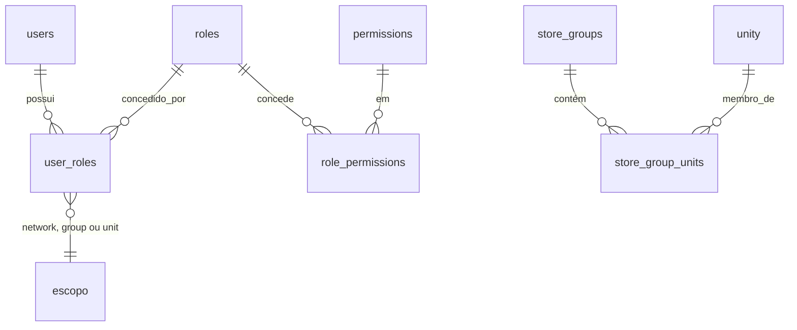

# 15 — RBAC: papéis, permissões e escopo

> PARTE 15 do briefing. Hoje existem três papéis num `STRING` (`admin | manager | user`), `ensureRole` é aplicado em **um único ponto** do roteador, e o escopo por unidade existe em dois controllers. No front-end, permissão é comparação de prefixo de rota — e `/delivery/*` não está em nenhum dos dois arrays, então um manager escreve no catálogo hoje.

---

## 1. Modelo



```sql
-- permissions: semeadas a partir do código, nunca editáveis pelo usuário
CREATE TABLE permissions (
  id           serial PRIMARY KEY,
  key          text UNIQUE NOT NULL,           -- 'orders:accept'
  resource     text NOT NULL,                  -- 'orders'
  action       text NOT NULL,                  -- 'accept'
  description  text NOT NULL,
  is_dangerous boolean NOT NULL DEFAULT false  -- exige reautenticação com MFA
);

CREATE TABLE roles (
  id         serial PRIMARY KEY,
  key        text UNIQUE NOT NULL,             -- 'store_manager'
  name       text NOT NULL,
  scope_kind text NOT NULL,                    -- escopo MÁXIMO em que o papel pode ser concedido
  is_system  boolean NOT NULL DEFAULT false,   -- papéis de sistema não podem ser editados nem excluídos
  created_at timestamptz NOT NULL DEFAULT now()
);

CREATE TABLE role_permissions (
  role_id       int REFERENCES roles(id) ON DELETE CASCADE,
  permission_id int REFERENCES permissions(id) ON DELETE CASCADE,
  PRIMARY KEY (role_id, permission_id)
);

-- MULTIVALORADO: um usuário pode ter o mesmo papel em vários escopos,
-- e papéis diferentes em escopos diferentes.
CREATE TABLE user_roles (
  id         bigserial PRIMARY KEY,
  user_id    int  NOT NULL REFERENCES users(id) ON DELETE CASCADE,
  role_id    int  NOT NULL REFERENCES roles(id),
  scope_kind text NOT NULL CHECK (scope_kind IN ('network','group','unit')),
  scope_id   int  NULL,                        -- NULL se e somente se scope_kind='network'
  granted_by int  NULL REFERENCES users(id),
  expires_at timestamptz NULL,                 -- elevação temporária (cobertura de férias)
  created_at timestamptz NOT NULL DEFAULT now(),
  CONSTRAINT scope_id_consistency CHECK (
    (scope_kind = 'network' AND scope_id IS NULL) OR
    (scope_kind <> 'network' AND scope_id IS NOT NULL)
  )
);
CREATE UNIQUE INDEX user_roles_uniq ON user_roles (user_id, role_id, scope_kind, COALESCE(scope_id, -1));
CREATE INDEX user_roles_user ON user_roles (user_id) WHERE expires_at IS NULL OR expires_at > now();

CREATE TABLE store_groups (
  id serial PRIMARY KEY, name text NOT NULL, key text UNIQUE NOT NULL,
  created_at timestamptz DEFAULT now()
);
CREATE TABLE store_group_units (
  group_id int REFERENCES store_groups(id) ON DELETE CASCADE,
  unity_id int REFERENCES unity(id)        ON DELETE CASCADE,
  PRIMARY KEY (group_id, unity_id)
);
```

`store_groups` existe **desde o dia 1**, ainda que com um único grupo "Todas as lojas". Regionais ("Zona Sul", "Shoppings", próprias vs. franqueadas) são inevitáveis com dezenas de unidades, e acrescentar um nível de escopo depois significa reemitir **todas** as concessões.

`expires_at` resolve um caso real e frequente: cobertura de férias. Uma elevação temporária que expira sozinha é muito melhor do que uma concessão permanente que ninguém lembra de revogar.

---

## 2. Convenção de nomes

`<recurso>[:<subrecurso>]:<ação>` — minúsculas, separado por dois-pontos, verbo de ação no singular.

| Exemplo | Significado |
|---|---|
| `orders:read` | ver pedidos no escopo |
| `orders:accept` / `orders:reject` / `orders:cancel` | transições do ciclo de vida |
| `orders:cancel:any` | cancelar mesmo após `out_for_delivery` (Corporate) |
| `orders:adjust` / `orders:eta:write` / `orders:item:cancel` | alterar itens e ETA após o aceite |
| `orders:dispatch` / `orders:ready` / `orders:delivery:fail` | despacho e exceções de entrega |
| `orders:autoaccept` | ativar aceite automático na unidade |
| `orders:refund` | estorno (perigoso) |
| `catalog:read` | ler cardápio |
| `catalog:master:write` | editar o mestre da rede (só Corporate) |
| `catalog:availability:write` | marcar item indisponível numa unidade (gerente) |
| `catalog:price:write` | sobrescrever preço numa unidade, dentro da política |
| `catalog:lock` / `catalog:publish` | travar campo, publicar para as unidades |
| `stores:settings:write` · `stores:pause:write` · `stores:hours:write` · `stores:open_close` | operação da loja |
| `wallet:read` · `wallet:adjust` · `wallet:adjust:high` | ledger e ajuste manual (perigosos) |
| `cashback:config:write` | alterar as regras do programa (perigoso) |
| `payments:refund` | perigoso |
| `users:read` · `users:invite` · `users:roles:write` · `roles:manage` | perigosos |
| `promotions:write` · `coupons:read` · `coupons:write` | marketing |
| `customers:read` · `customers:pii:read` · `customers:export` · `customers:erase` | LGPD |
| `chat:read` · `chat:write` · `chat:moderate` | conversa com o cliente |
| `reports:read` · `reports:export` · `reports:schedule` | relatórios |
| `audit:read` · `audit:export` | auditoria |
| `devices:manage` · `print:use` · `shift:close` · `orderhub:access` · `validator:use` | operação de loja |

**Regras:** curingas **não são armazenados** (não existe linha `orders:*`); um papel de "acesso total" é um papel que possui todas as permissões, gerado pelo seeder. Isso mantém a checagem como um simples teste de pertinência em conjunto, sem avaliação de glob, e faz de "o que este papel pode fazer" uma resposta SQL direta para a tela C-31.

---

## 3. Papéis semeados

| Papel | `scope_kind` | Concessão típica | Observação |
|---|---|---|---|
| `network_admin` | network | Operações corporativas | Tudo, exceto `platform:*` |
| `network_viewer` | network | Financeiro, marketing | Todos os `*:read` + `reports:export` |
| `regional_manager` | group | Supervisor regional | Pedidos, disponibilidade de catálogo e relatórios sobre um grupo |
| `store_manager` | unit | Responsável da loja | Ciclo de vida de pedidos, disponibilidade, pausas, relatórios da unidade |
| `store_operator` | unit | Atendente do Order Hub | `orders:read/accept/reject/status:write`, `chat:write` — **nada além** |
| `customer` | network | Usuários do app | Nenhuma permissão administrativa; existe para que todo usuário tenha uma linha de papel |

Papéis adicionais previstos (compostos a partir das mesmas chaves, sem código novo): `finance` (`finance:view`, `payments:refund`, `wallet:read`, `wallet:adjust`, `reports:*`, `audit:read`), `marketing` (`promotions:write`, `coupons:write`, `customers:read`, `reports:read`), `support` (`orders:read`, `orders:cancel`, `orders:refund`, `wallet:adjust`, `chat:*`, `customers:pii:read`).

---

## 4. Matriz papel × permissão

Legenda: ✅ concedida · ⚠️ concedida com limite · ❌ negada.

| Permissão | network_admin | network_viewer | finance | marketing | support | regional_manager | store_manager | store_operator |
|---|---|---|---|---|---|---|---|---|
| `orders:read` | ✅ | ✅ | ✅ | ✅ | ✅ | ✅ | ✅ | ✅ |
| `orders:accept` / `reject` | ✅ | ❌ | ❌ | ❌ | ❌ | ✅ | ✅ | ✅ |
| `orders:ready` / `dispatch` | ✅ | ❌ | ❌ | ❌ | ❌ | ✅ | ✅ | ✅ |
| `orders:eta:write` | ✅ | ❌ | ❌ | ❌ | ❌ | ✅ | ✅ | ✅ |
| `orders:item:cancel` | ✅ | ❌ | ❌ | ❌ | ✅ | ✅ | ✅ | ⚠️ até 40% do valor |
| `orders:cancel` | ✅ | ❌ | ❌ | ❌ | ✅ | ✅ | ✅ | ⚠️ não após `out_for_delivery` |
| `orders:cancel:any` | ✅ | ❌ | ❌ | ❌ | ⚠️ com aprovação | ❌ | ❌ | ❌ |
| `orders:refund` | ✅ | ❌ | ✅ | ❌ | ✅ | ❌ | ⚠️ até um teto | ❌ |
| `orders:autoaccept` | ✅ | ❌ | ❌ | ❌ | ❌ | ✅ | ✅ | ❌ |
| `chat:read` / `chat:write` | ✅ | ✅ (read) | ❌ | ❌ | ✅ | ✅ | ✅ | ✅ |
| `chat:moderate` | ✅ | ❌ | ❌ | ❌ | ✅ | ❌ | ❌ | ❌ |
| `catalog:read` | ✅ | ✅ | ✅ | ✅ | ✅ | ✅ | ✅ | ✅ |
| `catalog:availability:write` | ✅ | ❌ | ❌ | ❌ | ❌ | ✅ | ✅ | ✅ |
| `catalog:price:write` | ✅ | ❌ | ❌ | ⚠️ | ❌ | ⚠️ dentro da faixa | ⚠️ dentro da faixa | ❌ |
| `catalog:master:write` | ✅ | ❌ | ❌ | ✅ | ❌ | ❌ | ❌ | ❌ |
| `catalog:lock` / `catalog:publish` | ✅ | ❌ | ❌ | ⚠️ publish | ❌ | ❌ | ❌ | ❌ |
| `stores:pause:write` | ✅ | ❌ | ❌ | ❌ | ❌ | ✅ | ✅ | ✅ |
| `stores:open_close` | ✅ | ❌ | ❌ | ❌ | ❌ | ✅ | ✅ | ❌ |
| `stores:hours:write` / `settings:write` | ✅ | ❌ | ❌ | ❌ | ❌ | ✅ | ✅ | ❌ |
| `delivery:zones:write` | ✅ | ❌ | ❌ | ❌ | ❌ | ⚠️ dentro do limite | ⚠️ dentro do limite | ❌ |
| `courier:assign` | ✅ | ❌ | ❌ | ❌ | ❌ | ✅ | ✅ | ✅ |
| `wallet:read` | ✅ | ✅ | ✅ | ❌ | ✅ | ❌ | ❌ | ❌ |
| `wallet:adjust` | ✅ | ❌ | ✅ | ❌ | ✅ | ❌ | ❌ | ❌ |
| `wallet:adjust:high` | ✅ | ❌ | ⚠️ dupla aprovação | ❌ | ❌ | ❌ | ❌ | ❌ |
| `cashback:config:write` | ✅ | ❌ | ⚠️ dupla aprovação | ❌ | ❌ | ❌ | ❌ | ❌ |
| `payments:refund` | ✅ | ❌ | ✅ | ❌ | ⚠️ até um teto | ❌ | ❌ | ❌ |
| `promotions:write` | ✅ | ❌ | ❌ | ✅ | ❌ | ❌ | ⚠️ só local | ❌ |
| `coupons:write` | ✅ | ❌ | ❌ | ✅ | ⚠️ cortesia | ❌ | ⚠️ só local | ❌ |
| `loyalty:plans:write` / `benefits:write` | ✅ | ❌ | ❌ | ✅ | ❌ | ❌ | ❌ | ❌ |
| `customers:read` | ✅ | ✅ | ✅ | ✅ | ✅ | ⚠️ do grupo | ⚠️ da unidade | ❌ |
| `customers:pii:read` | ✅ | ❌ | ✅ | ⚠️ com justificativa | ✅ | ❌ | ❌ | ❌ |
| `customers:export` | ✅ | ⚠️ com justificativa | ✅ | ⚠️ | ❌ | ❌ | ❌ | ❌ |
| `customers:erase` | ✅ | ❌ | ❌ | ❌ | ❌ | ❌ | ❌ | ❌ |
| `reviews:read` / `reviews:reply` | ✅ | ✅ (read) | ❌ | ✅ | ✅ | ✅ | ✅ | ❌ |
| `reports:read` | ✅ | ✅ | ✅ | ✅ | ✅ | ✅ | ✅ | ❌ |
| `reports:export` / `schedule` | ✅ | ✅ | ✅ | ✅ | ❌ | ✅ | ✅ | ❌ |
| `finance:view` / `finance:reconcile` | ✅ | ✅ (view) | ✅ | ❌ | ❌ | ❌ | ❌ | ❌ |
| `users:read` | ✅ | ✅ | ❌ | ❌ | ❌ | ⚠️ do grupo | ⚠️ da unidade | ❌ |
| `users:invite` / `users:roles:write` | ✅ | ❌ | ❌ | ❌ | ❌ | ⚠️ abaixo do próprio nível | ⚠️ abaixo do próprio nível | ❌ |
| `roles:manage` | ✅ | ❌ | ❌ | ❌ | ❌ | ❌ | ❌ | ❌ |
| `audit:read` / `audit:export` | ✅ | ✅ (read) | ✅ | ❌ | ⚠️ read | ⚠️ do grupo | ⚠️ da unidade | ❌ |
| `settings:write` (rede) | ✅ | ❌ | ❌ | ❌ | ❌ | ❌ | ❌ | ❌ |
| `devices:manage` / `print:use` | ✅ | ❌ | ❌ | ❌ | ❌ | ✅ | ✅ | ✅ (só `print:use`) |
| `orderhub:access` / `shift:close` | ✅ | ❌ | ❌ | ❌ | ❌ | ✅ | ✅ | ✅ |
| `validator:use` | ✅ | ❌ | ❌ | ❌ | ✅ | ✅ | ✅ | ✅ |
| `notifications:broadcast` | ✅ | ❌ | ❌ | ✅ | ❌ | ❌ | ❌ | ❌ |

**Regra de não escalonamento:** nenhum usuário pode conceder um papel cujo conjunto de permissões não seja subconjunto do próprio, nem num escopo maior que o seu. Isso é validado no serviço, não só na UI.

---

## 5. Resolução em tempo de requisição

```ts
// platform/http/middlewares/authenticate.ts  → monta o RequestContext
interface RequestContext {
  requestId: string;
  actor: { userId: number; email: string; sessionId: string } | null;
  permissions: Set<string>;              // união já resolvida
  scope: {
    network: boolean;                    // true = irrestrito
    unitIds: number[];                   // totalmente expandido (grupos já achatados)
  };
  ip: string; userAgent: string;
}
```

Mantido em `AsyncLocalStorage` pelo tempo de vida da requisição:

1. Verifica assinatura e expiração do JWT **localmente** — **sem ida ao banco**. Isso corrige o `findByEmail` por requisição que existe hoje em `src/middlewares/auth.ts:26`.
2. Consulta `perm:{userId}:{permVersion}` no Redis (TTL 300 s). Miss → uma consulta juntando `user_roles → role_permissions → permissions`, mais uma expandindo `store_group_units`; depois cacheia.
3. Invalidação por incremento de `users.permissions_version` em qualquer concessão ou revogação. O JWT carrega `pv`; um token com `pv` velho força nova resolução (e, em revogações, uma checagem em `sessions`).

**Deliberadamente fora do JWT:** a lista de permissões — cresce além do limite de header e não pode ser revogada.
**Dentro do JWT:** `sub`, `sid`, `pv`, `role` (claim legado, ver §7) e `unitIds` apenas quando forem ≤ 10 (caminho rápido para o handshake de socket, ignorado se o `pv` divergir).

```ts
authorize('orders:accept', scopeFrom.param('storeId'))
authorize('catalog:master:write', scopeFrom.network())
authorize('orders:read', scopeFrom.resource(orderRepo.unityIdOf))  // escopo derivado da própria linha
```

Devolve `403` com `{ code: 'FORBIDDEN_PERMISSION' | 'FORBIDDEN_SCOPE' }`. **Distinguir os dois é o que permite às SPAs dizer "você pode fazer isso, mas não nesta loja"** ([17 §4.4](./17-ux-navegacao.md)).

---

## 6. Imposição na camada de query — a parte que realmente vale

Middleware sozinho é promessa; a garantia precisa morar onde as linhas são selecionadas. Três camadas, na ordem de implementação.

### Camada 1 — `ScopedRepository` (Fase 1, obrigatória)

Todo repositório que toca tabela com escopo de unidade estende esta classe. **É impossível chamar uma leitura ou escrita sem contexto, porque não existe método sem escopo.**

```ts
// platform/db/ScopedRepository.ts
export abstract class ScopedRepository<M extends Model> {
  protected abstract model: ModelStatic<M>;
  protected abstract unityColumn: string | null;   // null ⇒ não é escopado (tem de ser explícito)

  private scopeWhere(ctx: RequestContext): WhereOptions {
    if (!this.unityColumn) return {};
    if (ctx.scope.network) return {};
    if (ctx.scope.unitIds.length === 0) throw new ForbiddenError('NO_UNIT_SCOPE');
    return { [this.unityColumn]: { [Op.in]: ctx.scope.unitIds } };
  }

  findAllScoped(ctx: RequestContext, options: FindOptions = {}) {
    return this.model.findAll({
      ...options, where: { ...(options.where ?? {}), ...this.scopeWhere(ctx) }
    });
  }

  async findByPkScoped(ctx: RequestContext, id: number, options: FindOptions = {}) {
    const row = await this.model.findOne({
      ...options, where: { id, ...this.scopeWhere(ctx) } as WhereOptions
    });
    if (!row) throw new NotFoundError();   // 404, não 403: nunca vazar existência entre unidades
    return row;
  }

  async updateScoped(ctx, id: number, values, options: { transaction?: Transaction } = {}) {
    const [n] = await this.model.update(values, {
      where: { id, ...this.scopeWhere(ctx) } as WhereOptions, ...options
    });
    if (n === 0) throw new NotFoundError();
    return n;
  }
}
```

Dois detalhes não óbvios: o predicado de escopo é aplicado ao `where` **depois** da cláusula do chamador, então nunca pode ser sobrescrito por um `unityId` vindo do chamador; e uma linha fora de escopo devolve **404, não 403**, para que um Store Manager não consiga enumerar ids de pedido de outras unidades sondando códigos de status.

### Camada 2 — guarda de CI (Fase 1)

Um teste que faz grep em `src/modules/**` procurando `Model.findAll|findOne|update|destroy` fora de arquivos `*Repository.ts` e reprova o build. Feio, eficaz, cinco linhas.

### Camada 3 — RLS do PostgreSQL (Fase 3, defesa em profundidade)

Depois que a camada 1 estiver estável e auditada, habilitar RLS em `orders`, `order_items`, `products`, `unit_catalog_items` e `delivery_zones`:

```sql
ALTER TABLE orders ENABLE ROW LEVEL SECURITY;
CREATE POLICY orders_scope ON orders USING (
  current_setting('app.network', true) = 'on'
  OR unity_id = ANY (string_to_array(current_setting('app.unit_ids', true), ',')::int[])
);
```

com `withTransaction` emitindo `SET LOCAL app.unit_ids = '…'` no início da transação. É `SET LOCAL` (escopo de transação) **especificamente porque o Sequelize faz pooling de conexões** — um `SET` de sessão vazaria o escopo de um usuário para a requisição de outro. Migrations e o papel do AdminJS conectam como usuário `BYPASSRLS`.

Custo: todo caminho de escrita precisa estar dentro de uma transação. É por isso que isto é Fase 3, e não Fase 1.

---

## 7. Migração a partir do `role STRING` sem quebrar o app

O app mobile lê `role` do payload do JWT **e** do corpo da resposta de login. Ele precisa continuar vendo exatamente `'admin' | 'manager' | 'user'`.

| Passo | Mudança | Impacto no app |
|---|---|---|
| 1 | Criar as tabelas de RBAC. **Não tocar em `users.role`** | nenhum |
| 2 | Backfill: `role='admin'` → `network_admin` @ network; `role='manager'` com `unity_id` → `store_manager` @ `unit:{unityId}`; `role='manager'` com `unity_id` NULL → **sinalizado num relatório para atribuição manual**, recebendo `network_viewer` no interim; `role='user'` → `customer` @ network | nenhum |
| 3 | O JWT mantém `role` como **claim legado derivado**: `network_admin → 'admin'`; qualquer papel de unidade ou grupo → `'manager'`; senão `'user'`. Acrescentar `roles`, `pv`, `sid` | nenhum — claims aditivos, o app ignora chaves desconhecidas |
| 4 | Dual-write: `identityService.grantRole()` também recalcula e grava `users.role` com o valor derivado, **na mesma transação** | nenhum |
| 5 | Código v1 novo lê **somente** RBAC. O `ensureRole()` de `src/middlewares/auth.ts` fica intacto para o roteador legado | nenhum |
| 6 | (≥ 6 meses, após atualização forçada do app) remover o claim `role`, e depois `users.role`, em releases separadas | condicionado por `min_version` |

`users.role` passa a ser uma coluna **derivada e somente-leitura para humanos** durante toda a transição. Nada, em lugar nenhum, escreve nela diretamente — exceto a função de derivação.

---

## 8. Estado da implementação — Fase 1

Implementado no branch `feature/phase-1-order-hub` da API (não implantado).

| Item | Situação |
|---|---|
| Tabelas `permissions`, `roles`, `role_permissions`, `user_roles`, `store_groups`, `store_group_units` | ✅ migration `20260816091000-rbac-tables.js` |
| `users.permissions_version` | ✅ |
| Passos 1–3 da migração do §7 (tabelas, backfill, `users.role` intacta) | ✅ |
| `authorize()` com `FORBIDDEN_PERMISSION` / `FORBIDDEN_SCOPE` | ✅ verificado em servidor real |
| `ScopedRepository` (camada 1) | ✅ |
| Guarda de CI (camada 2) | ✅ |
| RLS (camada 3) | ⬜ Fase 3, como previsto |
| Cache no Redis | ⬜ em processo por ora — ver abaixo |

### 8.1 Desvios conscientes

**Nº 1 — o papel `customer` não é concedido em massa.** O §3 previa uma linha de papel para todo usuário do app. Seriam dezenas de milhares de linhas sem informação: a resolução trata "nenhuma concessão" e "só a concessão de `customer`" de forma idêntica, porque `customer` não tem nenhuma permissão. **A ausência de concessão administrativa é o papel de cliente.** O papel continua existindo na tabela `roles` para o dia em que ganhar alguma permissão própria.

**Nº 2 — o catálogo de permissões é JSON, não TypeScript.** `src/platform/rbac/catalog.json` é lido pelo código e pelo seeder. Uma lista em TS obrigaria o seeder a manter uma cópia, e duas cópias sempre derivam — uma deriva aqui vira permissão que o código exige e o banco desconhece. O custo é perder a união literal de tipos; a compensação é `assertPermissaoConhecida()`, chamada por `authorize()` na declaração da rota, ou seja, **na subida do processo**. Chave errada derruba o boot em vez de virar um 403 inexplicável.

**Nº 3 — o cache de permissões é em processo, não no Redis.** Redis é da trilha de plataforma da Fase 0, que ainda não subiu. A chave já é `userId:permissionsVersion`, que é justamente o que torna o cache compartilhado seguro; trocar o `Map` por Redis não muda mais nada.

**Limite conhecido:** persiste **uma** consulta por requisição, a que lê `permissions_version` e `disabled_at`. O §5 previa carregar a versão do claim `pv` do JWT e dispensar até isso, mas os tokens em circulação não a carregam, e emitir token novo é trabalho do módulo `identity`. Ainda assim, uma busca por chave primária no lugar do `findByEmail` por requisição do caminho legado já é o ganho da fase.

### 8.2 Backfill: o que ele encontrou

`role='manager'` **sem `unity_id`** existe de verdade na base — dois usuários. Eles receberam `network_viewer` e entraram no relatório que o seeder imprime. Atribuir escopo de unidade por adivinhação seria conceder acesso por acidente, que é exatamente o que este capítulo existe para impedir.
