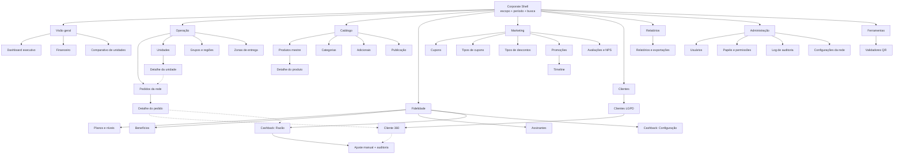

# 17 — UX e arquitetura de navegação

> PARTE 17 do briefing. Arquitetura de navegação de cada uma das três aplicações, mais os padrões transversais de UX: semântica de cor por estado, copy pt-BR, política de confirmação vs. desfazer, tratamento de permissão negada e matriz de notificações.

---

## 1. Corporate

**Shell:** sidebar fixa colapsável (240 px / 64 px) + topbar de 56 px + conteúdo. A topbar carrega: seletor de escopo, seletor de período global, busca/paleta de comandos, notificações e avatar.

### 1.1 Agrupamento da sidebar

| Seção | Itens |
|---|---|
| **Visão geral** | Dashboard executivo · Financeiro · Comparativo de unidades |
| **Operação** | Pedidos · Unidades · Grupos e regiões · Zonas de entrega |
| **Catálogo** | Produtos · Categorias · Adicionais · Publicação |
| **Fidelidade** | Planos e níveis · Benefícios · Assinantes · Cashback (Configuração · Razão · Ajustes) |
| **Marketing** | Cupons (Cupons · Tipos de cupons · Tipos de descontos) · Promoções · Timeline · Avaliações e NPS |
| **Clientes** | Clientes · Cliente 360 (acessado por drill) |
| **Relatórios** | Relatórios e exportações |
| **Administração** | Usuários · Papéis e permissões · Log de auditoria · Configurações da rede |
| **Ferramentas** | Validadores |

Itens sem permissão são **ocultados**; uma seção que fica vazia desaparece inteira (ver §4.4). A sidebar é gerada do mesmo manifesto que o router ([04 §8.2](./04-arquitetura-frontend.md)), então nunca existe rota acessível-porém-invisível.

### 1.2 Seletor de escopo — o elemento mais importante da topbar

```
┌ Escopo ──────────────────────────────┐
│ 🔍 Buscar unidade, grupo ou região…  │
│ ● Toda a rede                (12)    │
│ ▾ Região Centro-Sul           (5)    │
│     ○ Matsuya Mooca                  │
│     ○ Matsuya Liberdade              │
│ ▾ Região Oeste                (4)    │
│ ── Recentes ──                       │
│   Matsuya Mooca · Região Oeste       │
│ ☐ Comparar (até 4)                   │
└──────────────────────────────────────┘
```

O escopo é **pegajoso**: muda de tela sem resetar. Selecionar até 4 alvos ativa o modo comparação nas telas que o suportam (dashboards e relatórios).

### 1.3 Escopo na URL — compartilhável por construção

O escopo é **segmento de caminho**, não query, porque define *o que* a tela mostra:

```
/c/{escopo}/{seção}/{recurso}?{filtros}

/c/rede/dashboard?periodo=2026-08-01..2026-08-14
/c/regiao-centro-sul/pedidos?status=pending,preparing&pagamento=pix
/c/unidade-12/catalogo/produtos/845
/c/rede/cashback/razao?tipo=ADJUSTMENT&periodo=ultimos-30-dias
/c/unidade-12,unidade-19/comparativo?metrica=ticket_medio
```

Regras: slugs legíveis (`unidade-12`, nunca UUID); todo filtro vive na query e é serializável; abrir uma URL sem escopo autorizado mostra a tela de escopo negado **com o que o usuário pode ver** — nunca um fallback silencioso; o período aceita presets nomeados (`hoje`, `ontem`, `ultimos-7-dias`, `mes-atual`) além de intervalos, para o link não envelhecer.

### 1.4 Breadcrumbs, busca e notificações

**Breadcrumbs:** `Rede › Região Centro-Sul › Matsuya Mooca › Catálogo › Temaki Salmão`. Cada nível é clicável e **muda o escopo** — é o caminho natural de "subir" na hierarquia. O último nível não é link.

**Busca global / paleta de comandos (`Ctrl/⌘ + K`):** um único campo que resolve entidades e ações. Resultados agrupados em `Pedidos` (nº, telefone, e-mail), `Clientes`, `Unidades`, `Produtos`, `Cupons` e `Ações` (`Ir para relatórios`, `Trocar escopo para…`, `Exportar pedidos`, `Abrir log de auditoria`). A busca **respeita escopo e permissão** — o que o usuário não pode ver não aparece, nem como "sem acesso". Digitar apenas dígitos assume número de pedido.

**Central de notificações:** sino na topbar com contagem; painel lateral com abas `Alertas` (SLA, unidade offline, divergência de conciliação, pedido escalado), `Aprovações` (ajuste de cashback acima do teto, dupla aprovação de configuração) e `Avisos`. Cada item leva à origem.

### 1.5 Responsivo

O Corporate é **desktop-first (≥ 1280 px)**. Em tablet (768–1279 px) a sidebar colapsa para ícones e as tabelas viram "colunas prioritárias + expandir linha". Abaixo de 768 px só um subconjunto é suportado — **dashboards, pedidos, detalhe do pedido, clientes e notificações**, que é o que um diretor consulta no celular. Telas de edição pesada (catálogo, RBAC, publicação) mostram `Esta tela precisa de uma tela maior.` com link para as consultáveis. Prometer edição de catálogo no celular seria mentira e geraria erro de dados.

### 1.6 Arquitetura da informação



---

## 2. Store Manager / Portal da Unidade

**Shell:** sidebar de 220 px + topbar. O elemento dominante da topbar não é um escopo abstrato — é a **unidade ativa com seu estado operacional**:

```
[🏪 Matsuya Mooca ▾]   ● ABERTA   ⏱ Preparo 25 min   🔴 3 pedidos ativos   🔔   JS
```

### 2.1 Seções

| Seção | Itens |
|---|---|
| **Painel** | Visão do dia |
| **Pedidos** | Pedidos · Abrir Order Hub ↗ |
| **Operação** | Status da loja · Horários · Tempo de preparo · Área de entrega · Meios de pagamento |
| **Cardápio** | Itens da unidade · Indisponibilidades · Promoções locais · Cupons |
| **Desempenho** | Relatórios · Avaliações |
| **Unidade** | Equipe · Dispositivos e impressoras |

### 2.2 Troca de unidade

O seletor lista **só as unidades autorizadas** — nunca a rede inteira — com o estado ao lado de cada nome. Trocar de unidade **mantém a tela atual** (`/u/mooca/cardapio` → `/u/liberdade/cardapio`) e mostra `Você está agora em Matsuya Liberdade.` Se a tela não existir no destino, cai no painel.

Um badge persistente com a cor da unidade evita o erro clássico de editar o cardápio da loja errada. E quando o usuário tem mais de uma unidade, ações destrutivas (fechar loja, editar preço) trazem o nome da unidade **dentro do botão de confirmação**: `Fechar Matsuya Liberdade`.

**URL:** `/u/{slug-unidade}/{seção}?{filtros}` — por exemplo `/u/mooca/pedidos?periodo=hoje&status=cancelled`.
**Breadcrumbs:** `Matsuya Mooca › Cardápio › Temaki Salmão`.

### 2.3 Busca, notificações e responsivo

**Busca (`⌘K`):** escopo restrito à unidade — pedidos, itens do cardápio, membros da equipe — e ações rápidas (`Pausar delivery 30 min`, `Marcar item indisponível`, `Imprimir último pedido`).

**Notificações:** alertas próprios da unidade — SLA estourado, item esgotado, impressora offline, avaliação de 1 a 2 estrelas, publicação de catálogo recebida do Corporate, promoção da rede iniciando.

**Responsivo: tablet-first.** Em ≥ 768 px tudo funciona; a sidebar vira gaveta abaixo de 1024 px. No celular, painel, pedidos, status da loja e indisponibilidades são plenamente funcionais — são as ações que o gerente executa fora da loja. Só relatórios pesados e edição de zonas exigem tela maior.

---

## 3. Order Hub

**Shell: nenhum.** O Order Hub não tem sidebar. Navegação lateral é conflito de atenção. O shell é uma **barra de status de 56 px**, e o board ocupa o resto.

```
[● ABERTA ▾] Matsuya Mooca | Preparo 25min ▾ | 🔔 | 🖨 OK | 👥 3 | 🔍 | ⛶ | ⚙ | JS
```

Cada elemento da barra é um estado operacional acionável, não um item de menu. As telas H-05 a H-12 abrem como **drawer, sheet ou overlay sobre o board** — o board nunca é substituído, exceto no login e no modo degradado. É a diferença central em relação ao painel do iFood, que empilha telas cheias e faz o operador perder o rastro da fila.

**URL:** `/h/{slug-unidade}` para o board; as sobreposições ficam na query para serem deep-linkáveis a partir de push e notificação:

```
/h/mooca?pedido=1047&painel=preparo
/h/mooca?pedido=1047&painel=chat
/h/mooca?pedido=1042&painel=despacho
/h/mooca?tela=impressao
```

Recarregar restaura exatamente o estado.

**Troca de unidade:** só existe se o operador tem múltiplas unidades, e é **deliberadamente pesada** (confirmação + revalidação de PIN) — trocar de unidade por engano num pico é catastrófico.

**Busca:** `/` abre um campo sobreposto. Só pedidos: número, nome, últimos 4 dígitos do telefone. **Sem paleta de comandos** — as ações já são atalhos de teclado.

**Notificações:** não há central. Eventos que exigem ação **entram na faixa de Exceções do próprio board**. Uma fila de notificações separada seria uma segunda fila de trabalho — e uma segunda fila é uma fila esquecida.

**Responsivo:** ver [03 §3.2](./03-tres-aplicacoes.md). O modo `< 1024 px` (tablet retrato) é destino de primeira classe, não fallback. Abaixo de 640 px o painel mostra `O painel de pedidos precisa de um tablet ou computador.` com um resumo somente-leitura e o telefone do suporte — é uma tela de emergência, não uma versão do produto.

---

## 4. Princípios e padrões transversais

### 4.1 Semântica de cores por estado

**Regra fundamental: cor nunca é o único portador de significado** — sempre acompanha ícone e rótulo. Os tons partem da paleta já usada no app do cliente, mantendo continuidade de marca.

| Estado | Cor | Ícone | Semântica |
|---|---|---|---|
| `awaiting_payment` | Cinza-azulado | ⏳ | Neutro — ainda não é trabalho |
| `payment_failed` | Vermelho | ⚠ | Falha que exige ação |
| `pending` | **Âmbar** | ⏱ | Ação urgente do operador |
| `confirmed` | Azul | ✓ | Aceito, ainda não trabalhado |
| `preparing` | Azul escuro | 🍳 | Em trabalho |
| `ready` | Roxo | 📦 | Trabalho concluído, aguarda saída |
| `awaiting_courier` | Roxo escuro | 🕐 | Aguarda terceiro — risco de travar |
| `out_for_delivery` | Verde-azulado | 🛵 | Fora da loja |
| `delivered` | Verde | ✓ | Sucesso terminal |
| `rejected` | Vermelho escuro | ✕ | Terminal negativo, decisão da loja |
| `cancelled` | Vermelho | ✕ | Terminal negativo |
| `delivery_failed` | Laranja-vermelho | ⚠ | Exceção recuperável |
| `customer_not_found` | Laranja-vermelho | 📍 | Exceção recuperável |

Notas de projeto: `pending` é **âmbar e não vermelho** — vermelho fica reservado a *erro/falha*, senão o operador se dessensibiliza ao vermelho justamente quando ele importa. **Verde só significa "deu certo"**: nunca usar verde para "aceitar" como estado, só como ação. `paymentStatus` usa a mesma paleta, porém em badge de contorno, para não competir com o estado do pedido.

### 4.2 Padrões de copy pt-BR

**Estados vazios — sempre em 3 partes:** o que aconteceu · por quê / o que fazer · ação.

| Contexto | Copy |
|---|---|
| Lista sem dados | `Nada por aqui ainda.` / `Quando houver {entidade}, ela aparece nesta lista.` / `[Criar {entidade}]` |
| Filtro sem resultado | `Nenhum resultado para esses filtros.` / `Tente ampliar o período ou remover algum filtro.` / `[Limpar filtros]` |
| Busca sem resultado | `Não encontramos nada para "{termo}".` / `Confira a grafia ou tente o número do pedido.` |
| Order Hub sem pedidos | `Nenhum pedido no momento.` / `Assim que chegar um pedido novo, você ouve o alerta.` |
| Sem permissão | `Você não tem acesso a esta área.` / `Fale com o administrador da sua unidade se precisar deste acesso.` |

**Erros — nunca expor código técnico, sempre oferecer saída.** Sem "Ops!", sem "Algo deu errado".

| Situação | Copy |
|---|---|
| Falha de rede | `Não foi possível carregar. Verifique sua conexão.` `[Tentar de novo]` |
| Erro do servidor (5xx) | `Não conseguimos concluir agora. Já fomos avisados.` `[Tentar de novo]` `[Falar com o suporte]` |
| Validação | `Informe {campo}.` / `{Campo} precisa ter pelo menos {n} caracteres.` — sempre no campo, nunca só no topo |
| Conflito de edição | `Outra pessoa alterou este registro enquanto você editava.` `[Ver o que mudou]` `[Recarregar]` |
| Ação já executada | `Este pedido já foi aceito por {nome} há instantes.` |
| Sessão expirada | `Sua sessão expirou por segurança.` `[Entrar de novo]` |
| Offline | `Sem conexão. Suas ações serão enviadas quando a internet voltar.` |
| Impressão | `Não foi possível imprimir o pedido #{n}.` `[Tentar de novo]` `[Ver na tela]` |

**Carregamento:** skeleton com a forma do conteúdo real (nunca spinner central) abaixo de 3 s. Acima de 3 s, skeleton + `Carregando {entidade}…`. Acima de 10 s, converter em job assíncrono: `Estamos preparando seu relatório. Avisamos quando estiver pronto.` `[Ver em Relatórios]`. **Nunca bloquear a tela inteira.**

**Parcial:** quando parte dos dados falha, renderizar o resto e marcar o buraco: `Não foi possível carregar {seção}.` `[Recarregar esta seção]`. Uma falha de widget nunca derruba a página.

### 4.3 Confirmação vs. desfazer

| Tipo de ação | Padrão | Exemplos |
|---|---|---|
| Reversível, baixo impacto | **Desfazer** (toast de 8 s, sem confirmação) | Marcar item indisponível, arquivar avaliação, reordenar categoria, marcar notificação lida |
| Reversível, com efeito externo | **Desfazer com janela curta** (5 s); o efeito externo só dispara depois | Publicar aviso interno, pausar delivery |
| Irreversível, sem efeito no cliente | **Confirmação simples** com o nome do objeto | Excluir cupom não usado, remover usuário, excluir zona |
| Irreversível, com efeito no cliente ou em dinheiro | **Confirmação com motivo + painel de consequências** | Recusar pedido, cancelar pedido, cancelar item, reembolsar, ajustar cashback |
| Alto impacto sistêmico | **Confirmação por digitação + dupla aprovação** | Publicar catálogo para toda a rede, mudar % de cashback, desativar unidade, excluir cliente (LGPD) |

Regras transversais: **nunca oferecer desfazer para algo que o cliente já viu** — se o push saiu, não há desfazer. O botão de confirmação nomeia a ação (`Recusar pedido`), nunca `OK`/`Sim`. Ação destrutiva sempre à direita, e o botão só habilita com os campos obrigatórios preenchidos. **Nunca** usar delay artificial em botão, com a única exceção da faixa de observação ([03 §3.3](./03-tres-aplicacoes.md)), que é anti tap-through e não punição.

### 4.4 Permissão negada — ocultar, desabilitar ou explicar

Três regras, aplicadas nesta ordem:

| Situação | Tratamento | Por quê |
|---|---|---|
| O usuário **nunca** poderá ter a permissão no papel dele (ex.: operador e "Configurações da rede") | **Ocultar** — item de menu, seção e rota não existem | Mostrar o inacessível é ruído e vaza o modelo organizacional |
| O usuário **poderia** ter, mas não tem no escopo atual (ex.: gerente com `orders:cancel` em `unit:12` olhando `unit:19`) | **Desabilitar + explicar**: `Você não tem permissão para cancelar pedidos em Matsuya Liberdade.` `[Solicitar acesso]` | Ele precisa entender que a ação existe e como obtê-la |
| Campo **travado pelo Corporate** (catálogo) | **Visível, somente-leitura, com cadeado e origem**: `🔒 Preço definido pela matriz.` + quem travou e quando + `[Solicitar alteração]` | É informação de governança, não falta de permissão — esconder gera ticket de suporte |
| Acesso direto por URL sem permissão | Tela dedicada de acesso negado, com o que ele *pode* acessar + `[Solicitar acesso]` | Nunca 404 genérico — o usuário acharia que o link está quebrado |
| Ação acima do limite do papel (ex.: ajuste de cashback acima do teto) | Ação habilitada; o envio abre **fluxo de aprovação**: `Este ajuste precisa da aprovação de um gerente financeiro.` `[Enviar para aprovação]` | Transforma um bloqueio em fluxo de trabalho |

**Nunca desabilitar sem explicação.** Botão cinza sem tooltip é o padrão mais odiado em painel administrativo.

### 4.5 Matriz de notificações

Canais: **T** = toast in-app · **S** = som · **B** = badge/contador · **P** = push · **E** = e-mail · **X** = escalada (push + e-mail ao gerente).

| Evento | Order Hub | Store Manager | Corporate | Cliente |
|---|---|---|---|---|
| Pedido novo (`pending`) | **S + B + T** (+ push se aba oculta) | B | — | — |
| SLA de aceite a 30 s | **S (urgente) + T** | B | — | — |
| SLA de aceite expirou | **S + T persistente** | **P + B** | — | P |
| Pedido escalado (+2 min do SLA) | T | **X** | B | — |
| Auto-recusa por falta de resposta | T | **X + E** | **B + E** | P |
| Pedido aceito | T | — | — | P |
| Preparo atrasado (> ETA + 10 min) | **S + B (Exceções)** | B | — | — |
| ETA alterado pelo operador | T | — | — | **P** (se marcado) |
| Pedido pronto / saiu para entrega | T | — | — | **P** |
| Entregue | — | — | — | P + pedido de avaliação |
| Cliente cancelou | **S + T** | B | — | — |
| Loja cancelou / recusou | T | B | B (acima do limite de %) | **P** |
| Cancelamento parcial | T | B | — | **P** |
| Sem entregador > 5 min | **S + B (Exceções)** | **P** | — | — |
| Falha na entrega / cliente não localizado | **S + B (Exceções)** | **P** | B | **P** |
| Mensagem do cliente no chat | **S (agrupado) + B** | B | — | — |
| Chat sem resposta > 3 min | **B (Exceções)** | **P** | — | — |
| Pagamento não aprovado (pós-aceite) | **S + T** | **P** | B | **P** |
| Pix expirando (5 min) | — | — | — | **P** |
| Impressora offline | **T persistente + B** | **P + B** | — | — |
| Conexão perdida > 30 s | **T persistente** | B | B (unidade offline) | — |
| Loja fechada com pedidos chegando | **T persistente + S** | **P + E** | **B** | — |
| Item esgotado marcado | T | **B** | — | — |
| Publicação de catálogo recebida | — | **T + B + E** | T | — |
| Divergência de catálogo detectada | — | B | **B + E** | — |
| Ajuste de cashback acima do teto | — | — | **B + E (aprovação)** | — |
| Ajuste de cashback aplicado | — | — | B | **P** (extrato) |
| Cashback prestes a expirar (7 dias) | — | — | — | **P + E** |
| Cliente subiu de nível | — | — | — | **P** |
| Avaliação de 1 a 2 estrelas | — | **P + B** | B | — |
| NPS da unidade abaixo do limite (semanal) | — | **E** | **E + B** | — |
| Conciliação divergente | — | — | **B + E** | — |
| Relatório agendado pronto | — | **B + E** | **B + E** | — |
| Novo usuário convidado | — | B | B | — |
| Login em novo dispositivo | — | **P + E** | **P + E** | E |

**Regras:** som **só existe no Order Hub** — no Corporate ou no Store Manager seria hostil em reunião. Push ao cliente é **sempre único por evento**; nunca reenviar o mesmo estado. E-mail é para o que precisa de rastro ou para quem não está logado (aprovações, relatórios, segurança, resumos). Toda notificação leva a um destino acionável, nunca a uma lista genérica. Preferências por canal ficam em C-36 e no perfil de cada app; **alertas de segurança e de aprovação não podem ser desligados**.
