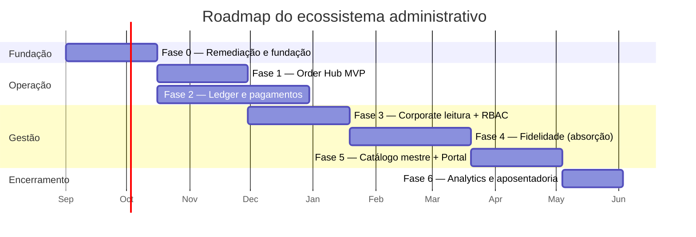

# 21 — Roadmap

> PARTE 21 do briefing. Sete fases, cada uma com **portão de saída explícito**. As durações supõem 2 a 3 pessoas de engenharia; some 40% se for uma só.

---

## Visão geral

As fases 1 e 2 correm em **paralelo** após a Fase 0: o Order Hub não depende do ledger (opera sobre pedidos que ainda não gastam cashback), e o ledger não depende do Hub.

---

## Fase 0 — Remediação e fundação · ~6 semanas

**Nada chega ao usuário. Tudo depois disto depende daqui.**

| Frente | Conteúdo |
|---|---|
| Segurança (bloqueante) | Os 13 itens de [18 §1](./18-seguranca.md): segredo do JWT, expurgo de `.env`, fechamento dos 9 endpoints abertos, `ensureAuth` falhando fechado, AdminJS, config validada, `dist/`, helmet e rate limit, middleware de erro, `address_snapshot`, dinheiro em centavos, backup com ensaio de restauração, testes de linha de base |
| Plataforma backend | `src/platform/*`, `/api/v1` montado e vazio, congelamento do roteador legado com guarda de CI, pino + request-id, `AppError` + `errorHandler`, Redis, BullMQ, outbox + relay, `audit_logs` particionada, Docker + GitHub Actions, ambientes local/dev/staging/prod |
| Plataforma frontend | Monorepo pnpm + Turborepo, tokens de design, núcleo do `packages/ui` (~15 componentes), `contracts`, `api-client`, `queries`, `auth` + manifesto de permissão, shell do console, CI, Storybook, esqueleto do `realtime` |

**Portões de saída:** todo item de [18 §1](./18-seguranca.md) verificado em produção · CI verde com migrations `up → down → up` · staging de pé com cópia anonimizada · restauração de backup ensaiada com sucesso · Storybook publicado.

**Risco desta fase:** dourar a pílula do design system. O timebox é duro; o que não couber vai para a Fase 1.

---

## Fase 1 — Order Hub MVP · ~6 semanas *(paralela à Fase 2)*

> **Andamento.** A fundação de backend está construída no branch
> `feature/phase-1-order-hub` e **não implantada** — nada de Fase 0 nem de Fase 1
> foi a produção; a decisão é implantar tudo junto, mais adiante. Feito: máquina
> de 13 estados, `store_change_log` com resync por cursor, lock otimista e
> pessimista, RBAC com escopo por unidade, Socket.IO `/ops` e o serializador que
> protege o app. Falta: SLA e escalada (dependem de BullMQ), impressão, modo
> offline, notificações e as 12 telas — que dependem do monorepo, ainda não
> iniciado. Detalhe em [09 §7](./09-pedidos.md) e [15 §8](./15-rbac.md).
>
> **Pré-requisito descoberto:** o delivery vivia em `feature/delivery-backend`,
> um branch nunca implantado, enquanto o endurecimento da Fase 0 saiu de
> `master`. Não existia base única sobre a qual construir. As duas linhas foram
> unidas antes de qualquer código novo.

Greenfield, zero acoplamento com o legado, **maior valor de negócio**, e prova a pilha inteira (tempo real, impressão, design system) nas condições mais duras.

| Entrega | Detalhe |
|---|---|
| Máquina de estados estendida | Os 13 estados de [03 §2](./03-tres-aplicacoes.md), com serializador legado preservando o contrato do app |
| RBAC mínimo | `store_operator` e `store_manager` com escopo de unidade; `ScopedRepository` obrigatório |
| Tempo real | Socket.IO `/ops`, rooms por unidade, `store_change_log`, endpoint `/changes`, heartbeat de aplicação |
| Order Hub (todas as 12 telas) | Board híbrido, SLA com som e escalada, aceite/recusa com motivo, preparo, chat, despacho, exceções |
| Impressão | Agente local v1 + fallback pelo navegador, com heartbeat e fila |
| Modo offline | Fila em IndexedDB com TTL, reconciliação com modal de reconhecimento |
| Notificações | Push ao cliente nas transições de status (hoje não existe nenhum tipo de push de delivery) |

**Portões de saída:** duas unidades piloto operando exclusivamente pelo Hub por 2 semanas · zero pedido perdido verificado por reconciliação do `store_change_log` · p95 de SLA de aceite abaixo de 5 min · fluxos E2E 1 a 5 verdes.

---

## Fase 2 — Ledger de cashback e pagamentos · ~10 semanas *(paralela à Fase 1)*

A fase de maior risco financeiro. Subfases com portões próprios, seguindo [10 §5](./10-cashback-ledger.md).

| Onda | Conteúdo | Portão |
|---|---|---|
| W0 | Purga dos cartões em texto puro; bloqueio do Pix mockado; índices `ix_points_user_document` e `ux_users_document` | Aval de segurança |
| W1 | Schema da carteira + `walletService` + suíte de invariantes | Testes de propriedade verdes |
| W2 | Backfill + dual-write sombra + reconciliação noturna | **7 noites limpas consecutivas** |
| W3 | QR de loja mapeado em reservas + **sweeper** | Sweeper observado liberando reservas reais |
| W4 | Leitura pelo ledger, rampa, grandfather, cutover | Aval do financeiro sobre o número agregado |
| W5 | Motor de regras de acúmulo + campanhas | Campanha lançada sem deploy |
| W6 | Mercado Pago Pix + webhooks + poller | Cenário de reconciliação passa em staging |
| W7 | Cartão com autorização/captura, pagamento híbrido, saga | Matriz de compensação inteiramente testada |
| W8 | Estornos, clawback, ajustes, quatro olhos | Revisão de auditoria |

**A W3 é deliberadamente cedo e entregável isoladamente** — corrige um bug que está silenciosamente destruindo resgates de clientes hoje, e não toca no módulo de delivery.

---

## Fase 3 — Corporate leitura + estrutura · ~7 semanas

| Entrega | Motivo de estar aqui |
|---|---|
| RBAC completo (tabelas, papéis semeados, telas C-30 e C-31) | Precisa existir antes de abrir acesso a franqueado |
| Endpoints de agregação no servidor + views materializadas | Aposenta as piores páginas de agregação no navegador |
| Dashboard executivo, financeiro, comparativo de unidades | Somente leitura ⇒ raio de dano baixo, vitória visível cedo para a diretoria |
| Pedidos da rede, detalhe do pedido, exportações assíncronas | Dá ao suporte a ferramenta que hoje não existe |
| Unidades, grupos e regiões, zonas | Base do escopo |
| Clientes com LGPD, Cliente 360 | Mascaramento de PII e trilha de acesso |
| Log de auditoria (C-32) | Torna a auditoria da Fase 0 visível |

**Portões:** paridade de números com o admin legado num mês fechado · fluxos E2E 1, 6 e 7 verdes · MFA obrigatório ativo para escopo `network`.

---

## Fase 4 — Fidelidade: absorção do admin legado · ~8 semanas

A fase mais lenta, porque envolve reescrever os *god components* (`SubscriberDetailsPage` 2001 linhas, `CashbackFormPage` 1092, `CashbackListPage` 1080) como módulos compostos com RHF + Zod e paginação no servidor.

Planos e níveis · benefícios · cupons e tipos · promoções e timeline · cashback (configuração, razão, ajustes) · assinantes · validadores unificados (C-34).

**Congelamento de features no legado começa no início desta fase.** Regra de *deletar ao migrar*: uma página só está pronta quando a rota legada foi removida e redirecionada **no mesmo PR**.

**Portões:** fluxo E2E 9 (paridade de regra de cashback) verde · paridade de exportação validada sobre um mês inteiro · aceite escrito de operações, financeiro e marketing.

---

## Fase 5 — Catálogo mestre e Portal da Unidade · ~6 semanas

| Entrega | Detalhe |
|---|---|
| Catálogo mestre + override por unidade | Backfill com relatório de clusters e **revisão humana** ([08 §2.4](./08-banco-de-dados.md)) |
| Publicação com diff e reversão | C-15 |
| Portal da Unidade completo | 18 telas, com o seletor de unidade e as travas do Corporate |
| `cart/remap` reimplementado sobre `catalog_item_id` | Mesma rota, resultado mais preciso, zero mudança no app |
| Rollout para franqueados | Depende do RBAC da Fase 3 |

**Portões:** catálogo de todas as unidades reconciliado com o mestre · nenhum item órfão · franqueados piloto operando o portal por 2 semanas.

---

## Fase 6 — Analytics, otimização e aposentadoria · ~4 semanas

Eventos de analytics ([25](./25-evolucoes-futuras.md)), funil e retenção, alertas de anomalia no Corporate, otimização de performance contra os orçamentos, e a **aposentadoria do admin legado** pelos 7 critérios de [04 §9.5](./04-arquitetura-frontend.md).

**Data de aposentadoria fixada na Fase 0** — alvo: fim da Fase 5 + 30 dias. Atraso dispara **corte de escopo, não adiamento de data**.

---

## Marcos de negócio

| Marco | Quando | Por que importa |
|---|---|---|
| Bug do débito órfão corrigido | Fase 2, W3 | Para de destruir resgates de clientes reais |
| Primeira loja operando delivery pelo Hub | Fase 1, semana 4 | Primeiro valor operacional entregue |
| Cashback pagando pedido de delivery | Fase 2, W7 | **A promessa central do produto**, hoje inexistente |
| Diretoria com visão de rede | Fase 3, semana 5 | Primeira vez que alguém consegue ver a rede inteira |
| Franqueado operando a própria unidade | Fase 5 | Destrava o modelo de franquia |
| Admin legado desligado | Fase 6 | Fim do custo de manter dois sistemas |
